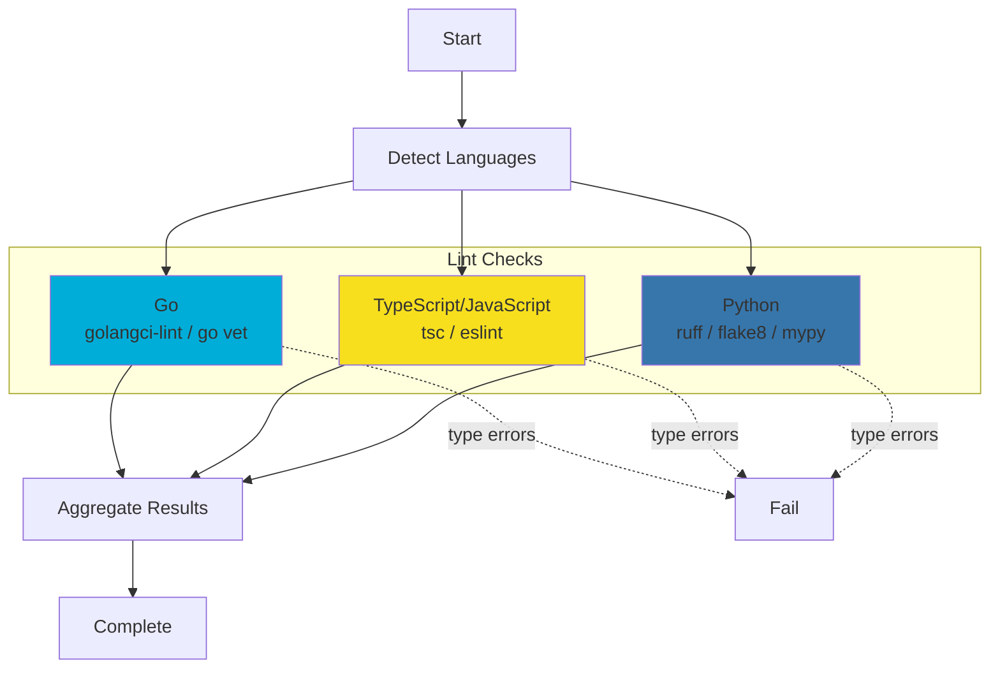

# Lint Phase Implementation Plan

**Status**: Planned
**Created**: 2024-12-04
**Target**: test-genie scenario

## Summary

Add a new "Lint" phase to test-genie's 8-phase testing architecture. The Lint phase performs static analysis including linting and type checking for Go, TypeScript/JavaScript, and Python. It will be inserted between Dependencies (phase 2) and Smoke (phase 3), becoming the new phase 3.

## Rationale

The current test-genie architecture has a gap: there's no phase that validates code quality through static analysis before running tests. This means:

1. **Type errors discovered late**: Unit tests run before type checking, wasting time
2. **Lint issues missed**: Code style and potential bugs aren't caught systematically
3. **Fail-fast violated**: The principle of catching errors early isn't fully applied

### Where It Fits

Current phase order:
```
1. Structure     (15s)  - Static - Files exist?
2. Dependencies  (30s)  - Static - Tools available?
3. Smoke         (90s)  - Runtime - UI loads?
4. Unit          (60s)  - Runtime - Tests pass?
5. Integration   (120s) - Runtime - Components work together?
6. Playbooks     (120s) - Runtime - E2E workflows pass?
7. Business      (180s) - Runtime - Requirements covered?
8. Performance   (60s)  - Runtime - Fast enough?
```

New phase order:
```
1. Structure     (15s)  - Static - Files exist?
2. Dependencies  (30s)  - Static - Tools available?
3. Lint          (45s)  - Static - Code well-formed?  ← NEW
4. Smoke         (90s)  - Runtime - UI loads?
5. Unit          (60s)  - Runtime - Tests pass?
6. Integration   (120s) - Runtime - Components work together?
7. Playbooks     (120s) - Runtime - E2E workflows pass?
8. Business      (180s) - Runtime - Requirements covered?
9. Performance   (60s)  - Runtime - Fast enough?
```

### Why a Dedicated Phase?

- **Separation of concerns**: Structure = files exist, Dependencies = tools available, Lint = code well-formed, Unit = code works
- **Fail-fast**: Lint errors should block before wasting time on tests
- **Clear reporting**: "Lint failed" vs "Unit tests failed" are different debugging mental models
- **Static analysis**: Lint doesn't require runtime, belongs with static phases

## Design Decisions

### Severity Handling
- **Lint issues**: Treated as **warnings** (don't block pipeline by default)
- **Type errors**: Treated as **errors** (block pipeline)
- **Rationale**: Lint issues are often stylistic; type errors indicate broken code

### Tool Availability
- **Missing preferred tool**: Warn and fallback to alternative
- **Missing all tools**: Skip that language's checks with info message
- **Example**: If `golangci-lint` missing, fallback to `go vet`

### Timeout
- **45 seconds** total for all languages
- Sufficient for most scenarios
- Configurable via `.vrooli/testing.json`

### Project Configuration Respect
- **Yes**: Respect project-specific configs (`.golangci.yml`, `eslint.config.js`, `tsconfig.json`, `pyproject.toml`)
- **Rationale**: Projects have intentional rules; test-genie shouldn't override them

## Architecture

### Package Structure

```
api/internal/lint/
├── doc.go                 # Package documentation
├── types.go               # Shared types, re-exports
├── runner.go              # Main orchestration
├── runner_test.go         # Orchestration tests
├── golang/
│   ├── doc.go
│   ├── linter.go          # golangci-lint / go vet
│   └── linter_test.go
├── nodejs/
│   ├── doc.go
│   ├── linter.go          # tsc / eslint
│   └── linter_test.go
└── python/
    ├── doc.go
    ├── linter.go          # ruff / flake8 / mypy
    └── linter_test.go
```

### Phase Integration

```
api/internal/orchestrator/phases/
├── types.go               # Add Lint constant
├── catalog.go             # Register lint phase
├── phase_lint.go          # Phase runner (NEW)
└── phase_lint_test.go     # Phase tests (NEW)
```

## Implementation Details

### Phase 1: Core Types & Registration

#### File: `api/internal/orchestrator/phases/types.go`

Add constant at line ~19 (between Dependencies and Smoke):

```go
const (
    Structure    Name = "structure"
    Dependencies Name = "dependencies"
    Lint         Name = "lint"           // ← ADD THIS
    Smoke        Name = "smoke"
    Unit         Name = "unit"
    Integration  Name = "integration"
    Playbooks    Name = "playbooks"
    Business     Name = "business"
    Performance  Name = "performance"
)
```

#### File: `api/internal/orchestrator/phases/catalog.go`

Add registration after Dependencies (after line 44), before Smoke:

```go
register(Spec{
    Name:        Dependencies,
    Runner:      runDependenciesPhase,
    Description: "Confirms required commands, runtimes, and declared resources are available.",
})
// ↓ ADD THIS BLOCK
register(Spec{
    Name:        Lint,
    Runner:      runLintPhase,
    Description: "Runs static analysis including linting and type checking for Go, TypeScript, and Python.",
})
// ↑ END ADD
register(Spec{
    Name:        Smoke,
    Runner:      runSmokePhase,
    Optional:    true,
    Description: "Validates UI loads correctly, establishes iframe-bridge communication, and has no critical errors.",
})
```

Weight assignment is automatic: Dependencies=10, Lint=20, Smoke=30, etc.

#### File: `api/internal/orchestrator/suite_execution.go`

Add to const block (around line 56):

```go
const (
    failureClassMisconfiguration  = phases.FailureClassMisconfiguration
    failureClassMissingDependency = phases.FailureClassMissingDependency
    failureClassTimeout           = phases.FailureClassTimeout
    failureClassSystem            = phases.FailureClassSystem
    PhaseStructure                = phases.Structure
    PhaseDependencies             = phases.Dependencies
    PhaseLint                     = phases.Lint        // ← ADD THIS
    PhaseUnit                     = phases.Unit
    PhaseIntegration              = phases.Integration
    PhaseBusiness                 = phases.Business
    PhasePerformance              = phases.Performance
)
```

Update presets (line 28-32):

```go
var defaultExecutionPresets = map[string][]string{
    "quick":         {"structure", "unit"},
    "smoke":         {"structure", "lint", "integration"},  // ← ADD lint
    "comprehensive": {"structure", "dependencies", "lint", "unit", "integration", "playbooks", "business", "performance"},  // ← ADD lint
}
```

---

### Phase 2: Internal Lint Package - Core

#### File: `api/internal/lint/doc.go`

```go
// Package lint provides static analysis validation for scenarios.
//
// It orchestrates linting and type checking across multiple languages:
//   - Go: golangci-lint (preferred) or go vet (fallback)
//   - TypeScript/JavaScript: tsc for type checking, eslint for linting
//   - Python: ruff (preferred) or flake8 (fallback), mypy for type checking
//
// The package follows the same patterns as the dependencies package,
// with a Runner that coordinates language-specific linters and
// aggregates their results into a unified report.
package lint
```

#### File: `api/internal/lint/types.go`

```go
package lint

import (
    "fmt"
    "strings"

    "test-genie/internal/shared"
)

// Re-export shared types for consistency across packages.
type (
    FailureClass    = shared.FailureClass
    ObservationType = shared.ObservationType
    Observation     = shared.Observation
    Result          = shared.Result
)

// Re-export constants.
const (
    FailureClassNone              = shared.FailureClassNone
    FailureClassMisconfiguration  = shared.FailureClassMisconfiguration
    FailureClassSystem            = shared.FailureClassSystem
    FailureClassMissingDependency = shared.FailureClassMissingDependency

    ObservationSection = shared.ObservationSection
    ObservationSuccess = shared.ObservationSuccess
    ObservationWarning = shared.ObservationWarning
    ObservationError   = shared.ObservationError
    ObservationInfo    = shared.ObservationInfo
    ObservationSkip    = shared.ObservationSkip
)

// Re-export constructor functions.
var (
    NewSectionObservation = shared.NewSectionObservation
    NewSuccessObservation = shared.NewSuccessObservation
    NewWarningObservation = shared.NewWarningObservation
    NewErrorObservation   = shared.NewErrorObservation
    NewInfoObservation    = shared.NewInfoObservation
    NewSkipObservation    = shared.NewSkipObservation

    OK                    = shared.OK
    OKWithCount           = shared.OKWithCount
    Fail                  = shared.Fail
    FailMisconfiguration  = shared.FailMisconfiguration
    FailMissingDependency = shared.FailMissingDependency
    FailSystem            = shared.FailSystem
)

// Severity indicates the severity of a lint issue.
type Severity string

const (
    SeverityError   Severity = "error"
    SeverityWarning Severity = "warning"
    SeverityInfo    Severity = "info"
)

// Issue represents a single lint or type error finding.
type Issue struct {
    File     string   `json:"file"`
    Line     int      `json:"line"`
    Column   int      `json:"column,omitempty"`
    Message  string   `json:"message"`
    Severity Severity `json:"severity"`
    Rule     string   `json:"rule,omitempty"`
    Source   string   `json:"source"` // e.g., "golangci-lint", "tsc", "eslint"
}

// RunResult is an alias for the generic shared.RunResult with LintSummary.
type RunResult = shared.RunResult[LintSummary]

// LintSummary tracks lint validation counts by language.
type LintSummary struct {
    GoChecked     bool `json:"goChecked"`
    NodeChecked   bool `json:"nodeChecked"`
    PythonChecked bool `json:"pythonChecked"`

    GoIssues     int `json:"goIssues"`
    NodeIssues   int `json:"nodeIssues"`
    PythonIssues int `json:"pythonIssues"`

    TypeErrors int `json:"typeErrors"` // Across all languages
    LintErrors int `json:"lintErrors"` // Across all languages (warnings)
}

// TotalChecks returns the number of languages checked.
func (s LintSummary) TotalChecks() int {
    count := 0
    if s.GoChecked {
        count++
    }
    if s.NodeChecked {
        count++
    }
    if s.PythonChecked {
        count++
    }
    return count
}

// TotalIssues returns the total number of issues found.
func (s LintSummary) TotalIssues() int {
    return s.GoIssues + s.NodeIssues + s.PythonIssues
}

// HasTypeErrors returns true if any type errors were found.
func (s LintSummary) HasTypeErrors() bool {
    return s.TypeErrors > 0
}

// String returns a human-readable summary.
func (s LintSummary) String() string {
    var parts []string
    if s.GoChecked {
        parts = append(parts, fmt.Sprintf("Go: %d issues", s.GoIssues))
    }
    if s.NodeChecked {
        parts = append(parts, fmt.Sprintf("Node: %d issues", s.NodeIssues))
    }
    if s.PythonChecked {
        parts = append(parts, fmt.Sprintf("Python: %d issues", s.PythonIssues))
    }
    if len(parts) == 0 {
        return "no languages checked"
    }
    return strings.Join(parts, ", ")
}

// LanguageResult holds the result of linting a single language.
type LanguageResult struct {
    Language     string        `json:"language"`
    Success      bool          `json:"success"`
    Issues       []Issue       `json:"issues,omitempty"`
    TypeErrors   int           `json:"typeErrors"`
    LintWarnings int           `json:"lintWarnings"`
    ToolsUsed    []string      `json:"toolsUsed"`
    Skipped      bool          `json:"skipped"`
    SkipReason   string        `json:"skipReason,omitempty"`
    Observations []Observation `json:"observations,omitempty"`
}
```

#### File: `api/internal/lint/runner.go`

```go
package lint

import (
    "context"
    "fmt"
    "io"
    "os"
    "path/filepath"

    "test-genie/internal/lint/golang"
    "test-genie/internal/lint/nodejs"
    "test-genie/internal/lint/python"
    "test-genie/internal/shared"
)

// LookupFunc is a function that looks up a command by name.
type LookupFunc func(name string) (string, error)

// Config holds configuration for lint validation.
type Config struct {
    // ScenarioDir is the absolute path to the scenario directory.
    ScenarioDir string

    // ScenarioName is the name of the scenario.
    ScenarioName string

    // CommandLookup is an optional custom command lookup function.
    CommandLookup LookupFunc
}

// Linter is the interface that language-specific linters must implement.
type Linter interface {
    Lint(ctx context.Context) *LanguageResult
}

// Runner orchestrates lint validation across Go, Node.js, and Python.
type Runner struct {
    config Config

    goLinter     Linter
    nodeLinter   Linter
    pythonLinter Linter

    logWriter io.Writer
}

// Option configures a Runner.
type Option func(*Runner)

// New creates a new lint validation runner.
func New(config Config, opts ...Option) *Runner {
    r := &Runner{
        config:    config,
        logWriter: io.Discard,
    }

    for _, opt := range opts {
        opt(r)
    }

    // Set defaults for linters if not provided via options
    if r.goLinter == nil {
        r.goLinter = golang.New(golang.Config{
            Dir:           filepath.Join(config.ScenarioDir, "api"),
            CommandLookup: config.CommandLookup,
        }, golang.WithLogger(r.logWriter))
    }
    if r.nodeLinter == nil {
        r.nodeLinter = nodejs.New(nodejs.Config{
            Dir:           filepath.Join(config.ScenarioDir, "ui"),
            CommandLookup: config.CommandLookup,
        }, nodejs.WithLogger(r.logWriter))
    }
    if r.pythonLinter == nil {
        r.pythonLinter = python.New(python.Config{
            Dir:           config.ScenarioDir,
            CommandLookup: config.CommandLookup,
        }, python.WithLogger(r.logWriter))
    }

    return r
}

// WithLogger sets the log writer for the runner.
func WithLogger(w io.Writer) Option {
    return func(r *Runner) {
        r.logWriter = w
    }
}

// WithGoLinter sets a custom Go linter (for testing).
func WithGoLinter(l Linter) Option {
    return func(r *Runner) {
        r.goLinter = l
    }
}

// WithNodeLinter sets a custom Node.js linter (for testing).
func WithNodeLinter(l Linter) Option {
    return func(r *Runner) {
        r.nodeLinter = l
    }
}

// WithPythonLinter sets a custom Python linter (for testing).
func WithPythonLinter(l Linter) Option {
    return func(r *Runner) {
        r.pythonLinter = l
    }
}

// Run executes all lint validations and returns the aggregated result.
func (r *Runner) Run(ctx context.Context) *RunResult {
    if err := ctx.Err(); err != nil {
        return &RunResult{
            Success:      false,
            Error:        err,
            FailureClass: FailureClassSystem,
        }
    }

    var observations []Observation
    var summary LintSummary
    var hasTypeErrors bool

    shared.LogInfo(r.logWriter, "Starting lint validation for %s", r.config.ScenarioName)

    // Check which languages are present
    hasGo := r.hasGoProject()
    hasNode := r.hasNodeProject()
    hasPython := r.hasPythonProject()

    if !hasGo && !hasNode && !hasPython {
        observations = append(observations, NewInfoObservation("No lintable languages detected"))
        return &RunResult{
            Success:      true,
            Observations: observations,
            Summary:      summary,
        }
    }

    // Section: Go Linting
    if hasGo {
        observations = append(observations, NewSectionObservation("🔷", "Linting Go code..."))
        shared.LogInfo(r.logWriter, "Linting Go code...")

        result := r.goLinter.Lint(ctx)
        summary.GoChecked = true
        summary.GoIssues = len(result.Issues)
        summary.TypeErrors += result.TypeErrors
        summary.LintErrors += result.LintWarnings

        observations = append(observations, result.Observations...)

        if result.TypeErrors > 0 {
            hasTypeErrors = true
        }

        if result.Skipped {
            shared.LogInfo(r.logWriter, "Go linting skipped: %s", result.SkipReason)
        } else if len(result.Issues) == 0 {
            shared.LogSuccess(r.logWriter, "Go code passed all checks")
        } else {
            shared.LogWarn(r.logWriter, "Go linting found %d issues", len(result.Issues))
        }
    }

    // Section: Node.js Linting
    if hasNode {
        observations = append(observations, NewSectionObservation("🟨", "Linting TypeScript/JavaScript..."))
        shared.LogInfo(r.logWriter, "Linting TypeScript/JavaScript...")

        result := r.nodeLinter.Lint(ctx)
        summary.NodeChecked = true
        summary.NodeIssues = len(result.Issues)
        summary.TypeErrors += result.TypeErrors
        summary.LintErrors += result.LintWarnings

        observations = append(observations, result.Observations...)

        if result.TypeErrors > 0 {
            hasTypeErrors = true
        }

        if result.Skipped {
            shared.LogInfo(r.logWriter, "Node linting skipped: %s", result.SkipReason)
        } else if len(result.Issues) == 0 {
            shared.LogSuccess(r.logWriter, "TypeScript/JavaScript passed all checks")
        } else {
            shared.LogWarn(r.logWriter, "Node linting found %d issues", len(result.Issues))
        }
    }

    // Section: Python Linting
    if hasPython {
        observations = append(observations, NewSectionObservation("🐍", "Linting Python code..."))
        shared.LogInfo(r.logWriter, "Linting Python code...")

        result := r.pythonLinter.Lint(ctx)
        summary.PythonChecked = true
        summary.PythonIssues = len(result.Issues)
        summary.TypeErrors += result.TypeErrors
        summary.LintErrors += result.LintWarnings

        observations = append(observations, result.Observations...)

        if result.TypeErrors > 0 {
            hasTypeErrors = true
        }

        if result.Skipped {
            shared.LogInfo(r.logWriter, "Python linting skipped: %s", result.SkipReason)
        } else if len(result.Issues) == 0 {
            shared.LogSuccess(r.logWriter, "Python code passed all checks")
        } else {
            shared.LogWarn(r.logWriter, "Python linting found %d issues", len(result.Issues))
        }
    }

    // Determine success: type errors fail, lint warnings don't
    success := !hasTypeErrors
    var failureClass FailureClass
    var remediation string
    var err error

    if hasTypeErrors {
        failureClass = FailureClassMisconfiguration
        remediation = fmt.Sprintf("Fix %d type error(s) before proceeding. Run type checker locally to see details.", summary.TypeErrors)
        err = fmt.Errorf("type checking failed with %d error(s)", summary.TypeErrors)
    }

    // Final summary
    totalIssues := summary.TotalIssues()
    if success {
        if totalIssues > 0 {
            observations = append(observations, NewWarningObservation(
                fmt.Sprintf("Lint completed with %d warning(s) (%d languages checked)", totalIssues, summary.TotalChecks()),
            ))
        } else {
            observations = append(observations, NewSuccessObservation(
                fmt.Sprintf("Lint validation passed (%d languages checked)", summary.TotalChecks()),
            ))
        }
    } else {
        observations = append(observations, NewErrorObservation(
            fmt.Sprintf("Lint validation failed: %d type error(s)", summary.TypeErrors),
        ))
    }

    shared.LogInfo(r.logWriter, "Lint validation complete: %s", summary.String())

    return &RunResult{
        Success:      success,
        Error:        err,
        FailureClass: failureClass,
        Remediation:  remediation,
        Observations: observations,
        Summary:      summary,
    }
}

// hasGoProject checks if the scenario has a Go project (api/go.mod).
func (r *Runner) hasGoProject() bool {
    goModPath := filepath.Join(r.config.ScenarioDir, "api", "go.mod")
    _, err := os.Stat(goModPath)
    return err == nil
}

// hasNodeProject checks if the scenario has a Node.js project (ui/package.json).
func (r *Runner) hasNodeProject() bool {
    packagePath := filepath.Join(r.config.ScenarioDir, "ui", "package.json")
    _, err := os.Stat(packagePath)
    return err == nil
}

// hasPythonProject checks if the scenario has Python files.
func (r *Runner) hasPythonProject() bool {
    // Check for common Python indicators
    indicators := []string{
        "pyproject.toml",
        "setup.py",
        "requirements.txt",
        "pytest.ini",
    }
    for _, indicator := range indicators {
        if _, err := os.Stat(filepath.Join(r.config.ScenarioDir, indicator)); err == nil {
            return true
        }
    }
    // Also check for any .py files in the root
    entries, err := os.ReadDir(r.config.ScenarioDir)
    if err != nil {
        return false
    }
    for _, entry := range entries {
        if !entry.IsDir() && filepath.Ext(entry.Name()) == ".py" {
            return true
        }
    }
    return false
}
```

---

### Phase 3: Go Linter

#### File: `api/internal/lint/golang/doc.go`

```go
// Package golang provides Go-specific linting using golangci-lint or go vet.
//
// Tool priority:
//  1. golangci-lint (comprehensive, respects .golangci.yml)
//  2. go vet (fallback, built-in)
//
// If golangci-lint is not available, a warning is logged and go vet is used.
// If neither is available, the check is skipped with an info message.
package golang
```

#### File: `api/internal/lint/golang/linter.go`

```go
package golang

import (
    "context"
    "encoding/json"
    "fmt"
    "io"
    "os"
    "os/exec"
    "path/filepath"
    "strings"

    "test-genie/internal/lint"
    "test-genie/internal/shared"
)

// Config holds configuration for Go linting.
type Config struct {
    Dir           string
    CommandLookup lint.LookupFunc
}

// Linter performs Go linting.
type Linter struct {
    config    Config
    logWriter io.Writer
}

// Option configures a Linter.
type Option func(*Linter)

// New creates a new Go linter.
func New(config Config, opts ...Option) *Linter {
    l := &Linter{
        config:    config,
        logWriter: io.Discard,
    }
    for _, opt := range opts {
        opt(l)
    }
    return l
}

// WithLogger sets the log writer.
func WithLogger(w io.Writer) Option {
    return func(l *Linter) {
        l.logWriter = w
    }
}

// Lint runs Go linting and returns the result.
func (l *Linter) Lint(ctx context.Context) *lint.LanguageResult {
    result := &lint.LanguageResult{
        Language: "go",
    }

    // Check if directory exists
    if _, err := os.Stat(l.config.Dir); os.IsNotExist(err) {
        result.Skipped = true
        result.SkipReason = "api/ directory not found"
        result.Success = true
        result.Observations = append(result.Observations,
            lint.NewSkipObservation("Go: api/ directory not found"))
        return result
    }

    // Check if go.mod exists
    goModPath := filepath.Join(l.config.Dir, "go.mod")
    if _, err := os.Stat(goModPath); os.IsNotExist(err) {
        result.Skipped = true
        result.SkipReason = "no go.mod found"
        result.Success = true
        result.Observations = append(result.Observations,
            lint.NewSkipObservation("Go: no go.mod found in api/"))
        return result
    }

    // Try golangci-lint first
    if l.hasCommand("golangci-lint") {
        return l.runGolangciLint(ctx, result)
    }

    // Fallback to go vet
    shared.LogWarn(l.logWriter, "golangci-lint not found, falling back to go vet")
    result.Observations = append(result.Observations,
        lint.NewWarningObservation("golangci-lint not available, using go vet"))

    if l.hasCommand("go") {
        return l.runGoVet(ctx, result)
    }

    // Neither available
    result.Skipped = true
    result.SkipReason = "no Go linting tools available"
    result.Success = true
    result.Observations = append(result.Observations,
        lint.NewSkipObservation("Go: no linting tools available (install golangci-lint or go)"))
    return result
}

func (l *Linter) hasCommand(name string) bool {
    if l.config.CommandLookup != nil {
        _, err := l.config.CommandLookup(name)
        return err == nil
    }
    _, err := exec.LookPath(name)
    return err == nil
}

func (l *Linter) runGolangciLint(ctx context.Context, result *lint.LanguageResult) *lint.LanguageResult {
    result.ToolsUsed = append(result.ToolsUsed, "golangci-lint")

    cmd := exec.CommandContext(ctx, "golangci-lint", "run", "--out-format", "json", "./...")
    cmd.Dir = l.config.Dir

    output, err := cmd.Output()

    // golangci-lint exits with 1 if there are issues, which is not an error for us
    if err != nil {
        if exitErr, ok := err.(*exec.ExitError); ok {
            // Exit code 1 means issues found, which we handle below
            if exitErr.ExitCode() != 1 {
                result.Success = false
                result.Observations = append(result.Observations,
                    lint.NewErrorObservation(fmt.Sprintf("golangci-lint failed: %v", err)))
                return result
            }
            // Use stderr output if stdout is empty
            if len(output) == 0 {
                output = exitErr.Stderr
            }
        } else {
            result.Success = false
            result.Observations = append(result.Observations,
                lint.NewErrorObservation(fmt.Sprintf("golangci-lint failed: %v", err)))
            return result
        }
    }

    // Parse JSON output
    issues, typeErrors := l.parseGolangciLintOutput(output)
    result.Issues = issues
    result.TypeErrors = typeErrors
    result.LintWarnings = len(issues) - typeErrors
    result.Success = typeErrors == 0

    if len(issues) == 0 {
        result.Observations = append(result.Observations,
            lint.NewSuccessObservation("Go: golangci-lint found no issues"))
    } else {
        result.Observations = append(result.Observations,
            lint.NewInfoObservation(fmt.Sprintf("Go: %d issue(s) found by golangci-lint", len(issues))))
    }

    return result
}

func (l *Linter) runGoVet(ctx context.Context, result *lint.LanguageResult) *lint.LanguageResult {
    result.ToolsUsed = append(result.ToolsUsed, "go vet")

    cmd := exec.CommandContext(ctx, "go", "vet", "./...")
    cmd.Dir = l.config.Dir

    output, err := cmd.CombinedOutput()

    if err != nil {
        // go vet exits with 1 if there are issues
        if exitErr, ok := err.(*exec.ExitError); ok && exitErr.ExitCode() == 1 {
            // Parse the output for issues
            issues := l.parseGoVetOutput(string(output))
            result.Issues = issues
            result.TypeErrors = len(issues) // go vet issues are considered type-level errors
            result.Success = false
            result.Observations = append(result.Observations,
                lint.NewErrorObservation(fmt.Sprintf("Go: go vet found %d issue(s)", len(issues))))
            return result
        }
        result.Success = false
        result.Observations = append(result.Observations,
            lint.NewErrorObservation(fmt.Sprintf("go vet failed: %v", err)))
        return result
    }

    result.Success = true
    result.Observations = append(result.Observations,
        lint.NewSuccessObservation("Go: go vet found no issues"))
    return result
}

// golangciLintOutput represents the JSON output from golangci-lint.
type golangciLintOutput struct {
    Issues []golangciLintIssue `json:"Issues"`
}

type golangciLintIssue struct {
    FromLinter string `json:"FromLinter"`
    Text       string `json:"Text"`
    Severity   string `json:"Severity"`
    Pos        struct {
        Filename string `json:"Filename"`
        Line     int    `json:"Line"`
        Column   int    `json:"Column"`
    } `json:"Pos"`
}

func (l *Linter) parseGolangciLintOutput(output []byte) ([]lint.Issue, int) {
    var parsed golangciLintOutput
    if err := json.Unmarshal(output, &parsed); err != nil {
        shared.LogWarn(l.logWriter, "failed to parse golangci-lint JSON: %v", err)
        return nil, 0
    }

    var issues []lint.Issue
    typeErrors := 0

    for _, i := range parsed.Issues {
        severity := lint.SeverityWarning
        // Type-related linters produce errors
        typeRelatedLinters := []string{"typecheck", "govet", "staticcheck"}
        for _, tl := range typeRelatedLinters {
            if i.FromLinter == tl {
                severity = lint.SeverityError
                typeErrors++
                break
            }
        }

        issues = append(issues, lint.Issue{
            File:     i.Pos.Filename,
            Line:     i.Pos.Line,
            Column:   i.Pos.Column,
            Message:  i.Text,
            Severity: severity,
            Rule:     i.FromLinter,
            Source:   "golangci-lint",
        })
    }

    return issues, typeErrors
}

func (l *Linter) parseGoVetOutput(output string) []lint.Issue {
    var issues []lint.Issue
    lines := strings.Split(output, "\n")

    for _, line := range lines {
        line = strings.TrimSpace(line)
        if line == "" {
            continue
        }
        // go vet output format: file.go:line:col: message
        // or: file.go:line: message
        parts := strings.SplitN(line, ":", 4)
        if len(parts) < 3 {
            continue
        }

        issue := lint.Issue{
            File:     parts[0],
            Severity: lint.SeverityError,
            Source:   "go vet",
        }

        // Parse line number
        if _, err := fmt.Sscanf(parts[1], "%d", &issue.Line); err != nil {
            continue
        }

        // Check if column is present
        if len(parts) == 4 {
            fmt.Sscanf(parts[2], "%d", &issue.Column)
            issue.Message = strings.TrimSpace(parts[3])
        } else {
            issue.Message = strings.TrimSpace(parts[2])
        }

        issues = append(issues, issue)
    }

    return issues
}
```

---

### Phase 4: Node.js Linter

#### File: `api/internal/lint/nodejs/doc.go`

```go
// Package nodejs provides TypeScript/JavaScript linting using tsc and eslint.
//
// Tools used:
//  - tsc --noEmit: Type checking (if tsconfig.json exists)
//  - eslint: Linting (if eslint config exists)
//
// Type errors from tsc are treated as errors that fail the phase.
// ESLint issues are treated as warnings that don't fail the phase.
package nodejs
```

#### File: `api/internal/lint/nodejs/linter.go`

```go
package nodejs

import (
    "context"
    "encoding/json"
    "fmt"
    "io"
    "os"
    "os/exec"
    "path/filepath"
    "regexp"
    "strconv"
    "strings"

    "test-genie/internal/lint"
    "test-genie/internal/shared"
)

// Config holds configuration for Node.js linting.
type Config struct {
    Dir           string
    CommandLookup lint.LookupFunc
}

// Linter performs Node.js linting.
type Linter struct {
    config    Config
    logWriter io.Writer
}

// Option configures a Linter.
type Option func(*Linter)

// New creates a new Node.js linter.
func New(config Config, opts ...Option) *Linter {
    l := &Linter{
        config:    config,
        logWriter: io.Discard,
    }
    for _, opt := range opts {
        opt(l)
    }
    return l
}

// WithLogger sets the log writer.
func WithLogger(w io.Writer) Option {
    return func(l *Linter) {
        l.logWriter = w
    }
}

// Lint runs Node.js linting and returns the result.
func (l *Linter) Lint(ctx context.Context) *lint.LanguageResult {
    result := &lint.LanguageResult{
        Language: "nodejs",
    }

    // Check if directory exists
    if _, err := os.Stat(l.config.Dir); os.IsNotExist(err) {
        result.Skipped = true
        result.SkipReason = "ui/ directory not found"
        result.Success = true
        result.Observations = append(result.Observations,
            lint.NewSkipObservation("Node: ui/ directory not found"))
        return result
    }

    // Check if package.json exists
    packagePath := filepath.Join(l.config.Dir, "package.json")
    if _, err := os.Stat(packagePath); os.IsNotExist(err) {
        result.Skipped = true
        result.SkipReason = "no package.json found"
        result.Success = true
        result.Observations = append(result.Observations,
            lint.NewSkipObservation("Node: no package.json found in ui/"))
        return result
    }

    var allIssues []lint.Issue

    // Run TypeScript type checking if tsconfig.json exists
    if l.hasTsConfig() {
        tscResult := l.runTsc(ctx)
        allIssues = append(allIssues, tscResult.Issues...)
        result.TypeErrors += tscResult.TypeErrors
        result.ToolsUsed = append(result.ToolsUsed, tscResult.ToolsUsed...)
        result.Observations = append(result.Observations, tscResult.Observations...)
    }

    // Run ESLint if config exists
    if l.hasEslintConfig() {
        eslintResult := l.runEslint(ctx)
        allIssues = append(allIssues, eslintResult.Issues...)
        result.LintWarnings += eslintResult.LintWarnings
        result.ToolsUsed = append(result.ToolsUsed, eslintResult.ToolsUsed...)
        result.Observations = append(result.Observations, eslintResult.Observations...)
    }

    // If no tools were run
    if len(result.ToolsUsed) == 0 {
        result.Skipped = true
        result.SkipReason = "no TypeScript or ESLint configuration found"
        result.Success = true
        result.Observations = append(result.Observations,
            lint.NewSkipObservation("Node: no tsconfig.json or ESLint config found"))
        return result
    }

    result.Issues = allIssues
    result.Success = result.TypeErrors == 0 // Type errors fail, lint warnings don't

    return result
}

func (l *Linter) hasTsConfig() bool {
    tsConfigPath := filepath.Join(l.config.Dir, "tsconfig.json")
    _, err := os.Stat(tsConfigPath)
    return err == nil
}

func (l *Linter) hasEslintConfig() bool {
    // Check for various ESLint config files
    configs := []string{
        ".eslintrc",
        ".eslintrc.js",
        ".eslintrc.cjs",
        ".eslintrc.json",
        ".eslintrc.yml",
        ".eslintrc.yaml",
        "eslint.config.js",
        "eslint.config.mjs",
        "eslint.config.cjs",
    }
    for _, config := range configs {
        if _, err := os.Stat(filepath.Join(l.config.Dir, config)); err == nil {
            return true
        }
    }
    return false
}

func (l *Linter) hasCommand(name string) bool {
    if l.config.CommandLookup != nil {
        _, err := l.config.CommandLookup(name)
        return err == nil
    }
    _, err := exec.LookPath(name)
    return err == nil
}

func (l *Linter) runTsc(ctx context.Context) *lint.LanguageResult {
    result := &lint.LanguageResult{
        Language:  "nodejs",
        ToolsUsed: []string{"tsc"},
    }

    // Find tsc - prefer local node_modules
    tscPath := l.findTsc()
    if tscPath == "" {
        result.Observations = append(result.Observations,
            lint.NewWarningObservation("Node: tsc not found, skipping type checking"))
        return result
    }

    cmd := exec.CommandContext(ctx, tscPath, "--noEmit")
    cmd.Dir = l.config.Dir

    output, err := cmd.CombinedOutput()

    if err != nil {
        // tsc exits with non-zero if there are errors
        issues := l.parseTscOutput(string(output))
        result.Issues = issues
        result.TypeErrors = len(issues)

        if len(issues) > 0 {
            result.Observations = append(result.Observations,
                lint.NewErrorObservation(fmt.Sprintf("Node: tsc found %d type error(s)", len(issues))))
        } else {
            result.Observations = append(result.Observations,
                lint.NewErrorObservation(fmt.Sprintf("tsc failed: %v", err)))
        }
        return result
    }

    result.Success = true
    result.Observations = append(result.Observations,
        lint.NewSuccessObservation("Node: tsc found no type errors"))
    return result
}

func (l *Linter) findTsc() string {
    // Try local node_modules first
    localTsc := filepath.Join(l.config.Dir, "node_modules", ".bin", "tsc")
    if _, err := os.Stat(localTsc); err == nil {
        return localTsc
    }
    // Try global
    if l.hasCommand("tsc") {
        return "tsc"
    }
    return ""
}

func (l *Linter) parseTscOutput(output string) []lint.Issue {
    var issues []lint.Issue
    // tsc output format: file(line,col): error TSxxxx: message
    re := regexp.MustCompile(`^(.+)\((\d+),(\d+)\):\s+error\s+(TS\d+):\s+(.+)$`)

    lines := strings.Split(output, "\n")
    for _, line := range lines {
        line = strings.TrimSpace(line)
        matches := re.FindStringSubmatch(line)
        if matches == nil {
            continue
        }

        lineNum, _ := strconv.Atoi(matches[2])
        colNum, _ := strconv.Atoi(matches[3])

        issues = append(issues, lint.Issue{
            File:     matches[1],
            Line:     lineNum,
            Column:   colNum,
            Message:  matches[5],
            Severity: lint.SeverityError,
            Rule:     matches[4],
            Source:   "tsc",
        })
    }

    return issues
}

func (l *Linter) runEslint(ctx context.Context) *lint.LanguageResult {
    result := &lint.LanguageResult{
        Language:  "nodejs",
        ToolsUsed: []string{"eslint"},
    }

    // Find eslint - prefer local node_modules
    eslintPath := l.findEslint()
    if eslintPath == "" {
        result.Observations = append(result.Observations,
            lint.NewWarningObservation("Node: eslint not found, skipping linting"))
        return result
    }

    cmd := exec.CommandContext(ctx, eslintPath, ".", "--format", "json")
    cmd.Dir = l.config.Dir

    output, err := cmd.Output()

    // eslint exits with 1 if there are issues
    if err != nil {
        if exitErr, ok := err.(*exec.ExitError); ok {
            if exitErr.ExitCode() == 1 {
                // Issues found, parse them
                if len(output) == 0 {
                    output = exitErr.Stderr
                }
            } else if exitErr.ExitCode() == 2 {
                // Configuration error
                result.Observations = append(result.Observations,
                    lint.NewErrorObservation(fmt.Sprintf("ESLint configuration error: %s", string(exitErr.Stderr))))
                return result
            }
        }
    }

    issues := l.parseEslintOutput(output)
    result.Issues = issues
    result.LintWarnings = len(issues)
    result.Success = true // ESLint issues are warnings, not failures

    if len(issues) == 0 {
        result.Observations = append(result.Observations,
            lint.NewSuccessObservation("Node: eslint found no issues"))
    } else {
        result.Observations = append(result.Observations,
            lint.NewWarningObservation(fmt.Sprintf("Node: eslint found %d issue(s)", len(issues))))
    }

    return result
}

func (l *Linter) findEslint() string {
    // Try local node_modules first
    localEslint := filepath.Join(l.config.Dir, "node_modules", ".bin", "eslint")
    if _, err := os.Stat(localEslint); err == nil {
        return localEslint
    }
    // Try global
    if l.hasCommand("eslint") {
        return "eslint"
    }
    return ""
}

type eslintOutput []eslintFileResult

type eslintFileResult struct {
    FilePath string         `json:"filePath"`
    Messages []eslintMessage `json:"messages"`
}

type eslintMessage struct {
    Line     int    `json:"line"`
    Column   int    `json:"column"`
    Message  string `json:"message"`
    RuleId   string `json:"ruleId"`
    Severity int    `json:"severity"` // 1 = warning, 2 = error
}

func (l *Linter) parseEslintOutput(output []byte) []lint.Issue {
    var parsed eslintOutput
    if err := json.Unmarshal(output, &parsed); err != nil {
        shared.LogWarn(l.logWriter, "failed to parse eslint JSON: %v", err)
        return nil
    }

    var issues []lint.Issue
    for _, file := range parsed {
        for _, msg := range file.Messages {
            severity := lint.SeverityWarning
            if msg.Severity == 2 {
                severity = lint.SeverityError
            }
            issues = append(issues, lint.Issue{
                File:     file.FilePath,
                Line:     msg.Line,
                Column:   msg.Column,
                Message:  msg.Message,
                Severity: severity,
                Rule:     msg.RuleId,
                Source:   "eslint",
            })
        }
    }

    return issues
}
```

---

### Phase 5: Python Linter

#### File: `api/internal/lint/python/doc.go`

```go
// Package python provides Python-specific linting using ruff, flake8, and mypy.
//
// Tool priority for linting:
//  1. ruff check (fast, modern)
//  2. flake8 (fallback)
//
// Type checking:
//  - mypy (if mypy.ini or pyproject.toml has mypy config)
//
// Type errors from mypy are treated as errors that fail the phase.
// Linting issues are treated as warnings that don't fail the phase.
package python
```

#### File: `api/internal/lint/python/linter.go`

```go
package python

import (
    "context"
    "encoding/json"
    "fmt"
    "io"
    "os"
    "os/exec"
    "path/filepath"
    "regexp"
    "strconv"
    "strings"

    "test-genie/internal/lint"
    "test-genie/internal/shared"
)

// Config holds configuration for Python linting.
type Config struct {
    Dir           string
    CommandLookup lint.LookupFunc
}

// Linter performs Python linting.
type Linter struct {
    config    Config
    logWriter io.Writer
}

// Option configures a Linter.
type Option func(*Linter)

// New creates a new Python linter.
func New(config Config, opts ...Option) *Linter {
    l := &Linter{
        config:    config,
        logWriter: io.Discard,
    }
    for _, opt := range opts {
        opt(l)
    }
    return l
}

// WithLogger sets the log writer.
func WithLogger(w io.Writer) Option {
    return func(l *Linter) {
        l.logWriter = w
    }
}

// Lint runs Python linting and returns the result.
func (l *Linter) Lint(ctx context.Context) *lint.LanguageResult {
    result := &lint.LanguageResult{
        Language: "python",
    }

    // Check if there are Python files
    if !l.hasPythonFiles() {
        result.Skipped = true
        result.SkipReason = "no Python files found"
        result.Success = true
        result.Observations = append(result.Observations,
            lint.NewSkipObservation("Python: no .py files found"))
        return result
    }

    var allIssues []lint.Issue

    // Run linting (ruff or flake8)
    lintResult := l.runLinter(ctx)
    allIssues = append(allIssues, lintResult.Issues...)
    result.LintWarnings += lintResult.LintWarnings
    result.ToolsUsed = append(result.ToolsUsed, lintResult.ToolsUsed...)
    result.Observations = append(result.Observations, lintResult.Observations...)

    // Run type checking if mypy is configured
    if l.hasMypyConfig() {
        mypyResult := l.runMypy(ctx)
        allIssues = append(allIssues, mypyResult.Issues...)
        result.TypeErrors += mypyResult.TypeErrors
        result.ToolsUsed = append(result.ToolsUsed, mypyResult.ToolsUsed...)
        result.Observations = append(result.Observations, mypyResult.Observations...)
    }

    // If no tools were run
    if len(result.ToolsUsed) == 0 {
        result.Skipped = true
        result.SkipReason = "no Python linting tools available"
        result.Success = true
        result.Observations = append(result.Observations,
            lint.NewSkipObservation("Python: no linting tools available (install ruff, flake8, or mypy)"))
        return result
    }

    result.Issues = allIssues
    result.Success = result.TypeErrors == 0 // Type errors fail, lint warnings don't

    return result
}

func (l *Linter) hasPythonFiles() bool {
    found := false
    filepath.WalkDir(l.config.Dir, func(path string, d os.DirEntry, err error) error {
        if err != nil {
            return nil
        }
        if d.IsDir() {
            // Skip common non-source directories
            name := d.Name()
            if name == "node_modules" || name == ".git" || name == "__pycache__" || name == ".venv" || name == "venv" {
                return filepath.SkipDir
            }
            return nil
        }
        if filepath.Ext(path) == ".py" {
            found = true
            return filepath.SkipAll
        }
        return nil
    })
    return found
}

func (l *Linter) hasMypyConfig() bool {
    // Check for mypy.ini
    if _, err := os.Stat(filepath.Join(l.config.Dir, "mypy.ini")); err == nil {
        return true
    }
    // Check pyproject.toml for [tool.mypy] section
    pyprojectPath := filepath.Join(l.config.Dir, "pyproject.toml")
    if data, err := os.ReadFile(pyprojectPath); err == nil {
        if strings.Contains(string(data), "[tool.mypy]") {
            return true
        }
    }
    return false
}

func (l *Linter) hasCommand(name string) bool {
    if l.config.CommandLookup != nil {
        _, err := l.config.CommandLookup(name)
        return err == nil
    }
    _, err := exec.LookPath(name)
    return err == nil
}

func (l *Linter) runLinter(ctx context.Context) *lint.LanguageResult {
    // Try ruff first (faster, modern)
    if l.hasCommand("ruff") {
        return l.runRuff(ctx)
    }

    // Fallback to flake8
    if l.hasCommand("flake8") {
        shared.LogWarn(l.logWriter, "ruff not found, falling back to flake8")
        return l.runFlake8(ctx)
    }

    // No linter available
    result := &lint.LanguageResult{Language: "python"}
    result.Observations = append(result.Observations,
        lint.NewWarningObservation("Python: no linter available (install ruff or flake8)"))
    return result
}

func (l *Linter) runRuff(ctx context.Context) *lint.LanguageResult {
    result := &lint.LanguageResult{
        Language:  "python",
        ToolsUsed: []string{"ruff"},
    }

    cmd := exec.CommandContext(ctx, "ruff", "check", "--output-format", "json", ".")
    cmd.Dir = l.config.Dir

    output, err := cmd.Output()

    // ruff exits with 1 if there are issues
    if err != nil {
        if exitErr, ok := err.(*exec.ExitError); ok && exitErr.ExitCode() == 1 {
            if len(output) == 0 {
                output = exitErr.Stderr
            }
        } else {
            result.Observations = append(result.Observations,
                lint.NewErrorObservation(fmt.Sprintf("ruff failed: %v", err)))
            return result
        }
    }

    issues := l.parseRuffOutput(output)
    result.Issues = issues
    result.LintWarnings = len(issues)
    result.Success = true

    if len(issues) == 0 {
        result.Observations = append(result.Observations,
            lint.NewSuccessObservation("Python: ruff found no issues"))
    } else {
        result.Observations = append(result.Observations,
            lint.NewWarningObservation(fmt.Sprintf("Python: ruff found %d issue(s)", len(issues))))
    }

    return result
}

type ruffIssue struct {
    Code     string `json:"code"`
    Message  string `json:"message"`
    Filename string `json:"filename"`
    Location struct {
        Row    int `json:"row"`
        Column int `json:"column"`
    } `json:"location"`
}

func (l *Linter) parseRuffOutput(output []byte) []lint.Issue {
    var parsed []ruffIssue
    if err := json.Unmarshal(output, &parsed); err != nil {
        shared.LogWarn(l.logWriter, "failed to parse ruff JSON: %v", err)
        return nil
    }

    var issues []lint.Issue
    for _, i := range parsed {
        issues = append(issues, lint.Issue{
            File:     i.Filename,
            Line:     i.Location.Row,
            Column:   i.Location.Column,
            Message:  i.Message,
            Severity: lint.SeverityWarning,
            Rule:     i.Code,
            Source:   "ruff",
        })
    }
    return issues
}

func (l *Linter) runFlake8(ctx context.Context) *lint.LanguageResult {
    result := &lint.LanguageResult{
        Language:  "python",
        ToolsUsed: []string{"flake8"},
    }

    cmd := exec.CommandContext(ctx, "flake8", "--format=%(path)s:%(row)d:%(col)d: %(code)s %(text)s", ".")
    cmd.Dir = l.config.Dir

    output, err := cmd.CombinedOutput()

    if err != nil {
        if exitErr, ok := err.(*exec.ExitError); ok && exitErr.ExitCode() == 1 {
            // Issues found
        } else {
            result.Observations = append(result.Observations,
                lint.NewErrorObservation(fmt.Sprintf("flake8 failed: %v", err)))
            return result
        }
    }

    issues := l.parseFlake8Output(string(output))
    result.Issues = issues
    result.LintWarnings = len(issues)
    result.Success = true

    if len(issues) == 0 {
        result.Observations = append(result.Observations,
            lint.NewSuccessObservation("Python: flake8 found no issues"))
    } else {
        result.Observations = append(result.Observations,
            lint.NewWarningObservation(fmt.Sprintf("Python: flake8 found %d issue(s)", len(issues))))
    }

    return result
}

func (l *Linter) parseFlake8Output(output string) []lint.Issue {
    var issues []lint.Issue
    // Format: path:row:col: code message
    re := regexp.MustCompile(`^(.+):(\d+):(\d+): (\w+) (.+)$`)

    lines := strings.Split(output, "\n")
    for _, line := range lines {
        line = strings.TrimSpace(line)
        matches := re.FindStringSubmatch(line)
        if matches == nil {
            continue
        }

        lineNum, _ := strconv.Atoi(matches[2])
        colNum, _ := strconv.Atoi(matches[3])

        issues = append(issues, lint.Issue{
            File:     matches[1],
            Line:     lineNum,
            Column:   colNum,
            Message:  matches[5],
            Severity: lint.SeverityWarning,
            Rule:     matches[4],
            Source:   "flake8",
        })
    }
    return issues
}

func (l *Linter) runMypy(ctx context.Context) *lint.LanguageResult {
    result := &lint.LanguageResult{
        Language:  "python",
        ToolsUsed: []string{"mypy"},
    }

    if !l.hasCommand("mypy") {
        result.Observations = append(result.Observations,
            lint.NewWarningObservation("Python: mypy not found, skipping type checking"))
        return result
    }

    cmd := exec.CommandContext(ctx, "mypy", ".")
    cmd.Dir = l.config.Dir

    output, err := cmd.CombinedOutput()

    if err != nil {
        if exitErr, ok := err.(*exec.ExitError); ok && exitErr.ExitCode() == 1 {
            // Type errors found
            issues := l.parseMypyOutput(string(output))
            result.Issues = issues
            result.TypeErrors = len(issues)
            result.Observations = append(result.Observations,
                lint.NewErrorObservation(fmt.Sprintf("Python: mypy found %d type error(s)", len(issues))))
            return result
        }
        result.Observations = append(result.Observations,
            lint.NewErrorObservation(fmt.Sprintf("mypy failed: %v", err)))
        return result
    }

    result.Success = true
    result.Observations = append(result.Observations,
        lint.NewSuccessObservation("Python: mypy found no type errors"))
    return result
}

func (l *Linter) parseMypyOutput(output string) []lint.Issue {
    var issues []lint.Issue
    // mypy output format: file:line: error: message
    re := regexp.MustCompile(`^(.+):(\d+): error: (.+)$`)

    lines := strings.Split(output, "\n")
    for _, line := range lines {
        line = strings.TrimSpace(line)
        matches := re.FindStringSubmatch(line)
        if matches == nil {
            continue
        }

        lineNum, _ := strconv.Atoi(matches[2])

        issues = append(issues, lint.Issue{
            File:     matches[1],
            Line:     lineNum,
            Message:  matches[3],
            Severity: lint.SeverityError,
            Source:   "mypy",
        })
    }
    return issues
}
```

---

### Phase 6: Phase Runner

#### File: `api/internal/orchestrator/phases/phase_lint.go`

```go
package phases

import (
    "context"
    "fmt"
    "io"

    "test-genie/internal/lint"
    "test-genie/internal/orchestrator/workspace"
)

// runLintPhase performs static analysis (linting and type checking) for Go, Node.js, and Python.
func runLintPhase(ctx context.Context, env workspace.Environment, logWriter io.Writer) RunReport {
    return RunPhase(ctx, logWriter, "lint",
        func() (*lint.RunResult, error) {
            config := lint.Config{
                ScenarioDir:   env.ScenarioDir,
                ScenarioName:  env.ScenarioName,
                CommandLookup: commandLookup,
            }

            runner := lint.New(config, lint.WithLogger(logWriter))
            return runner.Run(ctx), nil
        },
        func(r *lint.RunResult) PhaseResult[lint.Observation] {
            return ExtractWithSummary(
                r.Success,
                r.Error,
                r.FailureClass,
                r.Remediation,
                r.Observations,
                "",
                fmt.Sprintf("Lint validation completed (%d languages, %d issues)", r.Summary.TotalChecks(), r.Summary.TotalIssues()),
            )
        },
    )
}
```

---

### Phase 7: Documentation

#### File: `docs/phases/lint/README.md`

```markdown
# Lint Phase

**ID**: `lint`
**Timeout**: 45 seconds
**Optional**: No
**Requires Runtime**: No

The lint phase performs static analysis including linting and type checking for Go, TypeScript/JavaScript, and Python. It catches code quality issues and type errors early, before running tests.

## What Gets Checked



## Language Detection

| Language | Detection | Directory |
|----------|-----------|-----------|
| Go | `api/go.mod` exists | `api/` |
| TypeScript/JS | `ui/package.json` exists | `ui/` |
| Python | `.py` files, `pyproject.toml`, etc. | Root |

## Tool Priority

### Go
| Priority | Tool | Detection | Notes |
|----------|------|-----------|-------|
| 1 | golangci-lint | In PATH | Comprehensive, respects `.golangci.yml` |
| 2 | go vet | In PATH | Built-in fallback |

### TypeScript/JavaScript
| Tool | Detection | Purpose |
|------|-----------|---------|
| tsc | `tsconfig.json` exists | Type checking |
| eslint | ESLint config exists | Linting |

### Python
| Priority | Tool | Detection | Purpose |
|----------|------|-----------|---------|
| 1 | ruff | In PATH | Fast linting |
| 2 | flake8 | In PATH | Fallback linting |
| - | mypy | `mypy.ini` or `[tool.mypy]` in pyproject.toml | Type checking |

## Severity Handling

- **Type errors** (tsc, mypy, go vet, golangci-lint type checks): **Fail** the phase
- **Lint warnings** (eslint, ruff, flake8, golangci-lint style checks): **Warn** but pass

## Exit Codes

| Code | Meaning |
|------|---------|
| 0 | All checks passed (lint warnings are OK) |
| 1 | Type errors found |

## Configuration

Override lint settings in `.vrooli/testing.json`:

```json
{
  "lint": {
    "go": {
      "enabled": true,
      "tools": ["golangci-lint", "go-vet"]
    },
    "node": {
      "enabled": true,
      "tools": ["tsc", "eslint"]
    },
    "python": {
      "enabled": false
    }
  }
}
```

## Project Configuration

The lint phase respects project-specific configuration files:

| Language | Config Files |
|----------|-------------|
| Go | `.golangci.yml`, `.golangci.yaml` |
| TypeScript | `tsconfig.json` |
| ESLint | `.eslintrc.*`, `eslint.config.*` |
| Python | `pyproject.toml`, `ruff.toml`, `.flake8`, `mypy.ini` |

## Common Failures

| Error | Cause | Solution |
|-------|-------|----------|
| "tsc found N type error(s)" | TypeScript type errors | Fix type errors in your code |
| "mypy found N type error(s)" | Python type errors | Fix type annotations |
| "golangci-lint not found" | Tool not installed | `go install github.com/golangci/golangci-lint/cmd/golangci-lint@latest` |

## Quick Start

```bash
# Run lint phase only
test-genie execute my-scenario --phases lint

# Run structure through lint (no runtime needed)
test-genie execute my-scenario --phases structure,dependencies,lint
```

## See Also

- [Phases Overview](../README.md) - All phases
- [Dependencies Phase](../dependencies/README.md) - Previous phase
- [Smoke Phase](../smoke/README.md) - Next phase
```

---

## Files Changed Summary

| File | Change Type | Description |
|------|-------------|-------------|
| `api/internal/orchestrator/phases/types.go` | Modify | Add `Lint` constant |
| `api/internal/orchestrator/phases/catalog.go` | Modify | Register lint phase |
| `api/internal/orchestrator/phases/phase_lint.go` | Create | Phase runner |
| `api/internal/orchestrator/phases/phase_lint_test.go` | Create | Phase tests |
| `api/internal/orchestrator/suite_execution.go` | Modify | Add `PhaseLint`, update presets |
| `api/internal/lint/doc.go` | Create | Package docs |
| `api/internal/lint/types.go` | Create | Types and re-exports |
| `api/internal/lint/runner.go` | Create | Main orchestration |
| `api/internal/lint/runner_test.go` | Create | Orchestration tests |
| `api/internal/lint/golang/doc.go` | Create | Go linter docs |
| `api/internal/lint/golang/linter.go` | Create | Go linting |
| `api/internal/lint/golang/linter_test.go` | Create | Go linter tests |
| `api/internal/lint/nodejs/doc.go` | Create | Node linter docs |
| `api/internal/lint/nodejs/linter.go` | Create | Node linting |
| `api/internal/lint/nodejs/linter_test.go` | Create | Node linter tests |
| `api/internal/lint/python/doc.go` | Create | Python linter docs |
| `api/internal/lint/python/linter.go` | Create | Python linting |
| `api/internal/lint/python/linter_test.go` | Create | Python linter tests |
| `.vrooli/testing.json` | Modify | Add lint config section |
| `docs/phases/README.md` | Modify | Update overview, diagram, table |
| `docs/phases/lint/README.md` | Create | Lint phase documentation |
| `docs/phases/dependencies/README.md` | Modify | Update "Next phase" link |
| `docs/phases/smoke/README.md` | Modify | Update "Previous phase" link |

**Total: 23 files (14 new, 9 modified)**

## Implementation Order

1. Core infrastructure (types.go, catalog.go)
2. Internal lint package skeleton (doc.go, types.go, runner.go with stubs)
3. Go linter (most common, good starting point)
4. Node.js linter (second most common)
5. Python linter (optional for many scenarios)
6. Phase runner (wire it all together)
7. Configuration support
8. Documentation
9. Tests

## Testing Strategy

All tests should:
- Use `t.TempDir()` for isolated test scenarios
- Use stub functions for command execution (avoid actual tool invocation in unit tests)
- Tag tests with `[REQ:TESTGENIE-LINT-*]` markers
- Test both success and failure paths
- Test graceful handling of missing tools
- Test fallback behavior (golangci-lint → go vet)

## Notes

- The weight system auto-increments by 10, so inserting Lint between Dependencies and Smoke will give it weight 20 (Dependencies=10, Lint=20, Smoke=30, etc.)
- Phase order is determined by weight, not registration order, so this is safe
- All presets using "comprehensive" will automatically include lint in the correct position due to explicit phase listing
