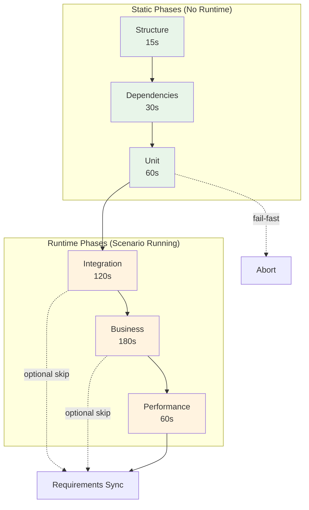

# Phase Catalog Reference

## Overview

Test Genie uses a phased testing architecture where tests are organized into progressive phases. Each phase has specific responsibilities, timeouts, and dependencies.

The Go orchestrator exposes the phase catalog via `GET /api/v1/phases`.

## Phase Definitions

### 1. Structure Phase

**ID**: `structure`
**Timeout**: 15 seconds
**Optional**: No
**Requires Runtime**: No

Validates scenario file structure and configuration.

**Checks:**
- Required files exist (README.md, PRD.md, service.json)
- `.vrooli/service.json` is valid JSON with required fields
- Test directory structure is correct
- Configuration files are properly formatted

**Exit Codes:**
| Code | Meaning |
|------|---------|
| 0 | All structure checks pass |
| 1 | Missing or invalid files |

---

### 2. Dependencies Phase

**ID**: `dependencies`
**Timeout**: 30 seconds
**Optional**: No
**Requires Runtime**: No

Verifies all dependencies are available.

**Checks:**
- Language runtimes (Go, Node.js, Python)
- Required CLI tools
- Resource availability
- Package dependencies installed

**Exit Codes:**
| Code | Meaning |
|------|---------|
| 0 | All dependencies available |
| 1 | Missing dependencies |

---

### 3. Unit Phase

**ID**: `unit`
**Timeout**: 60 seconds
**Optional**: No
**Requires Runtime**: No

Executes unit tests for all languages.

**Runners:**
| Language | Command | Coverage |
|----------|---------|----------|
| Go | `go test ./...` | Required |
| Node.js | `npm test` / `pnpm test` | Required |
| Python | `pytest` | Optional |

**Coverage Thresholds:**
- Warning: < 80%
- Error: < 70%

**Exit Codes:**
| Code | Meaning |
|------|---------|
| 0 | All tests pass, coverage met |
| 1 | Test failures or coverage below error threshold |

---

### 4. Integration Phase

**ID**: `integration`
**Timeout**: 120 seconds
**Optional**: Yes (when runtime not available)
**Requires Runtime**: Yes

Tests component interactions with running scenario.

**Checks:**
- API endpoint health
- UI accessibility
- CLI functionality
- Inter-component communication

**Exit Codes:**
| Code | Meaning |
|------|---------|
| 0 | All integration tests pass |
| 1 | Integration failures |
| 2 | Skipped (runtime not available) |

---

### 5. Business Phase

**ID**: `business`
**Timeout**: 180 seconds
**Optional**: Yes (when runtime not available)
**Requires Runtime**: Yes

Validates business logic and end-to-end workflows.

**Checks:**
- User journey workflows
- Business rule validation
- Data integrity
- Cross-component workflows

**Exit Codes:**
| Code | Meaning |
|------|---------|
| 0 | All business tests pass |
| 1 | Business logic failures |
| 2 | Skipped |

---

### 6. Performance Phase

**ID**: `performance`
**Timeout**: 60 seconds
**Optional**: Yes
**Requires Runtime**: Yes

Measures performance baselines and benchmarks.

**Checks:**
- Response time benchmarks
- Build time validation
- Resource usage
- Throughput testing

**Metrics Collected:**
- API response times (p50, p95, p99)
- Build duration
- Memory usage
- CPU utilization

**Exit Codes:**
| Code | Meaning |
|------|---------|
| 0 | Performance within thresholds |
| 1 | Performance regression detected |
| 2 | Skipped |

---

## Phase Flow



## Phase API Response

```json
GET /api/v1/phases

{
  "phases": [
    {
      "id": "structure",
      "name": "Structure Validation",
      "description": "Validates scenario file structure and configuration",
      "timeout": 15,
      "optional": false,
      "requiresRuntime": false,
      "order": 1
    },
    {
      "id": "dependencies",
      "name": "Dependency Check",
      "description": "Verifies all dependencies are available",
      "timeout": 30,
      "optional": false,
      "requiresRuntime": false,
      "order": 2
    }
    // ... more phases
  ]
}
```

## Configuration Override

Override phase settings in `.vrooli/testing.json`:

```json
{
  "phases": {
    "unit": {
      "timeout": 120,
      "coverageWarn": 85,
      "coverageError": 75
    },
    "performance": {
      "enabled": false
    }
  }
}
```

## See Also

- [Presets](presets.md) - Phase bundles
- [Phased Testing](../guides/phased-testing.md) - Understanding phases
- [Performance Testing](../guides/performance-testing.md) - Detailed performance phase guide
- [Custom Presets](../guides/custom-presets.md) - Creating custom presets
- [Architecture](../concepts/architecture.md) - Go orchestrator design
