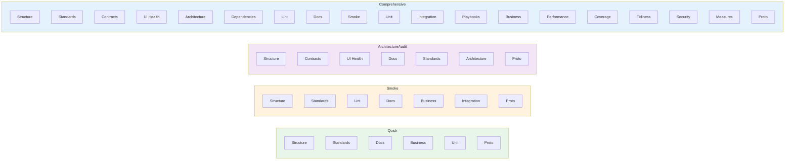

# Test Presets Reference

## Overview

Test Genie provides preconfigured presets that bundle common testing patterns. Presets make it easy to run the right tests for your situation without remembering individual phase configurations.

Timeout values in this document are runtime budgets, not runtime estimates. Actual `test-genie execute` estimates are calculated at execution time from recent per-phase history for the selected scenario when that data exists.

## Available Presets

### Quick

**Purpose**: Fast sanity check during development

```bash
test-genie execute my-scenario --preset quick
```

**Phases included:**
| Phase | Description | Timeout |
|-------|-------------|---------|
| Structure | Validates files and config | 15s |
| Standards | scenario-auditor standards rules | 60s |
| Docs | Validates Markdown, mermaid, links | 60s |
| Business | Validates requirements registry health | 180s |
| Unit | Runs unit tests | 60s |
| Proto | Validates Protocol Buffer contract health | 120s |

**Timeout budget**: Sum of the listed phase timeouts

**Use when:**
- Making quick code changes
- Running in pre-commit hooks
- Need fast feedback

**Skips:**
- Integration tests (requires running scenario)
- Performance tests
- Runtime-heavy validation

---

### Smoke

**Purpose**: Verify core functionality works

```bash
test-genie execute my-scenario --preset smoke
```

**Phases included:**
| Phase | Description | Timeout |
|-------|-------------|---------|
| Structure | Validates files and config | 15s |
| Standards | scenario-auditor standards rules | 60s |
| Lint | Type checking and linting | 30s |
| Docs | Validates Markdown, mermaid, links | 60s |
| Business | Validates requirements registry health | 180s |
| Integration | Basic connectivity tests | 120s |
| Proto | Validates Protocol Buffer contract health | 120s |

**Timeout budget**: Sum of the listed phase timeouts

**Use when:**
- Before pushing to remote
- After dependency updates
- Quick integration verification

**Skips:**
- Full business logic tests
- Performance benchmarks

---

### Architecture Audit

**Purpose**: Validate surface conformance and architectural shape

```bash
test-genie execute my-scenario --preset architecture-audit
```

**Phases included:**
| Phase | Description | Timeout |
|-------|-------------|---------|
| Structure | Validates files and config | 15s |
| Contracts | Validates CLI manifest bindings via cli-health | 60s |
| UI Health | Validates UI manifest bindings via ui-health | 60s |
| Docs | Validates Markdown, mermaid, links | 60s |
| Standards | scenario-auditor standards rules | 60s |
| Architecture | Audits structural cohesion | 120s |
| Proto | Validates Protocol Buffer contract health | 120s |

**Timeout budget**: Sum of the listed phase timeouts

**Use when:**
- Auditing a scenario's public surfaces
- Checking architectural conformance without runtime-heavy phases
- Running screaming-architecture or proto-contract review loops

---

### Comprehensive

**Purpose**: Full validation before release

```bash
test-genie execute my-scenario --preset comprehensive
```

**Phases included:**
| Phase | Description | Timeout |
|-------|-------------|---------|
| Structure | Validates files and config | 15s |
| Contracts | Validates CLI manifest bindings via cli-health | 60s |
| UI Health | Validates UI manifest bindings via ui-health | 60s |
| Standards | scenario-auditor standards rules | 60s |
| Architecture | Audits structural cohesion | 120s |
| Dependencies | Checks resources available | 30s |
| Lint | Type checking and linting | 30s |
| Docs | Validates Markdown, mermaid, links | 60s |
| Smoke | UI handshake / iframe-bridge | 90s |
| Unit | Runs unit tests | 60s |
| Integration | Full API/UI testing | 120s |
| Playbooks | BAS browser automation | 120s |
| Business | End-to-end workflows | 180s |
| Performance | Benchmarks and load tests | 60s |
| Coverage | Parses coverage artifacts | 30s |
| Tidiness | Delegates file/function quality checks | 120s |
| Security | Delegates security posture validation | 180s |
| Measures | Delegates measures coverage validation | 180s |
| Proto | Validates Protocol Buffer contract health | 120s |

**Timeout budget**: Sum of the listed phase timeouts

**Use when:**
- Before merging PRs
- Pre-deployment validation
- Full test coverage needed

**Includes everything.**

---

## Preset Comparison


```mermaid
graph LR
    subgraph Quick
        Q1[Structure]
        Q2[Standards]
        Q3[Docs]
        Q4[Business]
        Q5[Unit]
        Q6[Proto]
    end

    subgraph Smoke
        S1[Structure]
        S2[Standards]
        S3[Lint]
        S4[Docs]
        S5[Business]
        S6[Integration]
        S7[Proto]
    end

    subgraph ArchitectureAudit
        A1[Structure]
        A2[Contracts]
        A3[UI Health]
        A4[Docs]
        A5[Standards]
        A6[Architecture]
        A7[Proto]
    end

    subgraph Comprehensive
        C1[Structure]
        C2[Standards]
        C3[Contracts]
        C4[UI Health]
        C5[Architecture]
        C6[Dependencies]
        C7[Lint]
        C8[Docs]
        C9[Smoke]
        C10[Unit]
        C11[Integration]
        C12[Playbooks]
        C13[Business]
        C14[Performance]
        C15[Coverage]
        C16[Tidiness]
        C17[Security]
        C18[Measures]
        C19[Proto]
    end

    style Quick fill:#e8f5e9
    style Smoke fill:#fff3e0
    style ArchitectureAudit fill:#f3e5f5
    style Comprehensive fill:#e3f2fd
```

| Feature | Quick | Smoke | Architecture Audit | Comprehensive |
|---------|-------|-------|--------------------|---------------|
| Structure validation | ✅ | ✅ | ✅ | ✅ |
| Standards enforcement | ✅ | ✅ | ✅ | ✅ |
| Contract surface audit | ❌ | ❌ | ✅ | ✅ |
| Dependency check | ❌ | ❌ | ❌ | ✅ |
| Unit tests | ✅ | ❌ | ❌ | ✅ |
| Integration tests | ❌ | ✅ | ❌ | ✅ |
| Business registry validation | ✅ | ✅ | ❌ | ✅ |
| Proto contract validation | ✅ | ✅ | ✅ | ✅ |
| Performance | ❌ | ❌ | ❌ | ✅ |
| Requirements sync | ❌ | ❌ | ❌ | ✅ |
| **Planner estimate** | Scenario-aware at runtime | Scenario-aware at runtime | Scenario-aware at runtime | Scenario-aware at runtime |

## Custom Presets

Define custom presets in `.vrooli/testing.json`:

```json
{
  "presets": {
    "ci-fast": {
      "phases": ["structure", "unit"],
      "timeout": 120,
      "failFast": true
    },
    "nightly": {
      "phases": ["structure", "dependencies", "unit", "integration", "business", "performance"],
      "timeout": 3600,
      "failFast": false,
      "syncRequirements": true
    }
  }
}
```

Use custom presets:
```bash
test-genie execute my-scenario --preset ci-fast
```

## Phase Configuration

### Override Phase Timeouts

```json
{
  "phases": {
    "unit": {
      "timeout": 120,
      "enabled": true
    },
    "performance": {
      "timeout": 300,
      "enabled": false
    }
  }
}
```

### Skip Phases

```bash
# Skip specific phases
test-genie execute my-scenario --preset comprehensive --skip performance
test-genie execute my-scenario --preset comprehensive --skip standards

# Or in config
{
  "phases": {
    "performance": {
      "enabled": false
    }
  }
}
```

## See Also

- [Custom Presets Guide](../guides/custom-presets.md) - Step-by-step guide to creating custom presets
- [Phases Overview](../phases/README.md) - Detailed phase definitions
- [Phased Testing](../guides/phased-testing.md) - Understanding phases
- [CLI Commands](cli-commands.md) - CLI reference
