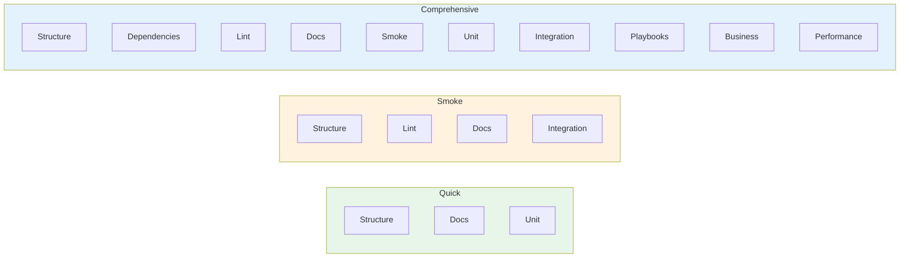

# Test Presets Reference

## Overview

Test Genie provides preconfigured presets that bundle common testing patterns. Presets make it easy to run the right tests for your situation without remembering individual phase configurations.

## Available Presets

### Quick

**Purpose**: Fast sanity check during development

```bash
test-genie execute my-scenario --preset quick
```

**Phases included:**
| Phase | Description | Timeout |
|-------|-------------|---------|
| Structure | Validates files and config | 15s |
| Docs | Validates Markdown, mermaid, links | 60s |
| Unit | Runs unit tests | 60s |

**Total time**: ~2 minutes

**Use when:**
- Making quick code changes
- Running in pre-commit hooks
- Need fast feedback

**Skips:**
- Integration tests (requires running scenario)
- Performance tests
- Business logic tests

---

### Smoke

**Purpose**: Verify core functionality works

```bash
test-genie execute my-scenario --preset smoke
```

**Phases included:**
| Phase | Description | Timeout |
|-------|-------------|---------|
| Structure | Validates files and config | 15s |
| Lint | Type checking and linting | 30s |
| Docs | Validates Markdown, mermaid, links | 60s |
| Integration | Basic connectivity tests | 120s |

**Total time**: ~4-5 minutes

**Use when:**
- Before pushing to remote
- After dependency updates
- Quick integration verification

**Skips:**
- Full business logic tests
- Performance benchmarks

---

### Comprehensive

**Purpose**: Full validation before release

```bash
test-genie execute my-scenario --preset comprehensive
```

**Phases included:**
| Phase | Description | Timeout |
|-------|-------------|---------|
| Structure | Validates files and config | 15s |
| Dependencies | Checks resources available | 30s |
| Lint | Type checking and linting | 30s |
| Docs | Validates Markdown, mermaid, links | 60s |
| Smoke | UI handshake / iframe-bridge | 90s |
| Unit | Runs unit tests | 60s |
| Integration | Full API/UI testing | 120s |
| Playbooks | BAS browser automation | 120s |
| Business | End-to-end workflows | 180s |
| Performance | Benchmarks and load tests | 60s |

**Total time**: ~10+ minutes

**Use when:**
- Before merging PRs
- Pre-deployment validation
- Full test coverage needed

**Includes everything.**

---

## Preset Comparison



| Feature | Quick | Smoke | Comprehensive |
|---------|-------|-------|---------------|
| Structure validation | ✅ | ✅ | ✅ |
| Dependency check | ❌ | ✅ | ✅ |
| Unit tests | ✅ | ✅ | ✅ |
| Integration tests | ❌ | ✅ | ✅ |
| Business logic | ❌ | ❌ | ✅ |
| Performance | ❌ | ❌ | ✅ |
| Requirements sync | ❌ | ❌ | ✅ |
| **Typical time** | ~1 min | ~4 min | ~8 min |

## Custom Presets

Define custom presets in `.vrooli/testing.json`:

```json
{
  "presets": {
    "ci-fast": {
      "phases": ["structure", "unit"],
      "timeout": 120,
      "failFast": true
    },
    "nightly": {
      "phases": ["structure", "dependencies", "unit", "integration", "business", "performance"],
      "timeout": 3600,
      "failFast": false,
      "syncRequirements": true
    }
  }
}
```

Use custom presets:
```bash
test-genie execute my-scenario --preset ci-fast
```

## Phase Configuration

### Override Phase Timeouts

```json
{
  "phases": {
    "unit": {
      "timeout": 120,
      "enabled": true
    },
    "performance": {
      "timeout": 300,
      "enabled": false
    }
  }
}
```

### Skip Phases

```bash
# Skip specific phases
test-genie execute my-scenario --preset comprehensive --skip-phase performance

# Or in config
{
  "phases": {
    "performance": {
      "enabled": false
    }
  }
}
```

## See Also

- [Custom Presets Guide](../guides/custom-presets.md) - Step-by-step guide to creating custom presets
- [Phases Overview](../phases/README.md) - Detailed phase definitions
- [Phased Testing](../guides/phased-testing.md) - Understanding phases
- [CLI Commands](cli-commands.md) - CLI reference
