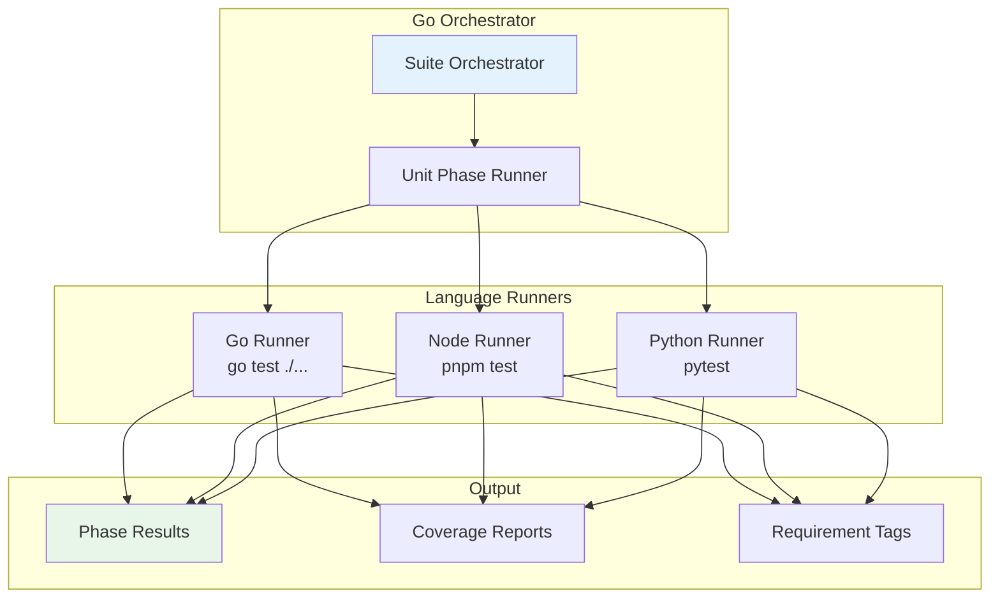

# Test Runners Reference

This document provides a complete reference for test runners in Vrooli's testing architecture.

## Overview

Test Genie's Go orchestrator handles test execution through language-specific runners. Each runner knows how to detect, execute, and report results for its target language.



## Language Detection

Test Genie automatically detects which languages are present in a scenario:

| Language | Detection | Directory |
|----------|-----------|-----------|
| Go | `go.mod` exists | `api/` |
| Node.js | `package.json` exists | `ui/` |
| Python | `pytest.ini` or `test_*.py` | `scripts/` or root |

## Go Test Runner

### Detection

```
api/
├── go.mod          # Triggers Go runner
├── main.go
└── main_test.go    # Test files (*_test.go)
```

### Execution

```bash
# What test-genie executes internally
cd api/
go test -v -coverprofile=coverage.out ./...
```

### Coverage

Coverage is calculated from `coverage.out`:

```bash
go tool cover -func=coverage.out | grep total
# total:    (statements)    79.4%
```

### Requirement Tag Extraction

Tags are extracted from test names and comments:

```go
func TestCreateProject(t *testing.T) {
    t.Run("creates project with valid data [REQ:MY-PROJECT-CREATE]", func(t *testing.T) {
        // Test implementation
    })
}
```

### Options (via `.vrooli/testing.json`)

```json
{
  "phases": {
    "unit": {
      "go": {
        "timeout": "60s",
        "race": true,
        "coverageWarn": 80,
        "coverageError": 70,
        "packages": ["./..."]
      }
    }
  }
}
```

| Option | Default | Description |
|--------|---------|-------------|
| `timeout` | `60s` | Per-test timeout |
| `race` | `false` | Enable race detection |
| `coverageWarn` | `80` | Warning threshold (%) |
| `coverageError` | `70` | Error threshold (%) |
| `packages` | `["./..."]` | Packages to test |

## Node.js Test Runner

### Detection

```
ui/
├── package.json    # Triggers Node runner
├── vite.config.ts  # Framework detection
└── src/
    └── App.test.tsx
```

### Framework Detection

| File | Framework | Command |
|------|-----------|---------|
| `vitest.config.*` | Vitest | `pnpm test` |
| `jest.config.*` | Jest | `pnpm test` |
| `package.json` scripts | Auto | `pnpm test` |

### Execution

```bash
# What test-genie executes internally
cd ui/
pnpm test --run --coverage
```

### Requirement Tag Extraction

For Vitest, use `@vrooli/vitest-requirement-reporter`:

```typescript
// vite.config.ts
import RequirementReporter from '@vrooli/vitest-requirement-reporter';

export default defineConfig({
  test: {
    reporters: [
      'default',
      new RequirementReporter({
        outputFile: 'coverage/vitest-requirements.json',
        emitStdout: true,
      }),
    ],
  },
});
```

Tags in test names:

```typescript
describe('projectStore [REQ:MY-PROJECT-CRUD]', () => {
  it('creates project', () => { /* ... */ });
  it('updates project', () => { /* ... */ });
});
```

### Options (via `.vrooli/testing.json`)

```json
{
  "phases": {
    "unit": {
      "node": {
        "timeout": 60000,
        "coverage": true,
        "coverageWarn": 80,
        "coverageError": 70,
        "framework": "auto"
      }
    }
  }
}
```

| Option | Default | Description |
|--------|---------|-------------|
| `timeout` | `60000` | Timeout in milliseconds |
| `coverage` | `true` | Enable coverage |
| `coverageWarn` | `80` | Warning threshold (%) |
| `coverageError` | `70` | Error threshold (%) |
| `framework` | `auto` | `vitest`, `jest`, or `auto` |

## Python Test Runner

### Detection

```
scripts/
├── pytest.ini      # Triggers Python runner
├── conftest.py
└── test_*.py       # Test files
```

Or:
```
api/
├── pyproject.toml  # With pytest config
└── tests/
    └── test_*.py
```

### Execution

```bash
# What test-genie executes internally
pytest -v --cov=src --cov-report=term-missing
```

### Requirement Tag Extraction

Use pytest markers:

```python
import pytest

@pytest.mark.requirement("MY-PROJECT-CREATE")
def test_create_project():
    # Test implementation
    pass

class TestProjectCRUD:
    """[REQ:MY-PROJECT-CRUD]"""

    def test_create(self):
        pass

    def test_update(self):
        pass
```

### Options (via `.vrooli/testing.json`)

```json
{
  "phases": {
    "unit": {
      "python": {
        "timeout": 60,
        "coverage": true,
        "coverageWarn": 80,
        "coverageError": 70,
        "markers": "not slow"
      }
    }
  }
}
```

| Option | Default | Description |
|--------|---------|-------------|
| `timeout` | `60` | Timeout in seconds |
| `coverage` | `true` | Enable coverage |
| `coverageWarn` | `80` | Warning threshold (%) |
| `coverageError` | `70` | Error threshold (%) |
| `markers` | `""` | Pytest markers filter |

## Coverage Thresholds

All runners share coverage threshold semantics:

| Level | Default | Behavior |
|-------|---------|----------|
| **Pass** | ≥80% | Test phase passes |
| **Warning** | 70-80% | Phase passes with warning |
| **Error** | <70% | Phase fails |

Configure per-scenario in `.vrooli/testing.json`:

```json
{
  "phases": {
    "unit": {
      "coverageWarn": 85,
      "coverageError": 75
    }
  }
}
```

## Running Tests

### Via Test Genie CLI

```bash
# Run all unit tests (quick preset)
test-genie execute my-scenario --preset quick

# Run comprehensive tests
test-genie execute my-scenario --preset comprehensive

# Run with verbose output
test-genie execute my-scenario --preset quick --verbose

# Stop on first failure
test-genie execute my-scenario --preset comprehensive --fail-fast
```

### Via Makefile

```bash
cd scenarios/my-scenario
make test
```

### Via REST API

```bash
API_PORT=$(vrooli scenario port test-genie API_PORT)

# Synchronous execution (blocks until complete)
curl -X POST "http://localhost:${API_PORT}/api/v1/test-suite/my-scenario/execute-sync" \
  -H "Content-Type: application/json" \
  -d '{"preset": "comprehensive"}'
```

## Phase Results

Results are returned in a structured format:

```json
{
  "phase": "unit",
  "status": "passed",
  "duration": 45.2,
  "languages": {
    "go": {
      "tests": 42,
      "passed": 42,
      "failed": 0,
      "coverage": 79.4
    },
    "node": {
      "tests": 18,
      "passed": 18,
      "failed": 0,
      "coverage": 82.1
    }
  },
  "requirements": [
    {"id": "MY-PROJECT-CREATE", "status": "implemented"},
    {"id": "MY-PROJECT-UPDATE", "status": "implemented"}
  ]
}
```

## Example Output

```
=== Running Comprehensive Tests for my-scenario ===

[Phase 1/6] Structure Validation...
✅ All required files present (3.2s)

[Phase 2/6] Dependency Checks...
✅ All dependencies available (12.5s)

[Phase 3/6] Unit Tests...
Go: 42 tests, 79.4% coverage ✅
Node: 18 tests, 82.1% coverage ✅
✅ Unit tests passed (45.3s)

[Phase 4/6] Integration Tests...
API: ✅ Healthy
UI: ✅ Accessible
CLI: ✅ Functional
✅ Integration tests passed (89.7s)

[Phase 5/6] Business Logic Tests...
✅ Core workflows validated (132.1s)

[Phase 6/6] Performance Tests...
✅ Performance within thresholds (41.8s)

=== All Tests Passed! ===
Total time: 5m 24s
Coverage: 80.2%
```

## CLI Test Runners (BATS)

For CLI testing with BATS framework:

```bash
bats test/cli/*.bats [options]
```

**Options:**
- `--tap` - TAP output format
- `--filter PATTERN` - Run tests matching pattern
- `--jobs N` - Parallel execution
- `-v` - Verbose output

**Example:**
```bash
# Run all CLI tests
bats test/cli/*.bats

# Run with TAP output for CI
bats --tap test/cli/*.bats

# Run specific test
bats test/cli/my-cli.bats --filter "shows version"
```

See [CLI Testing Guide](../guides/cli-testing.md) for writing BATS tests.

## CI/CD Integration

### GitHub Actions

```yaml
name: Test
on: [push, pull_request]

jobs:
  test:
    runs-on: ubuntu-latest
    steps:
      - uses: actions/checkout@v4

      - name: Setup
        run: |
          vrooli setup --yes
          vrooli scenario start test-genie

      - name: Run Tests
        run: |
          test-genie execute my-scenario --preset comprehensive --fail-fast
```

### GitLab CI

```yaml
test:
  script:
    - vrooli setup --yes
    - vrooli scenario start test-genie
    - test-genie execute my-scenario --preset comprehensive --fail-fast
```

## Environment Variables

Test runners respect these environment variables:

| Variable | Description | Default |
|----------|-------------|---------|
| `TEST_VERBOSE` | Enable verbose output | `false` |
| `TEST_TIMEOUT` | Global timeout override | varies |
| `TEST_GENIE_API_URL` | API endpoint | `http://localhost:8200` |

## Troubleshooting

### Go Tests Not Found

**Symptom**: `no test files`

**Check**:
1. Test files end with `_test.go`
2. `go.mod` exists in `api/`
3. Package has testable functions

### Node Tests Timeout

**Symptom**: Tests hang or timeout

**Check**:
1. No infinite loops in tests
2. Async operations properly awaited
3. Increase timeout in `.vrooli/testing.json`

### Python Import Errors

**Symptom**: `ModuleNotFoundError`

**Check**:
1. Virtual environment activated
2. Dependencies installed (`pip install -e .`)
3. `conftest.py` sets up path correctly

### Coverage Below Threshold

**Symptom**: Phase fails with coverage error

**Solutions**:
1. Add more unit tests
2. Lower threshold temporarily in `.vrooli/testing.json`
3. Exclude generated code from coverage

## See Also

- [Phased Testing](../guides/phased-testing.md) - Testing architecture overview
- [Scenario Unit Testing](../guides/scenario-unit-testing.md) - Writing unit tests
- [CLI Testing](../guides/cli-testing.md) - BATS testing guide
- [Phase Catalog](phase-catalog.md) - Phase definitions
- [Presets](presets.md) - Preset configurations
