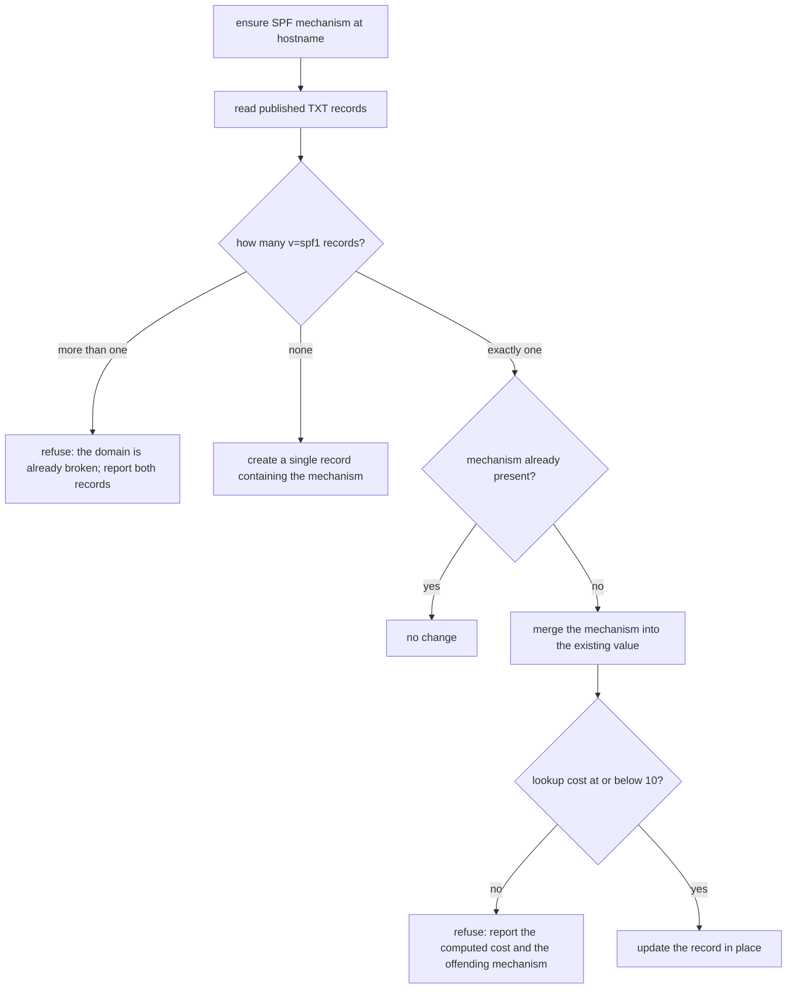

# Managed DNS Records

How this scenario writes DNS records on behalf of other scenarios, which record
types it supports, and the rules that keep a write from taking a domain offline.

Related: `concepts/DOMAINS.md` for the ingress/tunnel model,
`scenarios/scenario-to-cloud/docs/guides/dns-setup.md` for how a deployment
consumes this capability, and
`scenarios/landing-page-business-suite/docs/reference/EMAIL_DELIVERY.md` for the
mail records that motivated TXT and MX support.

> **Status.** This document describes the intended capability. Sections marked
> *Current gap* are not yet implemented and are tracked by the plan
> `mature-email-delivery-durable-configuration-provider-ladder`.

---

## Why this scenario owns DNS writes

`tunnel-manager` holds the Cloudflare API token (`vrooli/tunnel-manager ·
cloudflare-api-token`, scopes `Zone:Read` and `Zone:DNS:Edit`) and is the only
component that may use it.

> **Which zones that token covers is not recorded anywhere in the repository.**
> The DNS ownership ledger reflects only what this scenario has written, and its
> current contents are confined to one domain. Before relying on a write against
> any other zone, list the zones the token can read and confirm the target is
> among them. Do not infer zone access from the token being present.

That concentration is deliberate. A token that can edit DNS can also take a
whole domain offline, so it belongs in one place, on a machine an operator
controls, not in a deployed workload on a rented host. Deployed scenarios that
need DNS *verified* do so read-only, through public DNS, with no credential at
all.

The CLI deliberately exposes no DNS command. Deployment DNS is owned by
`scenario-to-cloud` and invoked through its typed client
(`scenarios/scenario-to-cloud/api/manageddns/client.go`); a second operator
surface for the same effect would make ownership ambiguous.

---

## The capability

One Connect RPC: `ConfigService.EnsureDNSRecord`.

| Field | Meaning |
| --- | --- |
| `provider_profile` | Which DNS provider profile to act through. Required. |
| `hostname` | Fully qualified record name. |
| `type` | Record type. See supported types below. |
| `content` | Record value. |
| `ttl` | 0–86400. |
| `proxied` | Cloudflare proxy flag. Valid only for A, AAAA and CNAME. |
| `owner` | Ownership tag recorded in the ledger, so a record can be attributed later. |
| `dry_run` | Compute and report the change without applying it. |

`dry_run` is the primary safety mechanism. Every caller should use it first and
show the operator the diff before applying.

### Supported record types

| Type | Supported | Notes |
| --- | --- | --- |
| A, AAAA | yes | May be proxied |
| CNAME | yes | May be proxied; also the tunnel ingress path |
| TXT | *Current gap* | Needed for SPF, DKIM and DMARC |
| MX | *Current gap* | Needed for inbound mail routing |

Validation runs twice — once in the service before dispatch and once in the
client — so an unsupported type is rejected at both layers.

### Operations

| Operation | State |
| --- | --- |
| Create when absent | Implemented |
| Delete | Implemented |
| Read for idempotency | Implemented, internal to the write path only |
| **Update in place** | *Current gap* — there is no update operation at all |

The absence of an update operation is not a detail. It is what makes SPF support
a new capability rather than a flag, because SPF cannot be changed by
delete-then-create.

---

## Ownership model: additive, never clobbering

An existing record is left untouched and reported as pre-existing. This scenario
never overwrites a record it did not create, and the ledger records only records
it wrote.

**For CNAME and A records this rule is exactly right. For SPF it is dangerous.**

A domain may publish exactly one SPF record. If the additive rule sees no record
matching what it wants and adds a second `v=spf1` TXT record, SPF stops
evaluating entirely — and on a domain publishing `p=reject`, every message from
that domain is then refused. Not spam-foldered. Refused.

So TXT support cannot be a copy of the CNAME path.

---

## SPF merge semantics

When a caller asks for an SPF mechanism to exist at a hostname:

Rules this encodes:

1. **Never create a second `v=spf1` record.** Refuse and report instead.
2. **Never delete before writing.** The gap between delete and create is a total
   mail outage. Use the update operation.
3. **Count lookups before writing**, including nested includes, and refuse a
   write that would exceed ten. Report the computed cost so the operator can see
   which mechanism is expensive. For reference: Amazon SES costs 1, SMTP2GO 1,
   SendGrid 2, Mailgun 3.
4. **Fail closed.** A refusal leaves DNS exactly as it was. A partial write is
   never acceptable.

DKIM and DMARC are ordinary additive records and do not need merge semantics.
DKIM selectors are separate owner names and coexist freely; DMARC is a single
record at `_dmarc.<domain>` that must be replaced in place rather than
duplicated.

---

## Failure behaviour

**A missing credential is an error, not a skip.** If the Cloudflare token or the
tunnel identifier cannot be resolved, the DNS client must report that condition
explicitly. Silently disabling DNS automation makes a broken configuration look
like a completed one, which is the same failure family that hid a production
mail outage for hours.

*Current gap.* The client is left nil and DNS automation is skipped without
complaint when credentials do not resolve.

Other failures:

| Condition | Behaviour |
| --- | --- |
| Zone not found for the hostname | Error naming the apex that was looked up |
| Record exists with different content | Reported as a conflict; not overwritten, except through the explicit update operation |
| Provider API rejects the write | Error carrying the provider's own message, with no credential in it |
| Lookup budget would be exceeded | Refusal carrying the computed cost; no write attempted |

No error message, log line, or response may contain a credential value.

---

## Calling this capability safely

1. Compute the desired records from a declared source, not by hand.
2. Call with `dry_run: true` and render the diff.
3. Have an operator review and approve it. Mail records especially: a wrong SPF
   record is an immediate, total, domain-wide outage.
4. Apply.
5. Verify through public DNS, not through the provider API — the question is
   what the world can see.

Never apply a DNS change automatically as part of a deployment. Verification
belongs in preflight; mutation belongs in an operator's hands.
