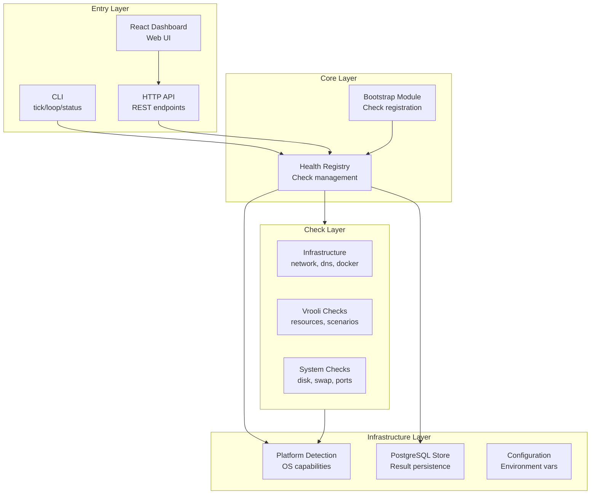

# Architecture

Vrooli Autoheal follows a layered architecture with clear responsibility separation.

## System Overview



## Layer Responsibilities

### Entry Layer

**HTTP API** (`api/main.go`, `api/internal/handlers/`)
- Server lifecycle (startup, graceful shutdown)
- Route registration and middleware
- Request/response JSON serialization
- Lifecycle enforcement (rejects direct execution)

**CLI** (`cli/vrooli-autoheal`)
- User-facing commands (tick, loop, status)
- API port auto-discovery
- Human-readable output formatting

**React Dashboard** (`ui/src/`)
- Real-time status visualization
- Auto-refresh and manual tick control
- Historical trends and events

### Core Layer

**Bootstrap Module** (`api/internal/bootstrap/`)
- Decides which checks get registered
- Provides operational defaults (target hosts, domains)
- Wires platform capabilities to checks

**Health Registry** (`api/internal/checks/`)
- Core types: Status, Result, Check interface
- Registration and execution management
- Platform filtering and interval enforcement

### Check Layer

**Infrastructure Checks** (`api/internal/checks/infra/`)
- Network connectivity (TCP dial)
- DNS resolution (host lookup)
- Docker daemon health
- Cloudflared tunnel status
- RDP/xrdp service status

**Vrooli Checks** (`api/internal/checks/vrooli/`)
- Resource health via `vrooli resource status`
- Scenario health via `vrooli scenario status`

### Infrastructure Layer

**Platform Detection** (`api/internal/platform/`)
- OS detection (linux/windows/macos)
- Capability detection (systemd, Docker, RDP, etc.)
- Cached for performance

**Persistence Store** (`api/internal/persistence/`)
- Health result CRUD operations
- 24-hour retention with cleanup
- Timeline and uptime queries

**Configuration** (`api/internal/config/`)
- Environment variable loading
- Database connection settings

## Key Design Decisions

### 1. Dependency Injection

Platform capabilities are injected into checks, not detected internally:

```go
// Check receives capabilities via constructor
func NewCloudflaredCheck(caps *platform.Capabilities) *CloudflaredCheck {
    return &CloudflaredCheck{caps: caps}
}
```

This makes checks testable with mock capabilities.

### 2. Operational Defaults in Bootstrap

Checks don't embed defaults; bootstrap provides them:

```go
// In bootstrap/checks.go
const DefaultNetworkTarget = "8.8.8.8:53"

func RegisterDefaultChecks(registry *checks.Registry, caps *platform.Capabilities) {
    registry.Register(infra.NewNetworkCheck(DefaultNetworkTarget))
}
```

This centralizes operational configuration.

### 3. CLI-Based Resource Management

Uses `vrooli resource/scenario` CLI commands instead of direct API calls:

```go
// Uses CLI for resource health
cmd := exec.Command("vrooli", "resource", "status", resourceName)
```

The CLI handles authentication, port discovery, and error handling.

## Data Flow

1. **Tick Request** arrives (HTTP POST or CLI command)
2. **Registry.RunAll()** iterates registered checks
3. Each check is **filtered** by platform and interval
4. Eligible checks **execute** and return Results
5. Results are **persisted** to PostgreSQL
6. **Summary** is computed and returned
7. **Dashboard** auto-refreshes to show new state
