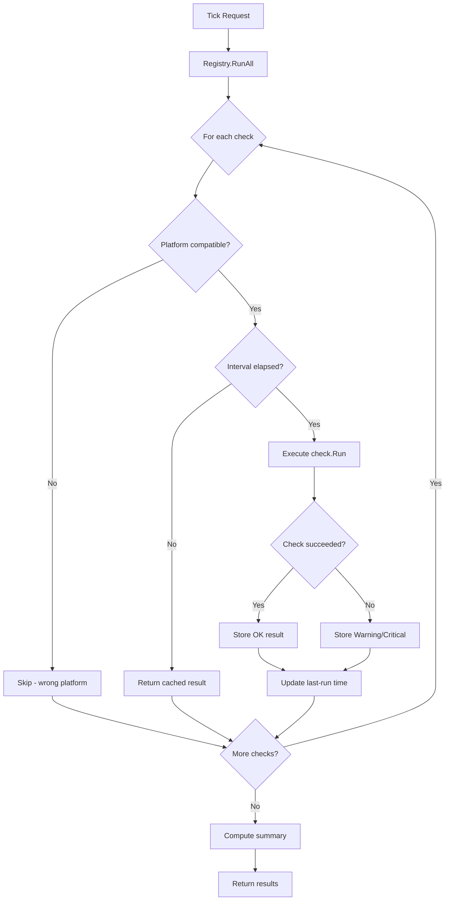
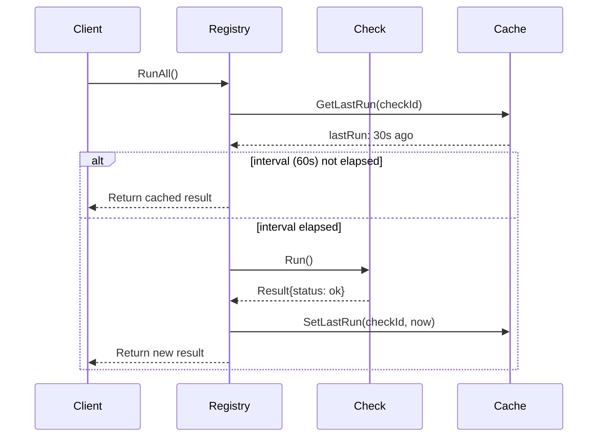
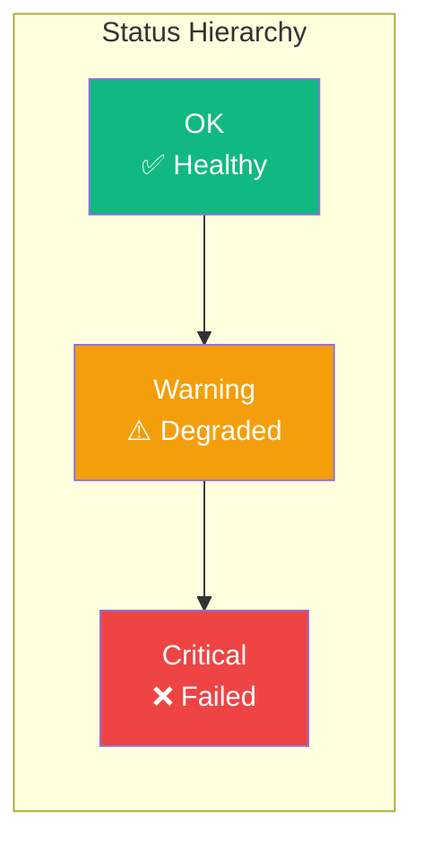
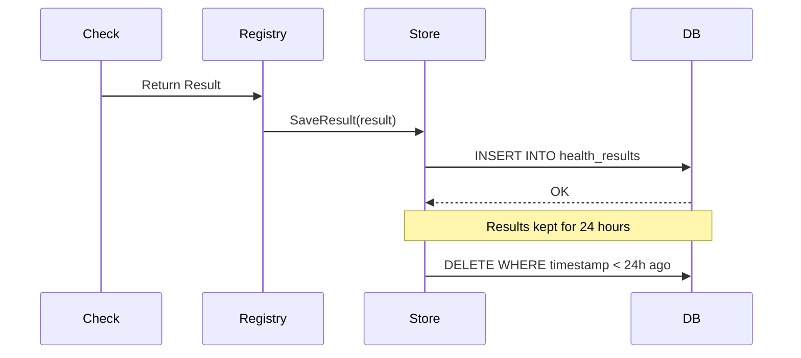

# Health Check Flow

How health checks execute from request to result.

## Tick Execution Flow



## Platform Filtering

Checks specify which platforms they support:

```go
type Check interface {
    ID() string
    Description() string
    IntervalSeconds() int
    Platforms() []platform.Type  // nil = all platforms
    Run(ctx context.Context) Result
}
```

Example: RDP check only runs on platforms that support RDP:

```go
func (c *RDPCheck) Platforms() []platform.Type {
    if c.caps.SupportsRdp {
        return []platform.Type{platform.Linux, platform.Windows}
    }
    return nil // Skip on all platforms if no RDP support
}
```

## Interval Enforcement

Each check has an interval that controls how often it runs:



The `--force` flag bypasses interval checks:

```bash
# Normal: respects intervals
vrooli-autoheal tick

# Force: runs all checks regardless of interval
vrooli-autoheal tick --force
```

## Result Status Levels



**Aggregation Rule**: Overall status is the worst status among all checks.

```go
func AggregateStatus(results []Result) Status {
    worst := StatusOK
    for _, r := range results {
        if r.Status > worst {
            worst = r.Status
        }
    }
    return worst
}
```

## Check Result Structure

Each check returns a Result:

```go
type Result struct {
    CheckID   string                 // "infra-network"
    Status    Status                 // OK, Warning, Critical
    Message   string                 // Human-readable description
    Details   map[string]interface{} // Optional structured data
    Timestamp time.Time              // When the check ran
    Duration  time.Duration          // How long it took
}
```

## Persistence Flow



## Error Handling

Checks should never panic. Errors are reported as Critical status:

```go
func (c *NetworkCheck) Run(ctx context.Context) checks.Result {
    conn, err := net.DialTimeout("tcp", c.target, 5*time.Second)
    if err != nil {
        return checks.Result{
            CheckID: c.ID(),
            Status:  checks.StatusCritical,
            Message: fmt.Sprintf("Network unreachable: %v", err),
        }
    }
    conn.Close()
    return checks.Result{
        CheckID: c.ID(),
        Status:  checks.StatusOK,
        Message: "Network connectivity OK",
    }
}
```
