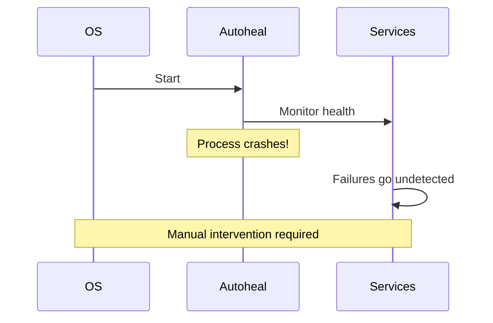
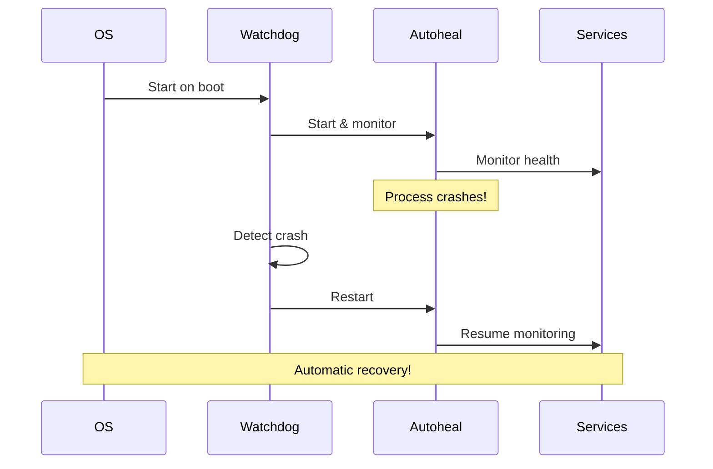
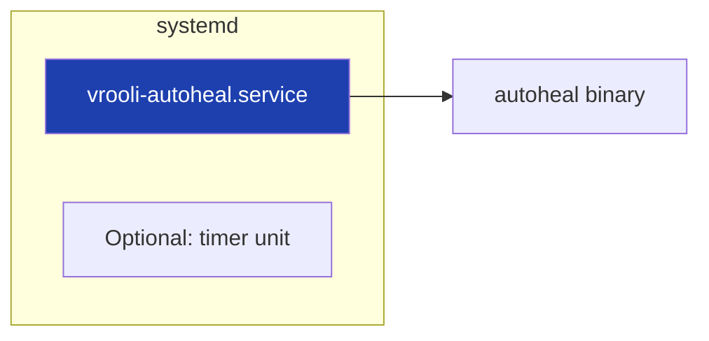
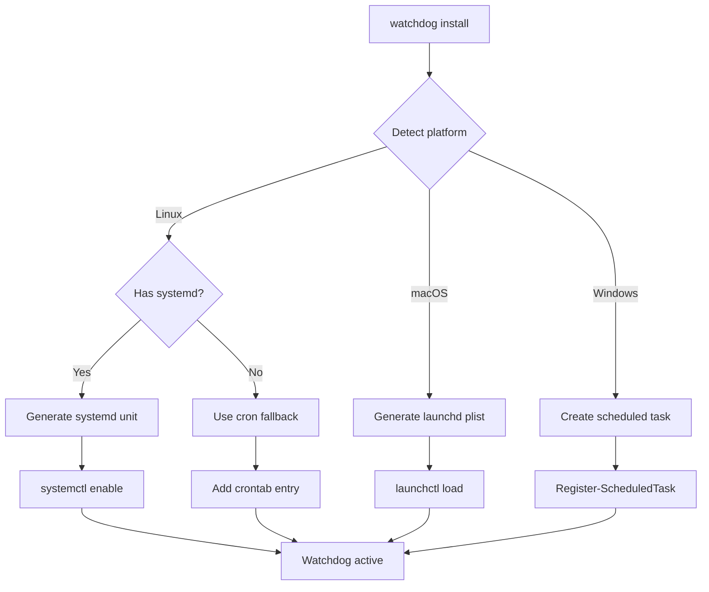
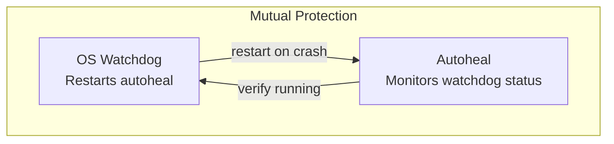

# Watchdog Design

How Autoheal survives crashes and reboots through OS-level watchdog integration.

## The Problem

Without a watchdog:



## The Solution

With OS-level watchdog:



## Platform-Specific Implementations

### Linux (systemd)



Service file (`/etc/systemd/system/vrooli-autoheal.service`):

```ini
[Unit]
Description=Vrooli Autoheal - Self-healing infrastructure supervisor
After=network.target docker.service

[Service]
Type=simple
ExecStart=/usr/local/bin/vrooli-autoheal loop
Restart=always
RestartSec=10
Environment=VROOLI_LIFECYCLE_MANAGED=true

[Install]
WantedBy=multi-user.target
```

### macOS (launchd)

Plist file (`~/Library/LaunchAgents/com.vrooli.autoheal.plist`):

```xml
<?xml version="1.0" encoding="UTF-8"?>
<!DOCTYPE plist PUBLIC "-//Apple//DTD PLIST 1.0//EN" ...>
<plist version="1.0">
<dict>
    <key>Label</key>
    <string>com.vrooli.autoheal</string>
    <key>ProgramArguments</key>
    <array>
        <string>/usr/local/bin/vrooli-autoheal</string>
        <string>loop</string>
    </array>
    <key>KeepAlive</key>
    <true/>
    <key>RunAtLoad</key>
    <true/>
</dict>
</plist>
```

### Windows (Scheduled Task or Service)

Using Windows Task Scheduler:

```powershell
$action = New-ScheduledTaskAction -Execute "vrooli-autoheal.exe" -Argument "loop"
$trigger = New-ScheduledTaskTrigger -AtStartup
$settings = New-ScheduledTaskSettingsSet -RestartCount 3 -RestartInterval (New-TimeSpan -Minutes 1)
Register-ScheduledTask -TaskName "VrooliAutoheal" -Action $action -Trigger $trigger -Settings $settings
```

## Installation Flow



## Verification

Check watchdog status:

```bash
# Linux
systemctl status vrooli-autoheal

# macOS
launchctl list | grep vrooli

# Windows
Get-ScheduledTask -TaskName "VrooliAutoheal"
```

## Self-Protection

The watchdog protects autoheal, but autoheal also monitors the watchdog:



The `watchdog` health check verifies the OS service is properly configured:

```go
func (c *WatchdogCheck) Run(ctx context.Context) checks.Result {
    if !c.isWatchdogInstalled() {
        return checks.Result{
            Status:  checks.StatusWarning,
            Message: "OS watchdog not installed",
        }
    }
    if !c.isWatchdogRunning() {
        return checks.Result{
            Status:  checks.StatusCritical,
            Message: "OS watchdog not running",
        }
    }
    return checks.Result{
        Status:  checks.StatusOK,
        Message: "OS watchdog active",
    }
}
```

## Design Principles

1. **Idempotent Installation**: Running `watchdog install` multiple times is safe
2. **Graceful Degradation**: Works without watchdog (just with reduced resilience)
3. **Platform Abstraction**: Same CLI command, platform-specific implementation
4. **Minimal Privileges**: Only requests elevated access when needed
5. **Visible Status**: Watchdog status shown in dashboard
