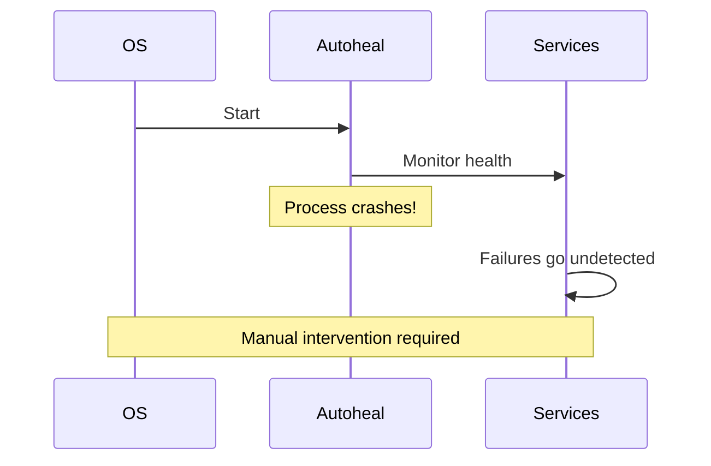
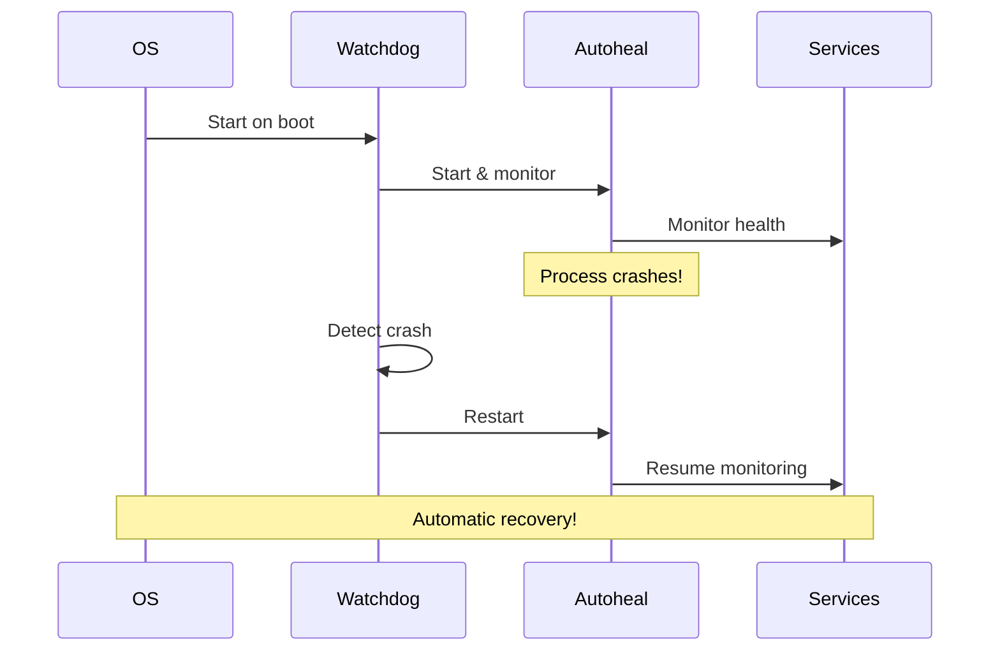
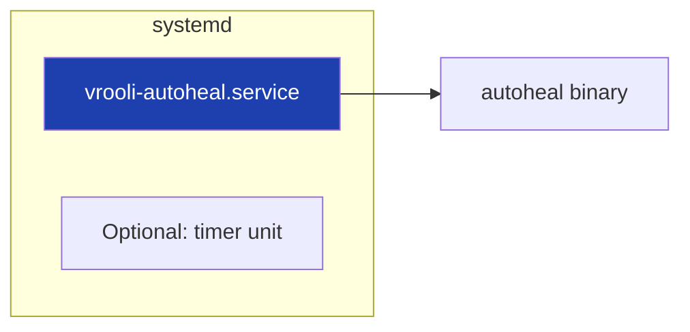
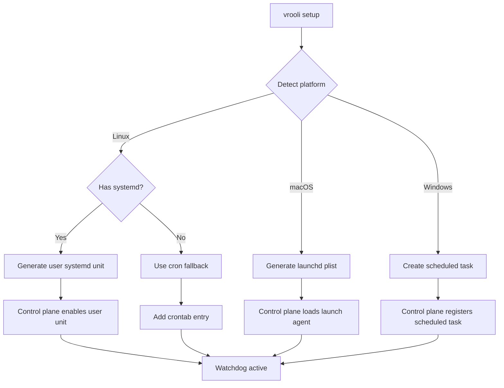
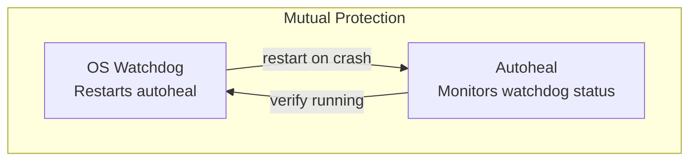

# Watchdog Design

How Autoheal survives crashes and reboots through OS-level watchdog integration.

## The Problem

Without a watchdog:


```mermaid
sequenceDiagram
    participant OS
    participant Autoheal
    participant Services

    OS->>Autoheal: Start
    Autoheal->>Services: Monitor health

    Note over Autoheal: Process crashes!

    Services->>Services: Failures go undetected

    Note over OS,Services: Manual intervention required
```

## The Solution

With OS-level watchdog:


```mermaid
sequenceDiagram
    participant OS
    participant Watchdog
    participant Autoheal
    participant Services

    OS->>Watchdog: Start on boot
    Watchdog->>Autoheal: Start & monitor
    Autoheal->>Services: Monitor health

    Note over Autoheal: Process crashes!

    Watchdog->>Watchdog: Detect crash
    Watchdog->>Autoheal: Restart
    Autoheal->>Services: Resume monitoring

    Note over OS,Services: Automatic recovery!
```

## Platform-Specific Implementations

### Linux (systemd)


```mermaid
graph LR
    subgraph "systemd"
        Service["vrooli-autoheal.service"]
        Timer["Optional: timer unit"]
    end

    Service --> Binary["autoheal binary"]

    style Service fill:#1e40af,color:#fff
```

Service file (`<systemd-service-dir>/vrooli-autoheal.service`):

```ini
[Unit]
Description=Vrooli Autoheal - Self-healing infrastructure supervisor
After=network.target docker.service

[Service]
Type=simple
ExecStart=/usr/local/bin/vrooli-autoheal loop
Restart=always
RestartSec=10
Environment=VROOLI_LIFECYCLE_MANAGED=true

[Install]
WantedBy=multi-user.target
```

### macOS (launchd)

Plist file (`~/Library/LaunchAgents/com.vrooli.autoheal.plist`):

```xml
<?xml version="1.0" encoding="UTF-8"?>
<!DOCTYPE plist PUBLIC "-//Apple//DTD PLIST 1.0//EN" ...>
<plist version="1.0">
<dict>
    <key>Label</key>
    <string>com.vrooli.autoheal</string>
    <key>ProgramArguments</key>
    <array>
        <string>/usr/local/bin/vrooli-autoheal</string>
        <string>loop</string>
    </array>
    <key>KeepAlive</key>
    <true/>
    <key>RunAtLoad</key>
    <true/>
</dict>
</plist>
```

### Windows (Scheduled Task or Service)

Using Windows Task Scheduler:

```powershell
$action = New-ScheduledTaskAction -Execute "vrooli-autoheal.exe" -Argument "loop"
$trigger = New-ScheduledTaskTrigger -AtStartup
$settings = New-ScheduledTaskSettingsSet -RestartCount 3 -RestartInterval (New-TimeSpan -Minutes 1)
Register-ScheduledTask -TaskName "VrooliAutoheal" -Action $action -Trigger $trigger -Settings $settings
```

## Installation Flow

Installation is owned by the project control plane. Operators run `sudo vrooli
setup`; the `autoheal_watchdog` safeguard renders and installs the native
user-scoped scheduler definition, applies the selected boot policy, and
verifies scheduler state. The scenario reports status but does not mutate host
scheduler state.


```mermaid
flowchart TD
    A[vrooli setup] --> B{Detect platform}
    B -->|Linux| C{Has systemd?}
    B -->|macOS| D[Generate launchd plist]
    B -->|Windows| E[Create scheduled task]

    C -->|Yes| F[Generate user systemd unit]
    C -->|No| G[Use cron fallback]

    F --> H[Control plane enables user unit]
    D --> I[Control plane loads launch agent]
    E --> J[Control plane registers scheduled task]
    G --> K[Add crontab entry]

    H --> L[Watchdog active]
    I --> L
    J --> L
    K --> L
```

## Verification

Check watchdog status:

```bash
# Linux
vrooli setup status

# macOS
launchctl list | grep vrooli

# Windows
Get-ScheduledTask -TaskName "VrooliAutoheal"
```

## Operational-history retention

Autoheal treats SQLite history as bounded operational evidence, not an
unlimited log sink. The named tuning constant
`userconfig.DefaultHistoryRetentionHours` is 24 hours. The manifest-owned
retention scheduler enforces that window for both `health_results` and
`action_logs` on startup and every 15 minutes, using bounded delete batches and
SQLite checkpoints. A contract test requires both manifest budgets to remain
aligned with the named constant.

Age is not a disk bound during an incident storm, so every high-volume table
also has a byte ceiling. The declared ceilings are 256 MiB for health results,
64 MiB for action logs, and 128 MiB each for system events, host inventory
snapshots, and incident observations. Their 704 MiB total leaves room for
durable rollups, indexes, WAL, and schema overhead beneath the database's 1 GiB
working-set budget. Durable outage intervals, incidents, and heal trackers are
kept separately from the raw operational ledgers.

Oversized health-result detail payloads and individual action-log text fields
are capped at 64 KiB with an explicit truncation marker. Retention failures are
logged and do not fail the health-check tick; the next scheduled cycle retries
the bounded pass. Autoheal owns liveness checks and their action cooldowns, while the
runtime supervisor remains the sole owner of pressure-epoch scenario recovery.
During a detected, regressed, or quiet-period-gated runtime pressure epoch,
autoheal records the unhealthy result but suppresses restart-class actions. If
the runtime registry cannot be read, it also fails closed for those actions.

`GET /api/v1/status` exposes the SQLite footprint, oldest/newest retained
health-result timestamps. `vrooli-autoheal retention status` reports per-table
row/byte measurements and declared bounds; `retention enforce --compact` is the
offline operator path for an immediate sweep plus physical reclamation. A
failed retention status read is shown as degraded so operators can diagnose
storage pressure before it affects normal health checks.

## Self-Protection

The watchdog protects autoheal, but autoheal also monitors the watchdog:


```mermaid
graph TB
    subgraph "Mutual Protection"
        Watchdog["OS Watchdog<br/>Restarts autoheal"]
        Autoheal["Autoheal<br/>Monitors watchdog status"]
    end

    Watchdog -->|restart on crash| Autoheal
    Autoheal -->|verify running| Watchdog
```

The `watchdog` health check verifies the OS service is properly configured:

```go
func (c *WatchdogCheck) Run(ctx context.Context) checks.Result {
    if !c.isWatchdogInstalled() {
        return checks.Result{
            Status:  checks.StatusWarning,
            Message: "OS watchdog not installed",
        }
    }
    if !c.isWatchdogRunning() {
        return checks.Result{
            Status:  checks.StatusCritical,
            Message: "OS watchdog not running",
        }
    }
    return checks.Result{
        Status:  checks.StatusOK,
        Message: "OS watchdog active",
    }
}
```

## Design Principles

1. **Idempotent Installation**: Re-running `vrooli setup` is safe
2. **Graceful Degradation**: Works without watchdog (just with reduced resilience)
3. **Platform Abstraction**: Project setup uses platform-specific native schedulers
4. **Minimal Privileges**: Only requests elevated access when needed
5. **Visible Status**: Watchdog status shown in dashboard
