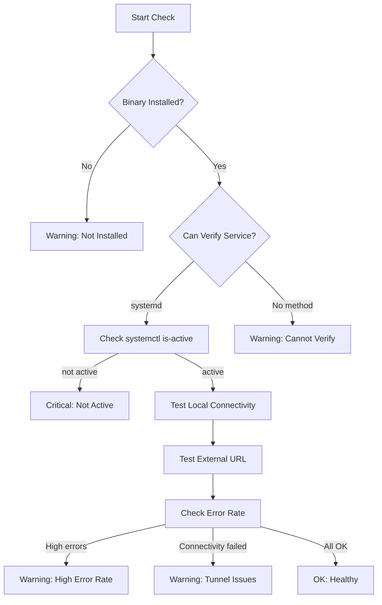

# Cloudflare Tunnel Check (infra-cloudflared)

Verifies that the cloudflared tunnel service is installed and running, enabling external access to hosted scenarios.

## Overview

| Property | Value |
|----------|-------|
| Check ID | `infra-cloudflared` |
| Category | Infrastructure |
| Interval | 60 seconds |
| Platforms | All (where cloudflared is installed) |

## What It Monitors

This check performs a multi-stage verification:

1. **Installation Check**: Verifies `cloudflared` binary is in PATH
2. **Service Check**: On Linux with systemd, checks if the cloudflared service is active
3. **Connectivity Tests**: Tests actual tunnel functionality:
   - Local endpoint connectivity (default port 21774)
   - External URL connectivity (optional)
4. **Error Rate Monitoring**: Checks journal logs for ERR entries in the last 5 minutes



## Connectivity Tests

The check performs HTTP connectivity tests to verify the tunnel is actually forwarding traffic:

### Local Endpoint Test
- Tests `http://127.0.0.1:{port}/` where port defaults to 21774 (app-monitor UI)
- Verifies the tunnel's target service is reachable
- A failed local test indicates the target service may be down

### External URL Test (Optional)
- If configured, tests the public tunnel URL
- Verifies end-to-end tunnel accessibility
- Useful for detecting Cloudflare-side issues

### Error Rate Monitoring
- Counts "ERR" entries in cloudflared logs from the last 5 minutes
- Threshold: 10 errors triggers a warning
- High error rates may indicate network issues or tunnel instability

## Status Meanings

| Status | Meaning |
|--------|---------|
| **OK** | Cloudflared is installed and service is active |
| **Warning** | Installed but cannot verify service status, OR not installed |
| **Critical** | Installed but service is not active |

## Why It Matters

Cloudflare Tunnel (cloudflared) provides:
- Secure external access without opening firewall ports
- HTTPS termination and certificate management
- DDoS protection
- Access control via Cloudflare Access

Without cloudflared, scenarios are only accessible on the local network.

## Common Failure Causes

### 1. Service Not Started
```bash
# Check service status
sudo systemctl status cloudflared

# Start service
sudo systemctl start cloudflared

# Enable auto-start
sudo systemctl enable cloudflared
```

### 2. Tunnel Configuration Issues
```bash
# Check tunnel configuration
ls -la ~/.cloudflared/
cat ~/.cloudflared/config.yml

# Validate configuration
cloudflared tunnel --config ~/.cloudflared/config.yml validate
```

### 3. Authentication Problems
```bash
# Check credentials
cloudflared tunnel list

# Re-authenticate if needed
cloudflared tunnel login
```

### 4. Network Connectivity
Cloudflared requires outbound HTTPS access to Cloudflare's network:
```bash
# Test connectivity to Cloudflare
curl -I https://api.cloudflare.com/client/v4/

# Check if tunnel can connect
cloudflared tunnel run --config ~/.cloudflared/config.yml
```

### 5. Conflicting Processes
```bash
# Check for multiple cloudflared processes
ps aux | grep cloudflared

# Kill orphan processes
sudo pkill cloudflared
sudo systemctl restart cloudflared
```

## Troubleshooting Steps

1. **Check installation**
   ```bash
   which cloudflared
   cloudflared --version
   ```

2. **Check service status**
   ```bash
   sudo systemctl status cloudflared
   sudo journalctl -u cloudflared --since "10 minutes ago"
   ```

3. **Test tunnel manually**
   ```bash
   cloudflared tunnel info <tunnel-name>
   cloudflared tunnel run <tunnel-name>
   ```

4. **Verify tunnel is registered**
   ```bash
   cloudflared tunnel list
   ```

5. **Check Cloudflare dashboard**
   - Login to dash.cloudflare.com
   - Navigate to Zero Trust > Networks > Tunnels
   - Verify tunnel status shows "Healthy"

## Configuration

The check requires cloudflared to be:
1. Installed in PATH
2. Configured as a systemd service (on Linux)

### Installing cloudflared
```bash
# Debian/Ubuntu
curl -L https://github.com/cloudflare/cloudflared/releases/latest/download/cloudflared-linux-amd64.deb -o cloudflared.deb
sudo dpkg -i cloudflared.deb

# As systemd service
sudo cloudflared service install
```

## Related Checks

- **infra-network**: Cloudflared requires internet connectivity
- **infra-dns**: Cloudflared uses DNS for coordination

## Recovery Actions

| Action | Description | Risk |
|--------|-------------|------|
| **Start Service** | Start the cloudflared service | Safe |
| **Restart Service** | Restart the cloudflared service to recover from errors | Safe |
| **Test Tunnel** | Test tunnel connectivity to local and external endpoints | Safe |
| **View Logs** | View recent cloudflared logs | Safe |
| **Diagnose** | Get detailed diagnostic information about the tunnel | Safe |

### Test Tunnel

The Test Tunnel action performs connectivity tests:
1. Tests local endpoint connectivity (default port 21774)
2. Tests external URL if configured
3. Reports pass/fail for each test

Use this to quickly verify tunnel health without restarting the service.

### Diagnose

The Diagnose action gathers:
- Service status via `systemctl status cloudflared`
- Tunnel info via `cloudflared tunnel info`
- Recent errors from journal logs
- Connectivity test results

## Auto-Heal Behavior

When this check fails and auto-heal is enabled, the system may:
1. Restart cloudflared service
2. Wait for service to stabilize
3. Re-run connectivity tests to verify recovery

## Security Notes

- Cloudflared creates an outbound-only connection (no inbound ports needed)
- All traffic is encrypted with TLS
- Access can be further restricted via Cloudflare Access policies

---

*Back to [Check Catalog](../check-catalog.md)*
