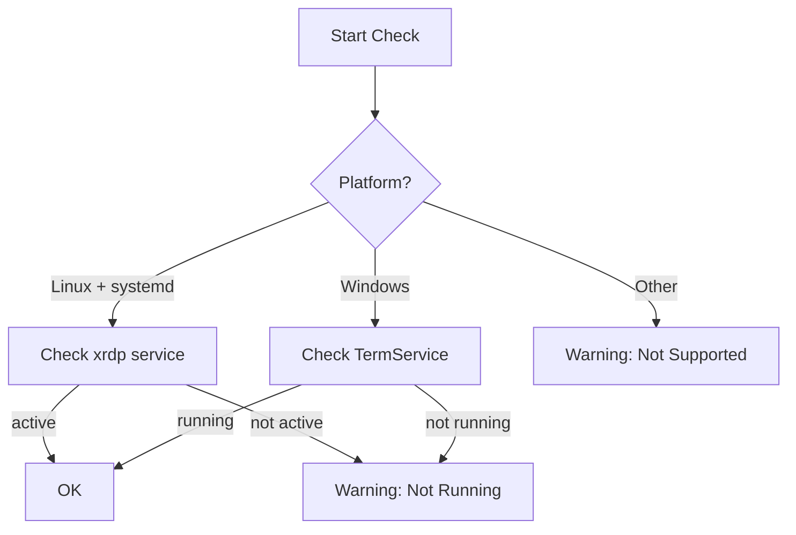

# Remote Desktop Check (infra-rdp)

Verifies that the RDP (Remote Desktop Protocol) service is running for remote GUI access.

## Overview

| Property | Value |
|----------|-------|
| Check ID | `infra-rdp` |
| Category | Infrastructure |
| Interval | 120 seconds |
| Platforms | Linux (with systemd), Windows |

## What It Monitors

This check verifies RDP service availability based on the platform:

| Platform | Service Checked | Method |
|----------|-----------------|--------|
| Linux + systemd | xrdp | `systemctl is-active xrdp` |
| Windows | TermService | Windows service query |
| Other | N/A | Returns warning |



## Status Meanings

| Status | Meaning |
|--------|---------|
| **OK** | RDP service is running and accepting connections |
| **Warning** | RDP service is not running, or platform doesn't support RDP checking |
| **Critical** | RDP service explicitly failed (Windows TermService error) |

## Why It Matters

RDP provides:
- Remote GUI access for administration
- Visual debugging of UI applications
- Access when SSH-only isn't sufficient

This is particularly important for:
- Headless servers needing occasional GUI access
- Remote development environments
- Visual testing and debugging

## Common Failure Causes

### Linux (xrdp)

#### 1. Service Not Started
```bash
# Check status
sudo systemctl status xrdp

# Start service
sudo systemctl start xrdp
sudo systemctl enable xrdp
```

#### 2. xrdp Not Installed
```bash
# Install xrdp
sudo apt install xrdp

# Configure for your desktop
sudo systemctl enable xrdp
sudo adduser xrdp ssl-cert
```

#### 3. Desktop Environment Missing
xrdp requires a desktop environment:
```bash
# Install minimal desktop
sudo apt install xfce4 xfce4-goodies

# Configure xrdp to use it
echo "startxfce4" > ~/.xsession
```

#### 4. Port 3389 Blocked
```bash
# Check if port is open
sudo ss -tlnp | grep 3389

# Open port in firewall
sudo ufw allow 3389/tcp
```

### Windows (TermService)

#### 1. Remote Desktop Disabled
- Open System Properties > Remote
- Enable "Allow remote connections to this computer"

#### 2. Service Not Running
```powershell
# Check service
Get-Service TermService

# Start service
Start-Service TermService
Set-Service TermService -StartupType Automatic
```

## Troubleshooting Steps

### Linux
1. **Check xrdp status**
   ```bash
   sudo systemctl status xrdp
   sudo journalctl -u xrdp --since "10 minutes ago"
   ```

2. **Test local connection**
   ```bash
   # Connect locally
   xfreerdp /v:localhost
   ```

3. **Check logs**
   ```bash
   cat /var/log/xrdp.log
   cat /var/log/xrdp-sesman.log
   ```

4. **Verify port is listening**
   ```bash
   sudo ss -tlnp | grep 3389
   sudo netstat -tlnp | grep 3389
   ```

### Windows
1. **Check service status**
   ```powershell
   Get-Service TermService
   ```

2. **Check Remote Desktop settings**
   ```powershell
   Get-ItemProperty 'HKLM:\System\CurrentControlSet\Control\Terminal Server' -Name fDenyTSConnections
   ```

3. **Check firewall**
   ```powershell
   Get-NetFirewallRule -DisplayGroup "Remote Desktop"
   ```

## Configuration

### Linux xrdp Configuration
```bash
# Main config
sudo nano /etc/xrdp/xrdp.ini

# Session manager config
sudo nano /etc/xrdp/sesman.ini
```

Key settings:
- `port=3389`: RDP port
- `max_bpp=32`: Color depth
- `security_layer=tls`: Encryption

### Windows Configuration
Enable via:
- System Properties > Remote Desktop
- Group Policy: Computer Configuration > Windows Settings > Security Settings > Local Policies > User Rights Assignment

## Related Checks

- **infra-network**: RDP requires network connectivity for remote access
- No direct dependencies on other infrastructure checks

## Auto-Heal Actions

When this check fails, autoheal may attempt:
1. Start xrdp/TermService
2. Restart the service if it's hung
3. Alert administrators for configuration issues

## Security Notes

- RDP traffic should be encrypted (TLS for xrdp, NLA for Windows)
- Consider using VPN or Cloudflare Tunnel instead of exposing port 3389
- Use strong passwords and consider multi-factor authentication

---

*Back to [Check Catalog](../check-catalog.md)*
