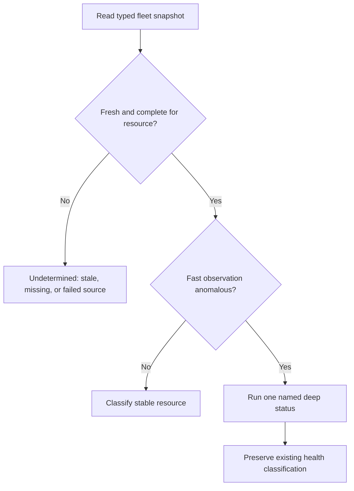

# Resource Checks (resource-*)

Monitors Vrooli resources (PostgreSQL, Redis, Ollama, etc.) via the vrooli CLI.

## Overview

| Property | Value |
|----------|-------|
| Check ID | `resource-{name}` (e.g., `resource-postgres`) |
| Category | Resource |
| Interval | 60 seconds |
| Platforms | All |

## What It Monitors

Resource checks consume the typed fleet contract from `vrooli resource status
--json`. A shared in-process snapshot provider refreshes the supervised fleet
once per bounded TTL and projects only the requested resource into each check.
It never parses human-oriented output:



## Known Resources

| Resource | Check ID | What It Monitors |
|----------|----------|------------------|
| PostgreSQL | `resource-postgres` | Database availability and health |
| Redis | `resource-redis` | Cache server availability |
| Ollama | `resource-ollama` | Local AI inference service |
| Qdrant | `resource-qdrant` | Vector database for embeddings |

## Status Meanings

| Status | Meaning |
|--------|---------|
| **OK** | Resource is running and healthy |
| **Warning** | Resource status is unclear or partially degraded |
| **Critical** | Resource is stopped or unhealthy |
| **Undetermined** | The source is stale, incomplete for this resource, timed out, or unavailable; it is never treated as healthy |

Resources are treated as **critical infrastructure** - a stopped resource triggers critical status because many scenarios depend on them.

## Snapshot and escalation policy

The default snapshot TTL is 20 seconds, the refresh cycle budget is 30 seconds,
and a failed refresh is backed off for 5 seconds. These are bounded internal
defaults, not per-resource knobs. Fresh fast results classify stable resources.
Anomaly, mode-drift, reacquisition, and recovery paths retain the named typed
deep status safeguard. Recovery verification explicitly bypasses both the
fleet and named-status caches, so a pre-action healthy result cannot certify
recovery. A stale healthy result cannot suppress an anomaly. Result details include observed time, age, expiry,
completeness, source, probe level, refresh error, and bounded provider metrics.

The `snapshotMetrics` details are the operator signal for fleet refreshes,
named deep checks, coalesced callers, refresh failures, stale reads, incomplete
responses, and accumulated refresh/deep latency. Process and CPU attribution
is reported only by control-plane/platform surfaces that support it; Autoheal
does not read `/proc`, service managers, containers, or host sockets directly.

| Control | Default | Accepted test range | Impact |
|---|---:|---:|---|
| Snapshot TTL | 20s | positive duration | Longer values reduce fleet calls but delay stable-state changes. |
| Refresh cycle budget | 30s | positive duration | Caps one typed fleet acquisition before it becomes undetermined. |
| Failed-refresh backoff | 5s | positive duration | Prevents a failed control-plane call from becoming a hot retry loop. |
| Recurring scheduler jitter | 0–10% of interval | bounded by `DefaultRecurringJitterFraction` | Spreads aligned checks without materially changing configured cadence. |

The controls are provider/registry seams used by startup wiring and deterministic
tests; they are not arbitrary per-resource configuration fields.

## Why It Matters

Resources are the building blocks for scenarios:

- **PostgreSQL**: Data persistence for most scenarios
- **Redis**: Session storage, caching, queues
- **Ollama**: Local AI inference without API costs
- **Qdrant**: Semantic search, embeddings storage

When a resource fails, all scenarios depending on it will likely fail.

## Common Failure Causes

### 1. Container Not Running
```bash
# Check container status
docker ps -a | grep postgres

# Start resource
vrooli resource start postgres
```

### 2. Docker Daemon Down
If Docker isn't running, no containers can run:
```bash
sudo systemctl status docker
sudo systemctl start docker
```

### 3. Port Conflicts
```bash
# Check if port is in use
sudo ss -tlnp | grep 5432  # PostgreSQL
sudo ss -tlnp | grep 6379  # Redis

# Stop conflicting process or change resource port
```

### 4. Disk Space
```bash
# Check disk usage
df -h /var/lib/docker

# Preview reclaim candidates through storage-manager
storage-manager cleanup plan
```

### 5. Out of Memory
```bash
# Check memory
free -h

# Check Docker memory limits
docker stats --no-stream
```

## Troubleshooting Steps

### PostgreSQL (resource-postgres)
```bash
# Check status
vrooli resource status postgres

# View logs
vrooli resource logs postgres

# Restart
vrooli resource restart postgres

# Check directly
docker exec -it vrooli-postgres psql -U postgres -c "SELECT 1;"
```

### Redis (resource-redis)
```bash
# Check status
vrooli resource status redis

# Test connectivity
docker exec -it vrooli-redis redis-cli ping

# Check memory
docker exec -it vrooli-redis redis-cli info memory
```

### Ollama (resource-ollama)
```bash
# Check status
vrooli resource status ollama

# Test API
curl http://localhost:11434/api/tags

# Pull a model
vrooli resource ollama pull llama2
```

### Qdrant (resource-qdrant)
```bash
# Check status
vrooli resource status qdrant

# Test API
curl http://localhost:6333/collections

# Check health
curl http://localhost:6333/healthz
```

## Configuration

Resource configuration is managed via the vrooli CLI and `.vrooli/service.json`:

```json
{
  "resources": {
    "postgres": {
      "enabled": true,
      "port": 5432
    },
    "redis": {
      "enabled": true,
      "port": 6379
    }
  }
}
```

## Related Checks

- **infra-docker**: All resources run as Docker containers
- **infra-network**: Some resources need external connectivity
- Other resource checks (shared dependencies)

## Auto-Heal Actions

When a resource check fails, autoheal may attempt:
1. Restart the resource container
2. Pull latest image if container is missing
3. Recreate container from configuration
4. Alert administrators for persistent failures

## Adding Custom Resources

When you install a new resource, autoheal automatically creates a check for it:

```bash
# Install resource
vrooli resource install custom-db

# Check is auto-registered as resource-custom-db
vrooli-autoheal checks  # Lists all checks including new one
```

---

*Back to [Check Catalog](../check-catalog.md)*
