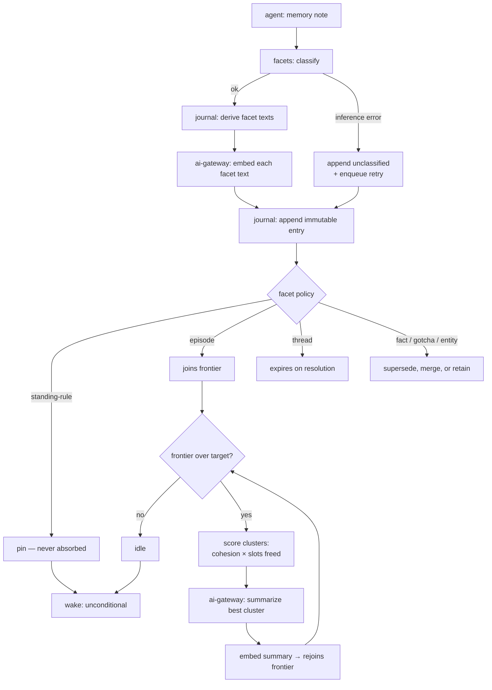

# Flows — Vrooli Memory

This document is the canonical workflow and state-transition map for
the scenario. Use it when behavior depends on ordered states, retries,
cancellation, stale completion, background jobs, polling, or mutually
exclusive UI modes.

## Purpose Of This Document

Use this document to answer:

- Which user/system workflows matter?
- Which workflows have explicit states and events?
- Which transitions are illegal?
- Which tests prove workflow correctness?
- Which flows are known but not modeled yet?

Plain CRUD with no meaningful ordering constraints does not need a
workflow model.

## Flow Inventory

`health` is a stateless reporting domain and ships no workflows. List
each real stateful flow your domains add below, with its owner, trigger,
outcome, statefulness, and validation level.

| Flow | Domain | Trigger | Outcome | Statefulness | Validation |
|---|---|---|---|---|---|
| Write (`note`) | journal | Agent invokes the note verb. | One immutable journal entry, classified and embedded. | Classification/embedding may fail; entry is appended unclassified and retried. Never cancelled, never lost. | L2 — deterministic, retry-on-inference-failure. |
| Compaction pass | forest | Frontier exceeds target size (scheduled sweep). | One or more summary nodes; frontier back under target. | Aborts cleanly on inference failure with no partial summary written. Idempotent — a re-run recomputes candidacy from current state. | L3 — scheduled, resumable, no partial writes. |
| Recall (`recall`) | recall | Agent or operator issues a query. | Ranked hits across all depths with descendants collapsed. | Read-only. No state. | L1 — stateless query. |
| Wake (`wake`) | recall | Session start, or projection refresh. | Pinned rules + budgeted cover over the frontier. | Read-only. Reports overflow rather than truncating pinned content. | L1 — stateless query. |
| Projection refresh | harness | Wake output changes, or on demand. | Generated memory file written to each configured harness path. | One-directional. Hand edits to the target are discarded, never merged. | L2 — idempotent write. |
| Reclassification | facets | Operator correction, or retry of an unclassified entry. | New facet assignment; prior assignment retained as history. | Re-facet may make an entry compaction-eligible or pin it; the forest picks this up on the next pass. | L2 — additive, reversible. |

## Flow Details

Document each real flow here with its owner domain, trigger, inputs,
ordered steps, outputs, failure modes, retry/cancel behavior, tests, and
generated subpackages. The worked example below shows the expected shape.

<!-- EXAMPLE-DOMAIN:notes START -->
### Example domain — `notes` (removed by `template-manager detemplate`)

The template ships an `Attachment upload` flow on the `notes` domain as a
worked Level 5 temporal-workflow vertical slice. Copy its shape for your
own stateful flows, then remove it.

Add this row to the Flow Inventory above:

| Flow | Domain | Trigger | Outcome | Statefulness | Validation |
|---|---|---|---|---|---|
| Attachment upload | notes | User/CLI uploads a file for a note. | Blob is stored and metadata is persisted. | Stateful upload request with validation and failure paths. | Level 5 workflow tests: matrix, traces, declarative spec, checked Quint model, generated artifacts, and production replay. |

#### Attachment upload

- Owner domain: notes.
- Trigger: multipart upload request from UI or CLI.
- Inputs: note id, file key/name, file bytes, content type, file size.
- Steps:
  1. Parse multipart request.
  2. Validate note id and file metadata.
  3. Store opaque bytes through BlobStore.
  4. Persist attachment metadata through notes repository seam.
  5. Return proto-typed metadata response.
- Outputs: uploaded attachment metadata or typed error response.
- Failure modes: missing note id, missing file, invalid metadata, blob
  write failure, metadata persistence failure.
- Retry/cancel behavior: caller may retry after transport/storage
  failure; duplicate handling belongs to the owning real domain when
  product requirements demand it.
- Tests: `api/handlers/notes/attachments_handler_test.go`,
  `api/internal/notes/attachments_service_test.go`,
  `api/internal/notes/flow/flow_test.go`,
  `ui/src/features/notes/AttachmentUpload.test.tsx`, and
  `ui/src/features/notes/flow/flow.test.ts`.
- Generated subpackages: `api/internal/notes/flow/generated/`
  (`model.qnt`, `artifact.json`, `runtime.go`, `replay.go`) and
  `ui/src/features/notes/flow/generated/` (`model.qnt`, `artifact.json`,
  `runtime.ts`, `replay.helper.ts`).
- Requirements: template starter only.

These example state machines belong in the State Machines table below:

| Domain/Flow | States | Illegal Transitions | Enforcement |
|---|---|---|---|
| notes / attachment upload API | received, bytes_stored, metadata_recorded, failed | metadata before bytes, terminal-state escape, duplicate terminal events | `*.flow.json` contract, generated Quint model, generated formal artifact replay, side-effect cleanup tests |
| notes / attachment upload UI | idle, selected, uploading, succeeded, failed | start before select, stale completion after reset/reselect, retry without file context | `*.flow.json` contract, generated Quint model, generated formal artifact replay, attempt-id stale completion tests |
<!-- EXAMPLE-DOMAIN:notes END -->

## State Machines

List each modeled flow's states, illegal transitions, and how they are
enforced. Plain CRUD with no ordering constraints does not appear here.

| Domain/Flow | States | Illegal Transitions | Enforcement |
|---|---|---|---|
| Write | `received → classified → embedded → appended` (terminal). Failure branch: `received → unclassified → appended → queued → classified`. | No transition back out of `appended`. An entry never returns to a mutable state. | Repository append tests; classifier-failure test (`VROOLIME-P0-002`). |
| Compaction pass | `idle → scoring → summarizing → written → idle`. | `summarizing → written` must be atomic: a pass that fails mid-summary returns to `idle` with nothing written. No partial tree. | Pass abort test; frontier-unchanged-on-failure test (`VROOLIME-P0-007`). |
| Entry lifecycle | `active → superseded` and `active → expired` (thread facet only). Both terminal. | Neither transition deletes the entry. `superseded` and `expired` are marks, not removals. | Facet policy tests (`VROOLIME-P0-005`). |
| Node lifecycle | `leaf → on-frontier → absorbed`, and for summaries `created → on-frontier → absorbed`. | An absorbed node never leaves the tree; it leaves only the *frontier*. Absorption is not deletion. | Forest membership tests (`VROOLIME-P0-001`, `VROOLIME-P0-007`). |

## Maturity Ladder

Temporal workflows mature in layers. Do not skip the executable layers
to add a standalone formal document.

| Level | Name | What exists |
|---|---|---|
| 0 | Unmodeled risk | Lifecycle behavior exists only inside handlers, components, callbacks, or jobs. |
| 1 | Inventory | The flow is listed here with owner, source links, risk, and next step. |
| 2 | Workflow model | State/status values, event values, `Transition`, and `CheckInvariants` live beside the owning domain or feature. |
| 3 | Matrix + traces | Tests cover every state/event pair and replay representative traces against production transition logic. |
| 4 | Declarative contract | A domain-local `*.flow.json` declares states, events, transitions, invariants, and named traces. |
| 5 | Checked formal model | Quint/TLA+ or an equivalent tool is generated from the contract, checked, and replayed by production tests. |

## Production Shape

Three (Go) or four (UI) files per flow at the top of the feature folder,
plus one `generated/` sibling. Everything in `generated/` is codegen output.

Every flow lives in a `flow/` subdirectory next to its consumer with
conventional file names. API domains that own durable lifecycle state use:

```text
api/internal/<domain>/
  flow/
    flow.json                   # hand: source of truth (schema v6)
    transition.go               # hand: wrapper (package flow)
    flow_test.go                # hand: thin replay delegation (package flow)
    generated/
      model.qnt
      artifact.json
      runtime.go                # package generated
      replay.go
```

UI features that own client-side modes use:

```text
ui/src/features/<domain>/
  flow/
    flow.json                   # hand: source of truth (schema v6)
    transition.ts               # hand: wrapper
    fixtures.ts                 # hand: replay fixtures
    flow.test.ts                # hand: thin replay delegation
    generated/
      model.qnt
      artifact.json
      runtime.ts
      replay.helper.ts
```

Every flow uses the same file names. The `flow/` directory IS the unit;
the contract no longer declares any output paths or module names.

The workflow owns state/status values, events, `Transition`, and
`CheckInvariants`. It should be pure or nearly pure. Effects live
outside the workflow behind seams: repositories, BlobStore, clocks,
timers, HTTP clients, or UI API modules.

The `*.flow.json` contract is the source of truth. Level 5 generated
Quint models, formal artifacts, and Go/TypeScript declarations are
checked-in source artifacts for reviewability, but they are refreshed
and checked by the `flow-verifier` scenario CLI; the
scenario lifecycle runs `make temporal-models` (which calls
`flow-verifier verify check`) before the normal test
suite. A Quint file by itself is not accepted: the model must typecheck,
test, verify named invariants, emit deterministic artifacts, and those
artifacts must replay against the production Go/TypeScript transition
functions.

The generated declarations keep state/event topology and formal
freshness metadata out of hand-maintained test lists. They also provide
pure status-transition helpers generated from the `*.flow.json`
transition matrix. For TypeScript flows, the same declarations can own
the discriminated state/event union shape and replay fixture contract.
Production workflow wrappers call those helpers for abstract validity
and next-status outcomes, while keeping payload validation, side-effect
orchestration, and rich state construction in hand-authored code. API
replay tests get expected paths, hashes, invariants, and generated checks
from `generated/<folder>/runtime.go`; UI replay tests import the same metadata
from `generated/<folder>/runtime.ts`. The generated `replay.{go,helper.ts}`
files own the assertion calls; the hand-authored top-level test simply binds
the wrapper's transition function and the fixtures and invokes
`RunReplay`/`runFormalReplay` once.

Formal artifacts use schema v6 coverage metadata. Matrix completeness,
terminal transition checks, named trace coverage, and generated MBT trace
coverage are separate fields. Do not treat generated trace
`allPairsCovered` as required proof of correctness; replay tests require
the complete transition matrix and named traces, while generated trace
coverage reports how much the model explorer happened to visit.

Schema v6 `flow.json` files carry no path or module information. The
`replay` block declares only `transition.function` (plus
`transition.statusAccessor` for TS or `transition.stateType` /
`transition.statusField` for Go). Everything else is derived from the
flow directory.

Go flows emit `flow/generated/replay.go` and require a hand-authored
`flow/flow_test.go` (package `flow`) that calls `generated.RunReplay`.
TypeScript flows emit `flow/generated/replay.helper.ts` and require a
hand-authored `flow/flow.test.ts` that calls
`runFormalReplay({ transition, fixtures })` at module top level.
`flow-verifier verify check` byte-compares every generated file and runs an
AST-level lint over the hand-authored test, so a silent bypass — missing
import, stubbed transition, or call buried inside a guarded block —
fails the check.

To scaffold a new flow:

```bash
flow-verifier flows new ui/src/features/<feature> --flow-id <flow-id> --lang ts --root .
flow-verifier flows new api/internal/<domain>     --flow-id <flow-id> --lang go --root .
```

The scaffold writes the hand-authored files and immediately runs
`generate`, so `check` is green from the moment it returns.

To add or rename a state/event:

1. Edit the owning `*.flow.json`.
2. Regenerate that flow with `flow-verifier verify run --flow <flow-id>`.
3. Update only payload-specific wrapper branches that need new runtime
   data; the abstract transition table is generated.
4. Update the UI replay fixture module. The generated formal replay fixture
   interface should make missing state/event fixtures a type error.
5. Run `make temporal-models` and the scenario tests.

## Deferred / Unmodeled Flows

| Flow | Risk | Next Step |
|---|---|---|
| Receipt distillation | Deferred to `VROOLIME-P2-001`. The deliberate write verb is the primary path because it reaches every harness, not only agent-manager-spawned agents. Signal-to-noise over the receipt stream is unmeasured. | Once the P0 loop has real data. |
| Drift detection on re-summarization | Deferred to `VROOLIME-P2-003`. Summaries are lossy by design, so fact *dropping* is intended; only fact *mutation* is a defect, and the two are indistinguishable without re-reading leaves. | Once multi-generation compaction output exists to calibrate against. |
| Eval suite runs | Deferred to `VROOLIME-P2-004`. Requires a reviewed corpus; generated-only cases cannot certify under the search-hub provider contract. | Once there is enough real memory content to author positives and junk negatives. |

## Flow Diagram — the write and compaction loop



## Cross-References

- [`DOMAINS.md`](DOMAINS.md) — owning domain map
- [`DATA.md`](DATA.md) — persisted state and retention
- [`../internal/SEAMS.md`](../internal/SEAMS.md) — side-effect boundaries
- [`../internal/TESTING.md`](../internal/TESTING.md#temporal-workflow-tests) — matrix and trace testing
