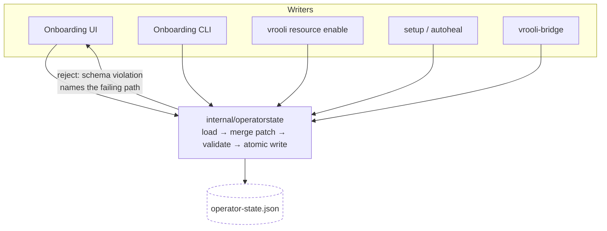

# Design — Vrooli Onboarding

## The shape of the problem

An operator wants capabilities. The system is built from scenarios, resources, host tools, safeguards, credentials, and permissions. Onboarding's job is to accept the first and derive the rest — then commit the decision once, apply it, and prove it.

Three properties make that hard, and every design decision below follows from one of them:

1. **The catalog changes faster than the wizard.** A wizard that enumerates what exists is wrong the day a new resource lands. So the wizard renders only what manifests declare, and holds no inventory in code.
2. **Many writers, one document.** The wizard, the CLI, `vrooli resource enable`, setup, and bridge all change the same operator decisions. A writer that knows a subset of the document must not be able to destroy the rest.
3. **Four deployment tiers, one flow.** A repository install, a desktop bundle, a VPS, and a mobile target resolve their manifests from different places. The steps must not know which tier they are on.

## Decisions

### Scenario-first, not resource-first

Operators think in capabilities, not infrastructure. Selecting a scenario resolves the transitive closure of its declared scenario and resource dependencies; resources appear as a visible consequence of that choice, never as the primary selection.

One computation produces that closure, and four consumers read it: the wizard's rollup, the desktop bundle's catalog contents, the VPS provisioning list, and vrooli-bridge's subset decision. Deriving it four times would produce four slightly different answers.

*Rejected:* letting each surface walk dependencies itself. It is less code at first and diverges immediately.

### One write authority, field-scoped

`internal/operatorstate` is the only component that writes `.vrooli/operator-state.json`, and its write API takes a **field-scoped patch**, never a document.

The alternative — each writer marshalling its own struct over the whole document — is what produces silent field loss when one writer models fewer fields than the document carries. Adding the missing field to a struct fixes one instance; moving to patches removes the class.

**Tradeoff:** a patch API is more ceremony than "PUT the document" for the caller. It is worth it because the failure mode it prevents is silent, security-relevant, and unrecoverable under an `additionalProperties: false` schema. **Revisit if** the state document ever becomes small enough and stable enough that every writer can model all of it — which the roadmap (profiles, integrations) makes unlikely.

### Recorded intent is not the deliverable

A wizard that records preferences and never acts leaves the operator with no way to observe that setup happened. Apply is a first-class step: it installs opted-in tools, applies opted-in safeguards, enables resources, starts scenarios, reports a per-item outcome, and writes a completion marker.

Apply **orders and reports**; it does not implement. Each action delegates to its owning control-plane handler, because the repository contract reserves host detection and remediation for the control plane. Apply is idempotent, and a failure in one item skips its dependants without abandoning independent work.

### Manifest-declared, generically rendered

Anything an operator may decide is declared on a manifest and rendered from that declaration — including safeguard configuration fields, which come from schemas the safeguard manifest owns. A newly declared field appears in the UI with no code change.

This is the same property in the API: no resource-category map, no glossary table, no tool list in Go.

### The tier is resolved once, at the edge

Manifest resolution and state location are resolved from the deployment tier at one boundary. A repository install resolves the repository; a bundle resolves its staged catalog and its app-data state root. No step contains tier logic, and a tier that cannot supply a catalog yields a typed degraded state, never an unhandled error.

The bundle contract declares every catalog path onboarding reads, and packaging verifies them — a missing catalog becomes a build failure rather than a first-launch failure on an operator's machine.

### Credential values have exactly one path

A value enters in a request body or on standard input, goes to the credential authority, and is never written anywhere else. No response, log, URL, argument, operator-state field, or browser store carries one. The wizard displays configured/unconfigured status and the descriptor's declared purpose and obtain link — never a value.

## The experience

Ten steps, re-enterable, resuming at the first unsatisfied step. The consequence of a choice is visible on the same screen as the choice: selecting a scenario shows what it pulls in; opting into a safeguard shows its risk, privilege, and what it writes. Apply has an explicit review state so the operator consents to a target-scoped, revision-bound plan before execution.

Every non-ready state names its cause and its next action. Required gaps block; optional gaps offer a recorded degraded continue, because blocking on an optional gap trains operators to bypass the wizard. Configuration discovery is part of the launch contract: the same manifest-derived surface rendered by onboarding is published to search-hub with stable setting identities and remediation links.

The UI renders through the shared component library and design tokens, in light and dark, meets WCAG 2.1 AA, and is fully keyboard operable. Its page states, claims, and journeys are declared in [`experience/`](experience/) and checked against the built UI.

## Purpose profiles and goal intake

Purpose intake is active, data-driven behavior rather than a release-only
special case. Repository-owned profile JSON declares bounded questions,
conditional recommendations, provenance, and manual-selection availability.
The evaluator is shared by the API, CLI, and UI; it may recommend scenarios and
resources but it cannot execute code, grant permissions, or replace explicit
operator choices. The shipped profile set covers local use, development and
publishing, general-purpose setup, and customer-preinstalled defaults.

Adding a supported profile is a data change. A profile revision remains
reviewable, and the selected profile's source and revision are recorded as
provenance in operator state. Profile qualification still requires the
corresponding semantic and external evidence; implementation does not imply
release or native qualification.

## Deferred, on purpose

| Capability | Why deferred | Revisit trigger |
|---|---|---|
| Integrations step | Connector and connection models are owned by integration-hub | integration-hub ships |

Onboarding publishes its metadata-only configuration provider to search-hub;
indexing and query ranking remain search-hub responsibilities. A deferred
integration step says so and creates nothing. A step that fabricates state so
the flow looks complete is worse than an empty one.

A deferred step says so and creates nothing. A step that fabricates state so the flow looks complete is worse than an empty one.
