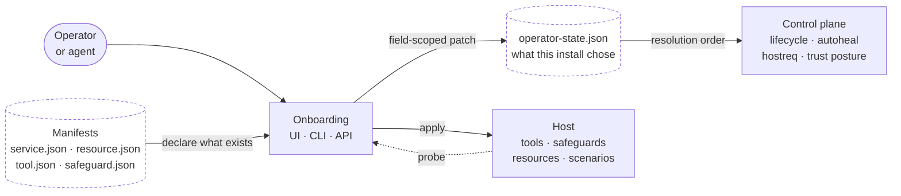

# Vrooli Onboarding

The operator surface for deciding **what a Vrooli install runs, and under what permissions** — then applying that decision and proving it worked.

It is scenario-first: operators pick capabilities, and resources, credentials, host tools, safeguards, and operating mode are derived from manifests. Every decision commits through one control-plane authority, so the browser, the terminal, an agent, and a remote coordinator all reach the same result.

> The configuration substrate this scenario implements is documented at [`/docs/configuration/`](../../docs/configuration/). New configurability lands as a doc page there first, then becomes a wizard step. The step-by-step implementation contract is [`docs/WIZARD_FLOW.md`](docs/WIZARD_FLOW.md); the UX contract is [`experience/`](experience/).

## What it is for



Manifests declare **what exists**. Operator state records **what this install chose**. Onboarding is the surface between them, and the only thing that turns a choice into applied host state.

## Surfaces

| Surface | Entry point | Use it when |
|---|---|---|
| Web UI | `make start`, then the lifecycle-managed UI port | A human is configuring a machine they can see |
| Interactive CLI | `vrooli-onboarding wizard` | A human is on a terminal, or there is no desktop session |
| Non-interactive CLI | `vrooli-onboarding wizard commit --selection "<file>"` | Automation, CI, vrooli-bridge, scenario-to-cloud |
| REST API | `/api/v2/...` | Another scenario is driving setup |
| Desktop bundle | The generated app's first-run flow | A tier-2 install configures itself |

All five produce identical operator state for identical choices. That is a tested claim (`ONB-PARITY-IDENTICAL-STATE`), not a convention — it holds because all of them write through one service.

## The ten steps

| # | Step | Operator decides | Derived from |
|---|---|---|---|
| 1 | Welcome | Whether to begin setup | The onboarding step model |
| 2 | Scenarios | Which capabilities this install runs | Scenario manifests; system-required entries are locked on |
| 3 | Core supervision set | Which seed scenarios must remain supervised | `core.seed`, locked `core.trusted_base`, and the declared closure |
| 4 | Resources | Which optional resources to add | Transitive closure of the scenario selection |
| 5 | Credentials | Which declared credentials to provision | Credential descriptors on selected manifests |
| 6 | Integrations | *(deferred)* | Owned by integration-hub; no placeholder bindings |
| 7 | Host | Which tools and safeguards to consent to | `hostTools` / `hostSafeguards` on selected manifests |
| 8 | Operating mode | Which scenarios restart automatically | `runtime.kind` and `runtime.auto_restart_default` |
| 9 | Apply | Confirmation to change the host | The committed selection |
| 10 | Validation | Whether to continue degraded | Live probes over credentials, tools, safeguards, resources |

Steps 1–8 record intent. Step 9 is where intent becomes host state. Step 10 is where the install is proven. Re-entry resumes at the first unsatisfied step.

The core supervision step edits only `core.seed`; it does not write an
autoheal target list. Before commit, onboarding asks the shared control-plane
resolver for the scenario/resource closure and displays each member's effective
supervision intent. After commit, `vrooli supervision-set --json` is the
operator-verifiable source consumed by autoheal. `core.trusted_base` remains a
locked subset of the seed. Operating-mode `auto_restart` choices are separate
and cannot remove a member from supervision.

## Architecture

- **Go API** (`api/`) — manifest read models, the readiness composer, the apply engine, and a thin relay to the credential authority. It holds no inventory of scenarios, resources, tools, or safeguards in code.
- **React + TypeScript UI** (`ui/`) — the ten-step wizard plus a health dashboard and glossary. Renders through shared primitives and semantic design tokens in light and dark themes.
- **Go CLI** (`cli/`) — interactive and non-interactive wizard, credentials, host requirements, readiness with a machine-readable exit code.
- **Control-plane state service** (`internal/operatorstate/`) — the single writer for `.vrooli/operator-state.json` and the single evaluator for the configuration resolution order. Onboarding is a client of it, not the owner.

There is no scenario-owned database. Credential values live only in the credential authority.

## Documentation map

| Read this | For |
|---|---|
| [`docs/START-HERE.md`](docs/START-HERE.md) | Orientation |
| [`docs/QUICKSTART.md`](docs/QUICKSTART.md) | First run in five minutes |
| [`docs/WIZARD_FLOW.md`](docs/WIZARD_FLOW.md) | The step-by-step implementation contract |
| [`docs/concepts/ARCHITECTURE.md`](docs/concepts/ARCHITECTURE.md) | Read models, write authority, tier resolution |
| [`docs/concepts/FLOWS.md`](docs/concepts/FLOWS.md) | The step machine, the apply sequence, re-entry |
| [`docs/concepts/DATA.md`](docs/concepts/DATA.md) | What is owned, what is projected, what is never stored |
| [`docs/reference/api-endpoints.md`](docs/reference/api-endpoints.md) | The HTTP surface |
| [`docs/reference/cli-commands.md`](docs/reference/cli-commands.md) | The command surface |
| [`docs/reference/configuration.md`](docs/reference/configuration.md) | Every operator-controllable decision and where it lands |
| [`experience/`](experience/) | Pages, states, claims, and journeys the UI must satisfy |
| [`docs/internal/PROBLEMS.md`](docs/internal/PROBLEMS.md) | What is not true yet |

## Working on it

```bash
make start                    # lifecycle-managed API + UI
make test                     # server-owned suite via test-genie
make logs                     # tail both processes
make stop
```

Never run the built binaries directly — that bypasses process naming, port assignment, and health checks.

Contract-changing work has an order:

1. Document the configurability in [`/docs/configuration/`](../../docs/configuration/).
2. Add or amend the operational target in [`PRD.md`](PRD.md) and its requirement in [`requirements/`](requirements/).
3. Add the page, state, or journey claim in [`experience/`](experience/).
4. Implement, and tag the test with its `[REQ:ID]`.

Statuses and PRD checkboxes are earned by requirement sync from passing evidence. Never set one by hand.

## Boundaries

Onboarding does **not**:

- author `service.json` or any manifest;
- own connector, OAuth, or integration lifecycles (integration-hub does);
- carry a private host-repair implementation — detection and remediation belong to the control plane, and onboarding orders and reports them;
- replace `secrets-manager` for credential lifecycle, backup, or keyring repair;
- store a credential value anywhere, at any point, in any form.
