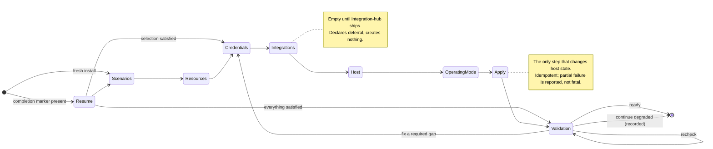
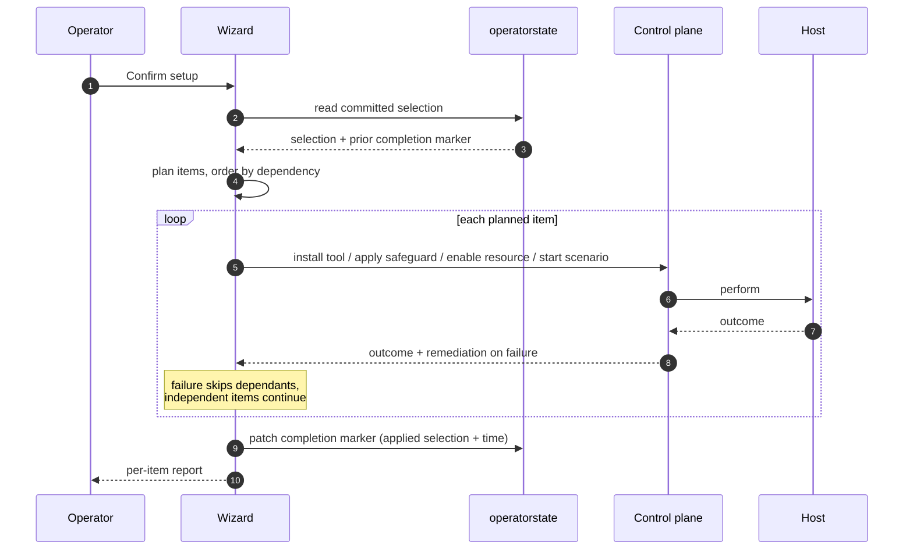
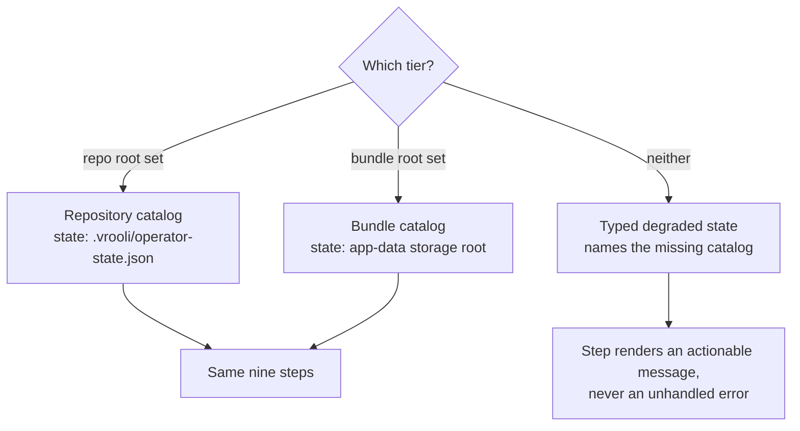

# Wizard Flow

This document is the implementation contract for the onboarding wizard. The
configuration substrate it reads from and writes to is documented in
[`/docs/configuration/`](../../../docs/configuration/); the UX contract it must
satisfy is [`experience/`](../experience/).

## One command configures or heals a host

```bash
vrooli setup --include-optional --maintenance-window --sudo-mode=ask --onboarding=auto
```

That command is the whole flow. Setup performs the bootstrap steps, hands off to
this wizard, and the wizard asks for every value the operator has to supply.
Nothing an operator needs is reached by a command outside it. In particular:

- `--sudo-mode=ask` lets the in-process `sudo` wrapper prompt when a host item
  needs privilege. An already-elevated invocation also works, but it runs the
  whole of setup as root and is outside this flow.
- Credentials are provisioned on the credentials step, not by a shell command.
- Host changes are consented to on the host step, and the list shown there is
  the list apply performs.

Two commands prove the resulting state, and they must agree:

```bash
vrooli credentials doctor --format json
curl -s http://127.0.0.1:$(vrooli scenario port vrooli-onboarding API_PORT)/api/v2/readiness
```

## Why the flow is shaped this way

Operators do not think in resources. They think in capabilities: "I want the
swarm running", not "I want Postgres, Redis, and Vault". So scenarios are the
unit of selection, and every infrastructure consequence is derived and shown
rather than asked for.

This is also the only reading under which
[`/docs/configuration/architecture.md`](../../../docs/configuration/architecture.md)
is coherent: manifests declare what a scenario needs, the wizard surfaces that
derivation, and the operator's unit of choice is their own use case.

## Step sequence

Nine steps including the welcome surface. Re-enterable from any step, resuming at the first unsatisfied one.



Each step commits its own decisions as it goes, through a field-scoped patch.
There is no "save at the end" — closing the browser mid-flow loses navigation
position, never decisions.

### 1 — Scenarios

Search and filter over the full catalog. System-required scenarios render
locked-on. Selecting a scenario resolves its transitive closure and names what
came with it.

```
┌─ Scenarios ─────────────────────────────────────────────┐
│  [search: ____________]   [ all | core | enabled ]       │
│                                                          │
│  ☑ vrooli-onboarding          CORE   (locked)            │
│  ☑ secrets-manager            CORE   (locked)            │
│  ☑ web-console                CORE   (locked)            │
│  ──────────────────────────────────────────────────      │
│  ☑ swarm-manager                      [keep running ☑]   │
│      ↳ pulls in: agent-manager, workspace-sandbox        │
│      ↳ tries: vrooli-events (degrades to local queue)    │
│  ☑ agent-manager                      [keep running ☑]   │
│  ☐ landing-page-business-suite                           │
│                                                          │
│  Required resources: postgres, redis, vault              │
│  Optional next step: ollama, qdrant                      │
└──────────────────────────────────────────────────────────┘
```

Contract:

- `service.system_required: true` renders locked-on and cannot be disabled,
  including by a hand-edited state file — the manifest wins for this field.
- The cascade line reads `dependencies.scenarios`. A required edge says
  "pulls in"; a `try_start` edge says "tries", with the degraded behaviour named.
- The keep-running toggle defaults to `runtime.auto_restart_default` and is
  hidden for `runtime.kind` of `on_demand` or `one_shot`.
- The footer rolls up the implied resource set, so the consequence is visible on
  the same screen as the choice.
- A dependency cycle is reported as a manifest defect, not traversed.

### 2 — Resources

Required resources — everything the closure implies — render locked and checked.
Optional resources declared through `optional_dependencies` are toggleable.
Standalone resources that no selected scenario requires get their own group.

Toggling an optional resource writes `resources.<name>.enabled` in operator
state. That field is the **only** authority for resource enablement; nothing
else carries the decision.

### 3 — Credentials

One card per credential descriptor in scope. Scope is the selected stack plus
the **project scope**: the descriptors declared by the repository-root manifest
`.vrooli/service.json`. The project manifest is the authoritative owner of
host-owned credentials that have no scenario directory to hang a declaration
from — `vrooli/remote-desktop` username and password are exactly that case — so
those cards appear on a repository install regardless of what the operator
selected. Their owner label is `project`, matching what `vrooli credentials
doctor` prints, so one address reads the same way on both surfaces.

A desktop bundle stages no repository-root manifest by design and therefore
shows no project-scope card. The exclusion is asserted by a test rather than
left to the accident of a missing file.

The card renders the descriptor in full:

```
┌─ OpenRouter API Key   (resource: openrouter · required) ─┐
│  Unified API gateway across LLM providers. Required for  │
│  scenarios that route LLM calls through OpenRouter.      │
│                                                          │
│  [ Get one → ]  https://openrouter.ai/keys               │
│  [••••••••••••••••••••••••••••••••••••••••]  [ Save ]    │
│                                                          │
│  Status: unconfigured                                    │
└──────────────────────────────────────────────────────────┘
```

Contract:

- `label`, `description`, and `obtain_url` all come from the descriptor. The
  descriptor declares `description` and `obtain_url` specifically for this
  surface; dropping them leaves the operator with an unexplained password box.
- Save relays the value to the credential authority. The value never appears in
  a response, a log, a URL, an argument, operator state, or browser storage.
- Descriptors with `provisioning: derived` are read-only status rows. The
  owning resource or scenario completes them through its own lifecycle after
  the declared source credential is present; onboarding contains no
  component-specific bootstrap path.
- The card shows configured/unconfigured status only. It never reads a value.
- On a host with no graphical session — a VPS, a CI runner, a headless bundle
  host — no native store exists. The step leads with the encrypted-file-store
  initialization instead of reporting a failure.

#### Deferred operator input

Bootstrap is allowed to run without a controlling terminal. When it reaches a
decision that only an operator can make — most importantly the encrypted
credential-store passphrase — it writes a typed, mode-`0600` request to the
operator-input queue and returns a configuration-pending result. The request
contains its kind, explanation, default, validation contract, and the work it
unblocks; it never contains a secret or a prompt-specific implementation.

The UI resolves the queue through `POST /api/v2/operator-inputs/resolve`. The
interactive CLI reads the same queue and submits the same answer document. Both
surfaces keep secret values in memory only, and the API applies the credential
store change before removing the request. A failed apply leaves the request in
place so a later onboarding session can retry it. Non-interactive callers must
surface `needs_input` and resume through onboarding; they must not invent a
second passphrase channel.

The Credentials step also exposes the metadata-only store status and the
following control-plane operations through the onboarding API and `store` CLI
group: backend selection, verified reselect/migration, initialization, unlock,
passphrase change, rewrap, and empty-backend retirement. Reselect derives the
complete manifest-backed inventory, copies values, verifies destination
read-back, and commits the new authority only after the whole migration
succeeds. These operations delegate to securestore; onboarding does not
maintain a second encrypted-store implementation.

### 4 — Integrations *(deferred)*

Empty until integration-hub ships. Where a selected scenario declares an
`integrations[]` requirement, the step names it as deferred and creates no
binding. The connector and connection models are owned by integration-hub; see
[`connectors.md`](../../../docs/configuration/integrations/connectors.md).

### 5 — Host

Tools and safeguards derived from the repository-root manifest, every scenario
in the selection closure, and their resources. The closure — not the raw
selection and not the whole catalog — is the input, because it is exactly what
apply will start. The consent screen, the readiness report, the apply plan, and
the apply run all read the same set, so the operator cannot consent to one list
and have setup perform another.

The derived name sets are asserted equal to `internal/hostreq.Resolve` for the
same selection. Two implementations remain by decision, because `hostreq` needs
a repository layout and onboarding must also serve a flat bundle catalog; the
conformance test is what makes that duplication safe.

```
┌─ Host Tools ────────────────────────────────────────────┐
│  ☑ git           required by 8 scenarios      user  LOW │
│  ☑ docker        required by all              user  LOW │
│  ☐ scenario-tool required by deployment-…     user  LOW │
├─ Host Safeguards ───────────────────────────────────────┤
│  ☑ clock         verifies system clock        none  LOW │
│  ☐ kernel_config high-performance networking  root  MED │
│      writes /etc/sysctl.d/99-vrooli.conf                │
│      ├ tcp_backlog        [ 4096 ]                      │
│      └ enable_bbr         [ ✓ ]                         │
│  ☐ nat-protection prevents loopback bypass    root  MED │
└──────────────────────────────────────────────────────────┘
```

Contract:

- Required entries are locked and checked; everything else is opt-in.
- Risk, privilege, bundling, and supported platforms come from the manifest and
  are visible **before** the operator consents, because a safeguard modifies
  host state.
- Where a safeguard declares a config schema, its fields render generically from
  that schema and persist validated values. A newly declared field works with no
  code change; an invalid value is rejected at the write boundary with the
  failing path named.
- A requirement not declared for the running platform renders unsupported, not
  missing — the two have different operator responses.

### 6 — Operating mode

Per-scenario keep-running confirmation, pre-filled from
`runtime.auto_restart_default` and stored as an operator override.

Global startup behaviour and profile selection are
[declared open work](../../../docs/configuration/operating-mode.md) in the
configuration contract. This step does not invent them.

### 7 — Apply

The only step that changes host state.



Contract:

- Apply orders and reports; each action is performed by its owning control-plane
  handler. Onboarding carries no private host-repair implementation.
- Idempotent: a second run with unchanged state changes nothing and reports
  every item as already satisfied.
- Partial failure is recorded as partially applied, with dependants skipped and
  the blocking dependency named.
- The completion marker is what makes "this install has been configured"
  observable — by re-entry, by autoheal, and by a desktop first-run.

### 8 — Validation

A live probe pass over everything the selection implies.

```
┌─ Validation ────────────────────────────────────────────┐
│  ✓  postgres reachable                                   │
│  ✓  vault reachable                                      │
│  ✓  OPENROUTER_API_KEY configured                        │
│  ✗  git not found on this host                           │
│       → Install the declared host tool, then recheck.    │
│  ⚠  qdrant unreachable (optional)                        │
│       → Start it, or continue without vector search.     │
│                                                          │
│  Status: 3 ready · 1 missing (required) · 1 degraded     │
│  [ Recheck ]  [ Continue with degraded ]  [ Back ]       │
└──────────────────────────────────────────────────────────┘
```

Contract:

- Probes cover credentials, host tools, host safeguards, **and resource
  reachability**. A report that omits whether Postgres is reachable answers a
  narrower question than the operator asked.
- Every non-ready item names a remediation specific to its cause.
- Recheck re-runs the pass without a reload.
- Continue-with-degraded is offered only when every **required** item is ready,
  and the acknowledgement is recorded so the degraded state stays visible to
  later diagnosis.
- Navigation back to any earlier decision remains available from this step.

#### The completion rule

Configuration is complete when readiness reports no unresolved required item.
The rule is enforced where the `.configuration-complete` marker is written, not
at a Next button, because three surfaces can complete configuration — the UI,
the CLI wizard, and a direct API caller — and only the marker write is common to
all three.

| Condition | Marker | Apply run status |
|---|---|---|
| Nothing unresolved | written | `applied` |
| A required credential, required host item, recovery gap, or unsuccessful apply item remains | withheld | `configuration_incomplete`, with the blockers named |
| Only optional items unresolved, not acknowledged | withheld | `configuration_incomplete`, with the degraded set named |
| Only optional items unresolved, acknowledged | written | `applied` |

The degraded acknowledgement is durable operator state, not a click. It carries
the digest of the exact degraded set it accepted, so a page reload cannot
discard it and an acknowledgement of one gap cannot authorise completion over a
different gap later. Record it with
`POST /api/v2/readiness/degraded-acknowledgement`, or from the CLI with
`vrooli-onboarding readiness acknowledge-degraded`.

The CLI's `readiness` command and the wizard's `validation` step exit non-zero
while a blocker remains, so a script cannot read a blocking verdict as success.

Setup then verifies the same populations in process before it reports. A present
marker no longer implies success on its own: when setup's verdict contradicts it,
setup reports `configuration_pending` and names the single command that resolves
it.

## Cross-cutting contracts

### Starter recommendation and input parity

`GET /api/v2/recommendation` returns the manifest-derived `starter` profile:
system-required scenarios plus the transitive resources they require. It is a
default, not an authorization decision. The UI and interactive CLI prefill it;
the operator can replace optional choices before applying. The declarative CLI
can accept it explicitly with `wizard run --accept-recommendation`, while
`--non-interactive` reports `needs_input` unless that explicit acceptance was
provided. All three surfaces then write the same field-scoped operator-state
patch and use the same apply/readiness APIs.

### Surface parity

The same nine steps exist in the UI, the interactive CLI, and the
non-interactive selection document. Identical choices produce byte-identical
operator state, because all three write through one service rather than three
code paths kept in step by review.

A session is shared state, not browser memory: a flow started in the browser
resumes from a terminal at the same step.

### Deployment-tier resolution



The bundle catalog must carry every manifest class the wizard reads — scenarios,
resources, tools, and safeguards. The bundle contract declares those paths and
packaging verifies them.

### What is locked in

Settled; do not relitigate without new evidence.

- **Source of truth is manifests plus operator state**, never onboarding internals.
- **Step order**: Scenarios → Resources → Credentials → Integrations → Host →
  Operating mode → Apply → Validation.
- **System-required scenarios are locked on**, per `service.system_required`.
- **Per-scenario auto-restart is the operator's call**; the manifest only recommends.
- **Re-enterable, not one-shot.**
- **Safeguard risk is a column, not a step.**
- **Apply is part of the wizard**, not a follow-up the operator must remember.
- **One write authority**, field-scoped patches, schema-validated before write.

### What is deferred

- **Goal intake** — depends on profiles.
- **Profiles** — until a second concrete profile exists. `active_profile` is
  already reserved in the state schema.
- **Integration-hub** — owns connectors and connections; step 4 is empty until it ships.

## See also

- [`/docs/configuration/architecture.md`](../../../docs/configuration/architecture.md) — source-of-truth tables and resolution order
- [`/docs/configuration/scenarios.md`](../../../docs/configuration/scenarios.md) — `system_required`, `runtime.kind`, scenario dependencies
- [`/docs/configuration/host/safeguards.md`](../../../docs/configuration/host/safeguards.md) — the `risk` field
- [`/.vrooli/schemas/operator-state.schema.json`](../../../.vrooli/schemas/operator-state.schema.json) — the write target
- [`../experience/`](../experience/) — page states, claims, and journeys
