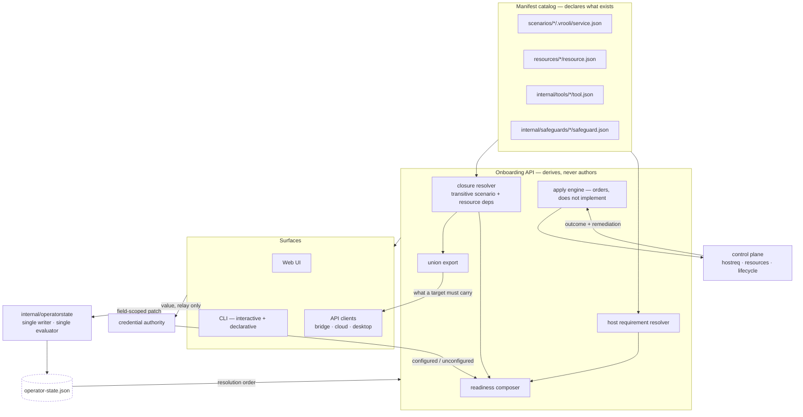

# Architecture

## Purpose Of This Document

Describe how onboarding is composed: what reads, what writes, who owns which
decision, and how the same flow serves every deployment tier.

## The two halves

Onboarding is a **read model** over manifests and a **client** of one write
authority. It owns no durable data of its own.

The read half recomputes from manifests on every entry, so a newly installed
scenario appears without re-running anything. The write half is a client: every
decision is a patch to a service onboarding does not own.

## Ownership

| Concern | Owner | Onboarding's role |
|---|---|---|
| What exists | Manifests | Reads |
| What this install chose | `internal/operatorstate` | Patches through the service |
| Credential values | Credential authority | Relays; never stores or reads |
| Host detection and remediation | Control plane | Orders the work, reports the outcome |
| Connectors and connections | integration-hub *(deferred)* | Declares the deferral |
| Purpose profiles | onboarding profile data + bounded evaluator | Recommends scenario choices; never grants permissions |
| Requirement status | Requirement sync from test evidence | Never asserts |

The row that matters most: **onboarding never implements host remediation.** The
repository contract reserves detection and repair for the control plane; a
scenario may observe, schedule, and report that state but must not carry a
private implementation. Apply therefore delegates every action and owns only the
ordering and the report.

## Why the write authority is separate

Five components change operator decisions: the wizard, the CLI, `vrooli resource
enable`, setup, and vrooli-bridge. A writer that models a subset of the document
and writes the whole document silently deletes everything it does not model —
and under an `additionalProperties: false` schema, that loss is unrecoverable
without hand repair.

The service therefore accepts a **field-scoped patch** and performs
load → merge → validate → atomic write under a process lock and a native
cross-process sidecar lock. The lock covers the replaceable state path, not the
data inode. Disjoint concurrent patches both survive; stale callers receive a
revision conflict instead of overwriting a newer choice.

It is also the single **evaluator** of the resolution orders declared in
[`/docs/configuration/architecture.md`](../../../../docs/configuration/architecture.md),
so "what is the effective value of X" has one answer rather than one per caller.

## Deployment-tier resolution

Tier is resolved once, at the edge. No step contains tier logic.

| Tier | Manifest catalog | Operator state |
|---|---|---|
| Repository install | Repository root | `.vrooli/operator-state.json` |
| Desktop bundle | Staged bundle catalog | App-data storage root |
| Remote host / VPS | That host's own catalog, driven over vrooli-bridge | That host's state |

A desktop app and a local install on one machine are separate installs by
design. Where a tier cannot supply a catalog, the affected step returns a typed
degraded state naming the missing catalog — never an unhandled error, because
"this tier does not carry that catalog" and "this host is broken" have different
operator responses.

The bundle contract declares every catalog path onboarding reads, and packaging
verifies them, so an omission fails our build instead of an operator's first
launch.

## Surfaces

The UI, the CLI, and API clients are peers over one API and one write service.
Parity is structural: identical choices produce byte-identical state because
there is one write path, not three code paths kept in step by review.

The UI is a `react-vite` surface with a scenario-owned manifest overlay. The
overlay maps the template's shell, page, feature, and theme slots onto the
existing `ui/src/components` tree while preserving the shared selector,
provider, token, and lifecycle contracts. Published React Component Library
primitives are consumed by production code; adopter tests assert only the
scenario boundary, while component-library assertions remain with the
versioned library source.

## Security posture

- A credential value crosses exactly one provisioning boundary: request body or
  standard input → credential authority. It appears in no API response, log,
  URL, argument, operator-state field, or browser store. The only display
  exception is the explicitly confirmed local CLI reveal, which refuses JSON
  and redirected output.
- Apply escalates privilege only where a manifest declares it, and only after
  the operator consents to that specific safeguard with its privilege visible.
- Trust posture and the core-set authority live in operator state and are owned
  by other components; onboarding preserves them and never rewrites them as a
  side effect of an unrelated choice.

## Cross-References

- [Data](DATA.md) · [Domains](DOMAINS.md) · [Flows](FLOWS.md)
- [Wizard flow](../WIZARD_FLOW.md)
- [Configuration reference](../reference/configuration.md)
## API transport foundation

The onboarding API is migrating domain by domain to generated Connect-RPC
services. `api/internal/modules` is the static registry used by endpoint
validation, while each `api/handlers/<domain>` package owns its module mount and
descriptor. The two health probes are the only REST exceptions and are listed
in `docs/internal/REST_EXCEPTIONS.md`; business operations move to the
following service map:

| Domain | Service |
|---|---|
| operatorinputs | `OperatorInputsService` |
| readiness | `ReadinessService` |
| apply | `ApplyService` |
| session | `SessionService` |
| selection | `SelectionService` |
| capabilities | `CapabilitiesService` |
| credentials | `CredentialsService` |
| host | `HostService` |
| operatorstate | `OperatorStateService` |
| resources | `ResourcesService` |
| glossary | `GlossaryService` |

The module registry and transport validation gate are the foundation for the
incremental migration. Legacy routes remain only until their named domain
phase removes them.

## Current API surface

Business operations use the generated Connect contract. The machine-readable
endpoint catalog at [`.vrooli/endpoints.json`](../../.vrooli/endpoints.json) is
the authoritative list of procedures, CLI mappings, and the two health probe
exceptions.

| Domain | Connect service | API maturity | UI / CLI ownership |
|---|---|---|---|
| operator inputs | `OperatorInputsService` | boundary and typed errors | `api/operatorinputs.ts`, operator inputs |
| readiness | `ReadinessService` | boundary, auth, typed errors | `api/readiness.ts`, readiness |
| apply | `ApplyService` | durable start and read pair | `api/apply.ts`, apply |
| session | `SessionService` | stable step identity | `api/session.ts`, wizard |
| selection | `SelectionService` | shared selection and union model | `api/selection.ts`, scenarios / union |
| capabilities | `CapabilitiesService` | typed action boundary | `api/capabilities.ts`, capabilities |
| credentials | `CredentialsService` | write-only value boundary | `api/credentials.ts`, credentials |
| host | `HostService` | control-plane delegation | `api/host.ts`, host |
| operator state | `OperatorStateService` | field-mask single writer | `api/operatorstate.ts`, operator |
| resources | `ResourcesService` | typed inventory and health | `api/resources.ts`, resources |
| glossary | `GlossaryService` | typed static reference data | `api/glossary.ts`, glossary |

The shared substrate is explicit: the target interceptor forwards a typed
request by its generated procedure address; one shared mutation interceptor
requires a verified human principal and the onboarding write capability; and
Connect error mapping
preserves invalid input, missing scope, unavailable node, and internal failure
as distinct codes. Health remains a plain `ops_probe` REST exception for
lifecycle managers and load balancers; its entries are recorded in
[`REST_EXCEPTIONS.md`](../internal/REST_EXCEPTIONS.md).

## Architecture maturity

| Surface | Level | Evidence | Remaining drift |
|---|---|---|---|
| API | 4 | Domain handlers mount generated Connect procedures; registry and transport tests cover the public surface. | Resource runtime status inherits the control-plane status command's host timeout. |
| UI | 4 | Each domain has a generated Connect client; the only raw HTTP client is the health probe. | Existing UI health and coverage debt remains in the scenario test contract. |
| CLI | 3 | The embedded manifest drives command construction and generated descriptor parity covers every RPC or omission. | Installed CLI Health reports primitive evidence warnings until its binary is rebuilt against current cli-core. |
| Documentation | 3 | Architecture, seams, errors, security, and API reference point to the current service contract. | Dated investigation records retain historical route examples. |
