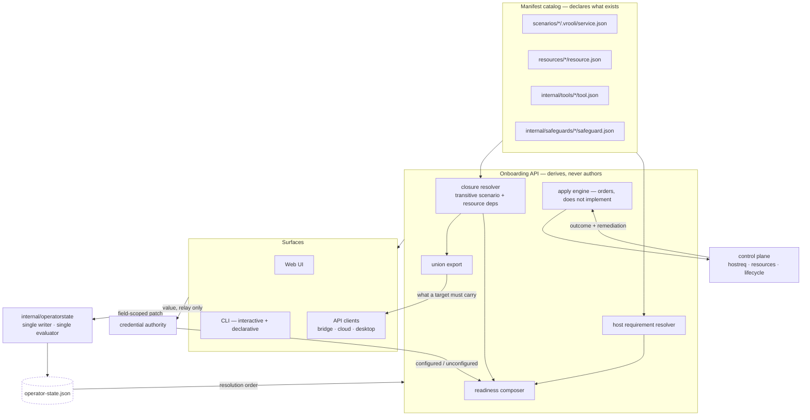

# Architecture

## Purpose Of This Document

Describe how onboarding is composed: what reads, what writes, who owns which
decision, and how the same flow serves every deployment tier.

## The two halves

Onboarding is a **read model** over manifests and a **client** of one write
authority. It owns no durable data of its own.

The read half recomputes from manifests on every entry, so a newly installed
scenario appears without re-running anything. The write half is a client: every
decision is a patch to a service onboarding does not own.

## Ownership

| Concern | Owner | Onboarding's role |
|---|---|---|
| What exists | Manifests | Reads |
| What this install chose | `internal/operatorstate` | Patches through the service |
| Credential values | Credential authority | Relays; never stores or reads |
| Host detection and remediation | Control plane | Orders the work, reports the outcome |
| Connectors and connections | integration-hub *(deferred)* | Declares the deferral |
| Requirement status | Requirement sync from test evidence | Never asserts |

The row that matters most: **onboarding never implements host remediation.** The
repository contract reserves detection and repair for the control plane; a
scenario may observe, schedule, and report that state but must not carry a
private implementation. Apply therefore delegates every action and owns only the
ordering and the report.

## Why the write authority is separate

Five components change operator decisions: the wizard, the CLI, `vrooli resource
enable`, setup, and vrooli-bridge. A writer that models a subset of the document
and writes the whole document silently deletes everything it does not model —
and under an `additionalProperties: false` schema, that loss is unrecoverable
without hand repair.

The service therefore accepts a **field-scoped patch** and performs
load → merge → validate → atomic write under a write lock. Disjoint concurrent
patches both survive; an invalid merge is rejected before anything is written,
with the failing path named.

It is also the single **evaluator** of the resolution orders declared in
[`/docs/configuration/architecture.md`](../../../../docs/configuration/architecture.md),
so "what is the effective value of X" has one answer rather than one per caller.

## Deployment-tier resolution

Tier is resolved once, at the edge. No step contains tier logic.

| Tier | Manifest catalog | Operator state |
|---|---|---|
| Repository install | Repository root | `.vrooli/operator-state.json` |
| Desktop bundle | Staged bundle catalog | App-data storage root |
| Remote host / VPS | That host's own catalog, driven over vrooli-bridge | That host's state |

A desktop app and a local install on one machine are separate installs by
design. Where a tier cannot supply a catalog, the affected step returns a typed
degraded state naming the missing catalog — never an unhandled error, because
"this tier does not carry that catalog" and "this host is broken" have different
operator responses.

The bundle contract declares every catalog path onboarding reads, and packaging
verifies them, so an omission fails our build instead of an operator's first
launch.

## Surfaces

The UI, the CLI, and API clients are peers over one API and one write service.
Parity is structural: identical choices produce byte-identical state because
there is one write path, not three code paths kept in step by review.

## Security posture

- A credential value crosses exactly one boundary: request body or standard
  input → credential authority. It appears in no response, log, URL, argument,
  operator-state field, or browser store.
- Apply escalates privilege only where a manifest declares it, and only after
  the operator consents to that specific safeguard with its privilege visible.
- Trust posture and the core-set authority live in operator state and are owned
  by other components; onboarding preserves them and never rewrites them as a
  side effect of an unrelated choice.

## Cross-References

- [Data](DATA.md) · [Domains](DOMAINS.md) · [Flows](FLOWS.md)
- [Wizard flow](../WIZARD_FLOW.md)
- [Configuration reference](../reference/configuration.md)
