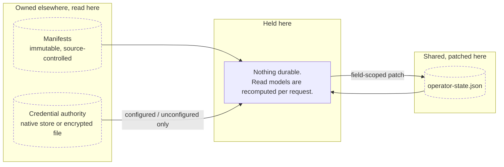

# Data

## Purpose Of This Document

Name the data onboarding owns, the data it projects without owning, and the data
it must never hold.

## Storage overview

Onboarding has **no scenario-owned database and no scenario-owned file**. The
one durable record it participates in is `.vrooli/operator-state.json`, and that
document is owned by `internal/operatorstate` in the control plane. Onboarding
patches it through that service.

## Data ownership

| Data | Owner | Onboarding |
|---|---|---|
| Scenario, resource, tool, safeguard declarations | Manifests | Reads |
| Credential descriptors | Manifests | Reads |
| Credential **values** | Credential authority | Relays once; never stores, reads, or returns |
| Scenario enablement, auto-restart override | `operator-state.scenarios.*` | Patches |
| Resource enablement | `operator-state.resources.*` | Patches — and this is the only authority for it |
| Host tool and safeguard opt-in, safeguard config | `operator-state.host_tools.*`, `host_safeguards.*` | Patches |
| Completion marker and degraded acknowledgement | `operator-state` | Patches |
| Trust posture | `operator-state.trust_posture` | **Preserves. Never writes.** |
| Core-set authority | `operator-state.core` | **Preserves. Never writes.** |
| Active profile | `operator-state.active_profile` | Reserved; deferred |
| Integration bindings | integration-hub | Deferred; creates nothing |

The two "preserves, never writes" rows are load-bearing. Trust posture selects
token, break-glass, node-execution, and JWKS-cache defaults across the whole
install; the core set grants control-plane fallback protection. Neither is an
onboarding decision, and both live in a document onboarding writes — so the
write path must be incapable of touching them.

## Schema map

| File | Schema | Written by |
|---|---|---|
| `.vrooli/operator-state.json` | [`operator-state.schema.json`](../../../../.vrooli/schemas/operator-state.schema.json) | `internal/operatorstate` only |
| `scenarios/*/.vrooli/service.json` | `service.schema.json` | Scenario authors |
| `resources/*/resource.json` | `resource.schema.json` | Resource authors |
| `internal/tools/*/tool.json` | `tool.schema.json` | Tool authors |
| `internal/safeguards/*/safeguard.json` | `safeguard.schema.json` | Safeguard authors |

Read models — scenarios, host requirements, readiness, union — are derived views
with no independent schema and no storage. They are recomputed per request, so a
newly installed scenario appears without a migration or a cache flush.

The state schema sets `additionalProperties: false`. That makes an invalid write
unrecoverable without hand repair, which is why validation happens **before** the
write rather than at read time.

## Migrations and compatibility

The document is versioned and additive. A field a binary does not model is
preserved on write, so an older binary cannot truncate a newer document. This is
the compatibility guarantee that lets the control plane, the wizard, the CLI, and
a bundled desktop binary of a different vintage share one file.

The retired V1 progress database is not a fallback and is not read.

## Import, export, and retention

Operator state is inspectable configuration and is safe to read, diff, and copy
between hosts. Deleting it resets onboarding choices and nothing else.

Credential material is never part of that copy. Recovery is an explicit
credential-authority operation through the encrypted bundle export and restore
commands, and deleting operator state does not delete a credential.

The union export is a derived artifact describing what a target must carry. It
is regenerated on demand and is never a stored authority.

## Privacy

No credential value, token, or recovery passphrase is written to this scenario's
files, logs, API responses, CLI output, browser storage, or URLs — at any point,
in any form, on any tier.

## Cross-References

- [Architecture](ARCHITECTURE.md) · [Flows](FLOWS.md) · [Domains](DOMAINS.md)
- [Configuration reference](../reference/configuration.md)
- [Security](../internal/SECURITY.md)
