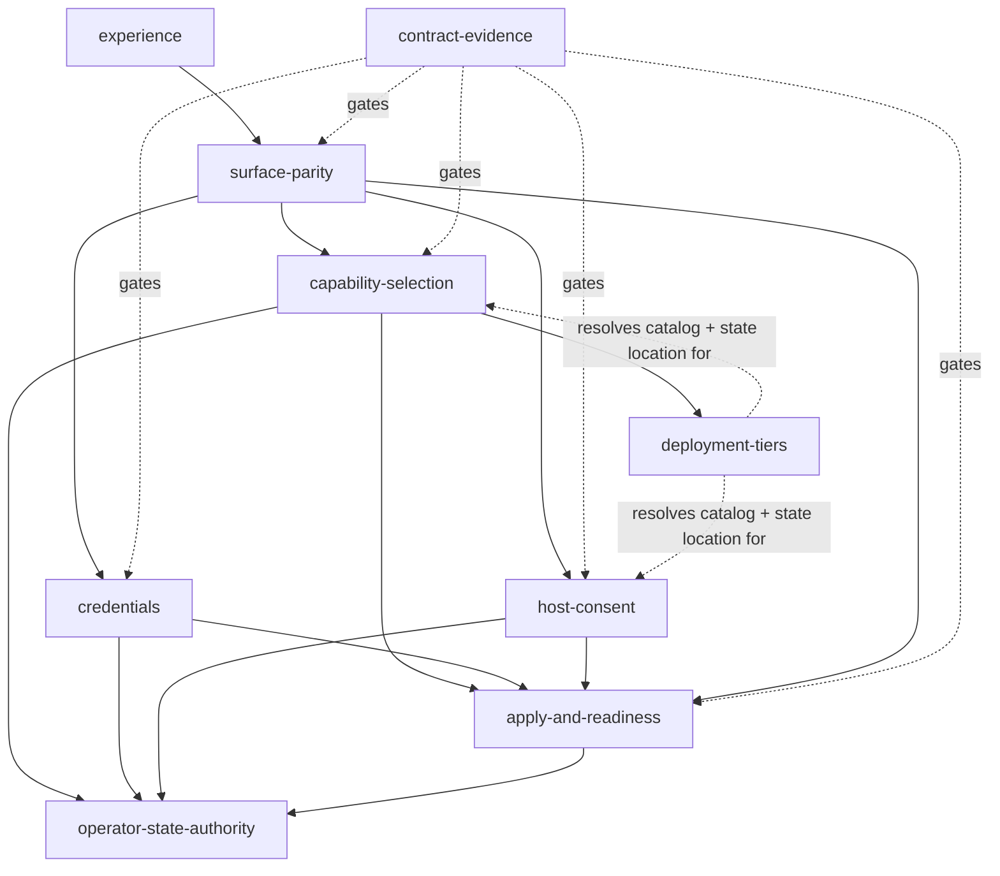

# Domains — Vrooli Onboarding

## Purpose Of This Document

Name the capabilities that own onboarding behaviour, so requirements, code, and
tests agree on where a decision lives.

## Domain inventory

| Domain | Purpose | Archetype | Owns data | Source Paths | Surfaces | Requirements |
|---|---|---|---|---|---|---|
| capability-selection | Turn a scenario choice into a resolved stack: transitive closure, derived and optional resources, operating-mode recommendation, and the union other tiers consume. | reporting | No | `api/closure.go`, scenario manifests | API, UI, CLI | `ONB-SELECT-*`, `ONB-OPMODE-PER-SCENARIO` |
| operator-state-authority | Commit every operator decision through one typed service that merges field-scoped patches, validates before writing, and preserves fields it does not own. | mutation | `.vrooli/operator-state.json`, via the control-plane service | `internal/operatorstate/**` | API, CLI, control plane | `ONB-STATE-*`, `ONB-REENTRY-RESUMES` |
| credentials | Present descriptor-complete guidance and relay a value to the credential authority without it crossing any other boundary. | integration | No | `api/v2_credentials.go`, credential descriptors | API, UI, CLI | `ONB-CRED-*` |
| host-consent | Derive host tools and safeguards from manifests and obtain informed operator consent before any host change. | reporting | No | `api/v2_host_requirements.go`, `internal/tools/**`, `internal/safeguards/**` | API, UI, CLI | `ONB-HOST-*` |
| apply-and-readiness | Turn recorded intent into applied host state by delegating to control-plane handlers, then probe and report honest readiness. | orchestration | No | `api/v2_apply.go`, `api/v2_readiness.go` | API, UI, CLI | `ONB-APPLY-*`, `ONB-READY-*` |
| surface-parity | Keep the UI, interactive CLI, non-interactive CLI, and API equal in capability and identical in result. | orchestration | Session pointer, in shared state | `api/v2_session.go`, `cli/domains/wizard/**` | API, CLI, UI | `ONB-PARITY-*`, `ONB-CLI-*` |
| deployment-tiers | Resolve catalog and state location from the running tier so one flow serves repository, bundle, and remote installs. | integration | No | `api/v2_read_model.go`, desktop catalog packager | API | `ONB-TIER-*` |
| experience | Satisfy the declared page, state, claim, and journey contract, with accessibility and theming as gates. | orchestration | Browser-local navigation only | `ui/src/components/wizard/**`, `experience/**` | UI | `ONB-UX-*`, `ONB-REENTRY-REVISABLE` |
| contract-evidence | Keep declared endpoint, CLI, and requirement contracts equal to the running code, enforced by tests. | reporting | No | `.vrooli/endpoints.json`, `requirements/**`, `api/*_test.go` | API, CLI | `ONB-CONTRACT-*` |

## Domain relationships

`operator-state-authority` is downstream of every decision domain and upstream of
none. That is deliberate: a domain that both decides and stores becomes the
second authority for whatever it stores.

## Shared concepts

Logical credential identities, deployment-tier provider policy, trust posture,
and the core-set authority are control-plane concepts. Onboarding surfaces them
as metadata, patches only the fields it owns, and preserves the rest.

## Non-domains

- `api/main.go` — HTTP composition.
- `api/helpers.go` and the test-support packages — transport and test scaffolding.
- `ui/src/lib/` — transport support; owns no decision.
- `ui/src/components/ui/` — presentation primitives, migrating to the shared library.
- `platforms/electron/` — a presentation host for the bundled runtime; see [SEAMS](../internal/SEAMS.md).

## Deferred domains

| Candidate | Why deferred | Revisit trigger |
|---|---|---|
| integrations | Connector and connection models are owned by integration-hub | integration-hub ships |
| profiles | A format designed against one example fits one example | A second concrete profile exists |
| configuration-discovery | Needs the operator-surface feed first | The feed lands; search-hub's provider gap is filled |

## Cross-References

- [Architecture](ARCHITECTURE.md) · [Data](DATA.md) · [Flows](FLOWS.md)
- [Wizard flow](../WIZARD_FLOW.md) · [`requirements/`](../../requirements/)
- [PRD](../../PRD.md) · [Problems](../internal/PROBLEMS.md)
