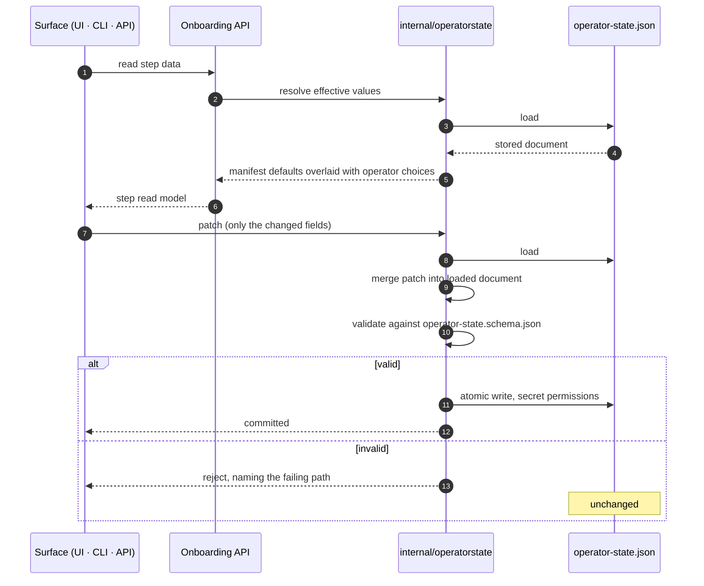
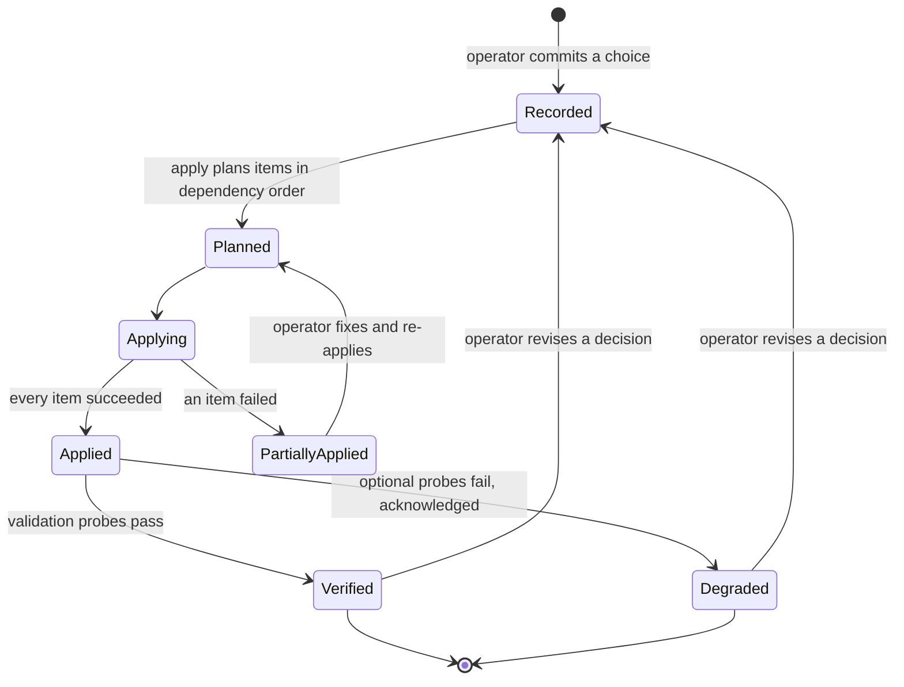
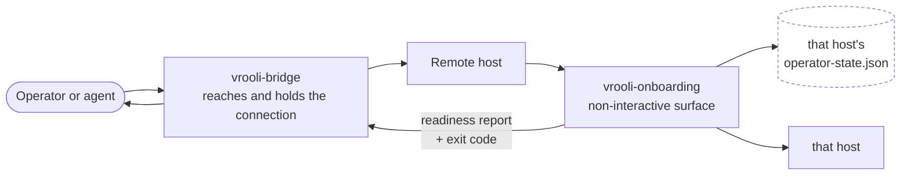

# Flows

## Purpose Of This Document

Record the lifecycle of an onboarding decision: how it is made, committed,
applied, verified, and revised.

## Flow inventory

| Flow | Trigger | Ends when |
|---|---|---|
| First run | No completion marker | Apply succeeds and validation is ready or acknowledged degraded |
| Re-entry | Completion marker present | The revised decision is committed and re-applied |
| Credential provisioning | An unconfigured declared descriptor | The authority reports the value configured |
| Host consent | A selected manifest declares a tool or safeguard | The operator opts in or declines |
| Remote onboarding | vrooli-bridge reaches a host | That host reports a green readiness report |
| Degraded continue | Optional items are not ready | The acknowledgement is recorded |

## The decision lifecycle

Every decision follows the same path, whichever surface makes it.

Two properties fall out of this shape:

- A field the writing binary does not model is loaded, merged around, and
  written back unchanged. Trust posture and the core-set authority survive a
  wizard save because nothing in the write path enumerates the document.
- Two surfaces patching disjoint fields at the same time both succeed, because
  the merge happens under the lock rather than in the caller.

## Intent becoming host state

Recording a choice changes nothing on the host. Apply is the transition.

`Applied` is not `Verified`. An item can install cleanly and still fail its
probe — a tool present but not on `PATH`, a safeguard written but not loaded, a
resource enabled but not reachable. Keeping the two states distinct is what lets
validation be a real gate rather than an echo of apply.

## Re-entry

Re-entry reads the completion marker and the committed selection, then resumes
at the first unsatisfied step rather than the first step. Adding one scenario
later does not mean re-answering every question, and no committed decision
becomes read-only after the first pass.

Navigation is disposable; decisions are not. Closing the browser mid-flow loses
the step pointer, never a committed choice.

## Remote onboarding

Bridge owns reaching the machine; onboarding owns deciding what runs there. The
boundary is the declarative selection document plus a machine-readable exit
code, so automation can branch on a real readiness result instead of parsing
prose.

## Failure handling

| Failure | Behaviour |
|---|---|
| Manifest catalog unavailable on this tier | Typed degraded state naming the missing catalog; other steps continue |
| Credential authority unreachable | Status reports `unsupported` with the backend condition and its fix, not `unconfigured` |
| Host has no graphical session | The encrypted file store is offered as the path forward, not reported as an error |
| Safeguard config fails its schema | Rejected at the write boundary with the failing path; nothing is written |
| One apply item fails | Its dependants are skipped and named; independent items continue; the run is partially applied |
| Required probe fails | Validation blocks and names the remediation |
| Optional probe fails | Degraded continue is offered and the acknowledgement is recorded |

## Deferred flows

Connector authorization and connection binding belong to integration-hub.
Onboarding declares the deferral and simulates nothing, because state nothing
can honour is worse than an empty step.

## Cross-References

- [Architecture](ARCHITECTURE.md) · [Data](DATA.md) · [Domains](DOMAINS.md)
- [Wizard flow](../WIZARD_FLOW.md)
- [Runbook](../operations/RUNBOOK.md)
