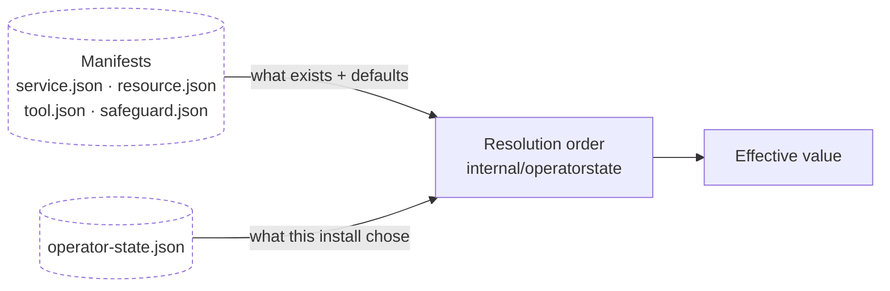

# Configuration

Every operator-controllable decision in a Vrooli install, where its truth lives,
and who may write it. The fleet-wide contract this implements is
[`/docs/configuration/`](../../../../docs/configuration/); this page is the
onboarding-side index of it.

## The two-file model



Manifests are declarative, source-controlled, and slow-changing. Operator state
is mutable, per-install, and machine-local. Nothing else is configuration:
lifecycle markers, caches, and generated runtime state are not.

## The decision table

| Decision | Truth | Written by | Wizard step |
|---|---|---|---|
| Scenario exists, and what it needs | `scenarios/<n>/.vrooli/service.json` | Scenario author | — |
| Scenario is system-required | `service.system_required` | Scenario author | 1 (locked on) |
| Scenario enabled on this install | `operator-state.scenarios.<n>.enabled` | Operator | 1 |
| Scenario runtime shape | `runtime.kind` | Scenario author | 6 (hides the toggle for `on_demand`/`one_shot`) |
| Auto-restart recommendation | `runtime.auto_restart_default` | Scenario author | 6 (pre-fills) |
| Auto-restart on this install | `operator-state.scenarios.<n>.auto_restart` | Operator | 6 |
| Scenario → scenario dependencies | `dependencies.scenarios` | Scenario author | 1 (cascade) |
| Resource required by a scenario | `dependencies.resources` | Scenario author | 2 (locked on) |
| Resource optional for a scenario | `optional_dependencies` | Scenario author | 2 (toggleable) |
| **Resource enabled on this install** | `operator-state.resources.<n>.enabled` | Operator | 2 |
| Credential declared | `credentials.descriptors[]` on a manifest | Author | 3 |
| Credential **value** | Credential authority | Operator, write-only | 3 |
| Host tool required | `hostTools[]` on a manifest | Author | 5 (locked on) |
| Host tool opted in | `operator-state.host_tools.<n>.opted_in` | Operator | 5 |
| Safeguard declared, with its risk | `internal/safeguards/<n>/safeguard.json` | Author | 5 |
| Safeguard opted in | `operator-state.host_safeguards.<n>.opted_in` | Operator | 5 |
| Safeguard config values | `operator-state.host_safeguards.<n>.config` | Operator | 5 |
| Setup completed, and with what | `operator-state` completion marker | Apply | 7 |
| Degraded acknowledgement | `operator-state` | Operator | 8 |
| Trust posture | `operator-state.trust_posture` | Control plane | — *(preserved, never written here)* |
| Core-set authority | `operator-state.core` | Control plane | — *(preserved, never written here)* |
| Active profile | `operator-state.active_profile` | *(deferred)* | — |
| Integration binding | `operator-state.integrations.*` | integration-hub *(deferred)* | 4 |

The bold row is the one that historically had two authorities. Resource
enablement lives in operator state and nowhere else: `vrooli resource enable`
writes it there, the wizard writes it there, and the repository service manifest
carries only declarative dependency data.

## One writer

`internal/operatorstate` is the only component that writes
`.vrooli/operator-state.json`. Every other component — the wizard, the CLI,
`vrooli resource enable`, setup, autoheal, vrooli-bridge — patches through it.

Its write is: **load → merge the field-scoped patch → validate against the schema
→ atomic write under a lock**. Three consequences:

- A field the writing binary does not model is preserved. An older binary cannot
  truncate a newer document.
- An invalid merge is rejected before anything is written, with the failing path
  named. The schema sets `additionalProperties: false`, so a bad write would
  otherwise need hand repair.
- Two surfaces patching disjoint fields concurrently both succeed.

Adding a writer that bypasses the service is a test failure.

## Resolution order

To answer "what is the effective value of X", the service walks a fixed order
per concern. These are the contract; no surface reimplements them.

**Scenario enabled**
```
1. service.json → service.system_required = true   →  always enabled, no override
2. operator-state → scenarios.<n>.enabled          →  if present
3. manifest default
```

**Auto-restart**
```
1. operator-state → scenarios.<n>.auto_restart     →  if present
2. service.json   → runtime.auto_restart_default   →  if present
3. schema default (false)
```

**Host tool / safeguard**
```
1. operator-state → host_*.<n>.opted_in            →  if present
2. manifest `required` field
```

**Safeguard config value**
```
1. operator-state → host_safeguards.<n>.config.<key>  →  if present and schema-valid
2. safeguard manifest's declared default
```

## The operator surface feed

The typed V2 host-requirements endpoint returns every operator-controllable decision the **current
catalog** declares — with its type, schema, risk, privilege, and default. The UI
renders forms from it and search-hub indexes it.

This is what keeps the wizard hardcode-free. A safeguard that declares a new
config field, or a resource that declares a new credential descriptor, appears in
the UI with no code change. It also means the answer to "what can I configure?"
is computed from manifests rather than maintained as a list that drifts.

## Environment

The lifecycle exports these. Set them yourself only when running a piece by hand.

| Variable | Purpose |
|---|---|
| `API_PORT` | Go API port |
| `UI_PORT` | UI port |
| `VITE_API_BASE_URL` | UI → API base, `http://localhost:${API_PORT}/api/v1` |
| `VROOLI_ROOT` | Repository root; selects the repository catalog and state document |
| `BUNDLE_ROOT` | Desktop bundle root; selects the staged catalog |
| `VROOLI_STORAGE_ROOT` | Storage root for a bundled install's operator state |

Exactly one of `VROOLI_ROOT` or `BUNDLE_ROOT` identifies the catalog. With
neither, the affected step returns a typed degraded state naming the missing
catalog rather than failing.

## Cross-References

- [`/docs/configuration/architecture.md`](../../../../docs/configuration/architecture.md) — the fleet-wide contract
- [`/.vrooli/schemas/operator-state.schema.json`](../../../../.vrooli/schemas/operator-state.schema.json)
- [Data](../concepts/DATA.md) · [Wizard flow](../WIZARD_FLOW.md)
