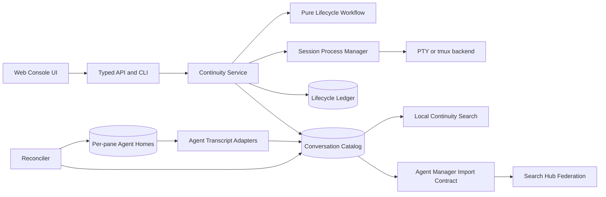
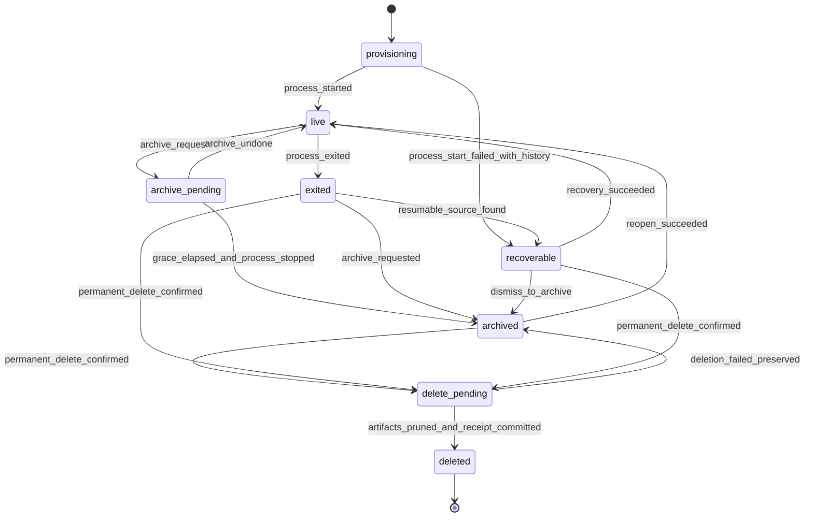
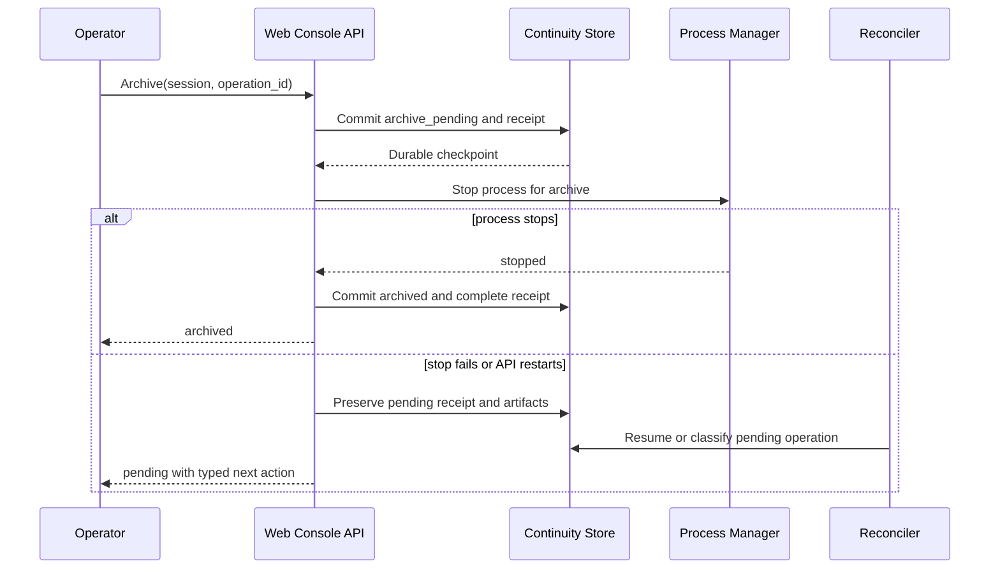

## Architectural posture

Use a greenfield lifecycle contract and remove the displaced coordination paths. Reuse the proven PTY backends, transcript tailers, raw agent histories, conversation event store, workspace layout, and Agent Manager retrieval plan. Do not preserve duplicate lifecycle decision logic behind compatibility flags.

The central design principle is one authority per concept:

| Concept | Authority |
| --- | --- |
| Web Console pane/session lifecycle | Web Console continuity domain |
| Raw Codex, Claude, OpenCode, Grok, and future agent history | The native agent runtime |
| Web Console conversation projection and alias catalog | Web Console continuity domain |
| Global run and conversation retrieval | Agent Manager |
| Federated discovery and ranking | Search Hub |
| Workspace presentation | Web Console workspace domain |
| Explicit retention and permanent deletion | Web Console continuity domain under operator policy |

## Target component flow



Handlers translate transport shapes only. The continuity service owns transactions, idempotency, transition receipts, and orchestration. The process manager starts, attaches, resizes, signals, and stops processes. It never deletes durable metadata.

## Canonical lifecycle

Represent lifecycle state explicitly. Do not infer state from missing rows, active-map membership, process presence, or a non-empty timestamp.



The executor must finalize exact state names after inspecting current generated contracts. The semantics are mandatory even if names change.

Model lifecycle commands and events as typed enums. Implement a pure transition function and invariant checker beside the continuity domain. Reach at least temporal maturity Level 4: declarative specification, exhaustive state-event matrix, representative traces, and production/spec conformance tests. Adopt Level 5 only if concurrency exploration finds state spaces that the matrix cannot cover safely.

Core invariants include:

1. Durable evidence cannot transition to physical absence without confirmed permanent-delete or retention authority.
2. A lifecycle command has one durable receipt, even after retry.
3. Process exit cannot select archive or delete policy.
4. An archived record remains searchable when its process and workspace pane are absent.
5. A missing projection produces a degraded recoverable state, not an empty result.
6. A recovered successor preserves predecessor lineage and aliases.
7. Retention never deletes the only surviving copy of message-bearing or agent-history-bearing evidence without an authorized policy receipt.
8. Reconciliation never modifies raw native transcripts.

## Canonical catalog and storage ownership

Create a cohesive domain such as `api/internal/continuity/`. Keep its schema, repository interfaces, workflow, service, reconciliation, search projection, measures, and tests together. Use the repository naming that best matches the final domain vocabulary.

Conceptual schema:

```sql
CREATE TABLE conversation_catalog (
    session_id TEXT PRIMARY KEY,
    lifecycle_state TEXT NOT NULL,
    lifecycle_version INTEGER NOT NULL,
    backend TEXT NOT NULL,
    agent_type TEXT NOT NULL,
    agent_session_id TEXT NOT NULL DEFAULT '',
    agent_home_ref TEXT NOT NULL DEFAULT '',
    rollout_ref TEXT NOT NULL DEFAULT '',
    original_title TEXT NOT NULL DEFAULT '',
    current_title TEXT NOT NULL DEFAULT '',
    topic_summary TEXT NOT NULL DEFAULT '',
    cwd TEXT NOT NULL DEFAULT '',
    created_at TEXT NOT NULL,
    last_activity_at TEXT NOT NULL,
    archived_at TEXT,
    deleted_at TEXT,
    recovered_into TEXT,
    source_fingerprint TEXT NOT NULL DEFAULT ''
);

CREATE TABLE conversation_aliases (
    session_id TEXT NOT NULL,
    alias_kind TEXT NOT NULL,
    alias_value TEXT NOT NULL,
    observed_at TEXT NOT NULL,
    PRIMARY KEY (alias_kind, alias_value)
);

CREATE TABLE session_lifecycle_receipts (
    operation_id TEXT PRIMARY KEY,
    session_id TEXT NOT NULL,
    actor_kind TEXT NOT NULL,
    actor_id TEXT NOT NULL DEFAULT '',
    command TEXT NOT NULL,
    from_state TEXT NOT NULL,
    to_state TEXT NOT NULL,
    reason_code TEXT NOT NULL,
    status TEXT NOT NULL,
    error_code TEXT NOT NULL DEFAULT '',
    created_at TEXT NOT NULL,
    completed_at TEXT
);
```

This is a design example, not a migration script. The executor must use Web Console's domain-owned schema substrate and current database conventions. Preserve existing personal data with an out-of-tree, repeatable repair operation or the repository's earned migration mechanism. Do not destructively recreate the live database.

Treat raw agent histories as native, non-regenerable source evidence. Treat FTS indexes, topic summaries, and derived search chunks as rebuildable projections. Treat Web Console conversation events as durable projected evidence that can also repair catalog metadata.

## Typed command and receipt contract

Use one request envelope for mutating lifecycle operations:

```proto
message SessionLifecycleCommand {
  string session_id = 1;
  string operation_id = 2;
  SessionLifecycleIntent intent = 3;
  string reason_code = 4;
  string expected_state = 5;
  bool operator_confirmed = 6;
}

message SessionLifecycleReceipt {
  string operation_id = 1;
  string session_id = 2;
  SessionLifecycleState prior_state = 3;
  SessionLifecycleState resulting_state = 4;
  OperationStanding standing = 5;
  repeated ArtifactStanding artifacts = 6;
  string next_action = 7;
}
```

Use stable operation IDs as idempotency keys. Reject stale expected-state mutations with a typed conflict. A replay returns the original receipt. Do not expose raw filesystem paths over the public API; use safe artifact references and operator-only diagnostics.

Archive success means the durable archive transition committed. Process termination may complete synchronously or through a durable operation, but an in-memory timer cannot be the only record of pending work. A restart must resume or safely reconcile the operation.

## Failure and recovery policy



Failures must preserve evidence first. If a projection, process, or dependency is unavailable, return the surviving metadata plus a typed degraded reason. Do not return an empty archive when integrity is unknown.

## Reconciliation

Build a deterministic inventory over:

- session and catalog rows;
- conversation identities and events;
- transcript checkpoints;
- workspace panes;
- per-pane Codex, Claude, OpenCode, Grok, and future agent homes;
- live PTY/tmux sessions;
- recovery lineages and archived tombstones.

Classify each identity into a closed set such as `healthy`, `projection_missing`, `catalog_missing`, `workspace_stale`, `source_missing`, `process_orphan`, `lineage_broken`, or `conflict`. The classification must explain its evidence and proposed action.

Provide dry-run and apply modes. Apply requires a stable inventory generation or fingerprint. Repeating apply must produce no new mutations. Repair metadata from immutable evidence; never guess an agent identity when several candidates are plausible. Preserve ambiguous records and require operator review.

Before applying to the live database, create a recoverable backup through the scenario's storage contract. Verify the backup, record its location through an opaque artifact reference, and prove rollback on a fixture copy.

## Search and title policy

Local Web Console search serves continuity. It searches all lifecycle states and does not require a live process or current session row. It supports exact text, time range, agent type, agent thread ID, pane ID, title, topic summary, CWD, and restore state.

Topic summaries are derived hints, never identity or deletion authority. Preserve the original title. Store current title and topic history separately. Update titles only at bounded conversation boundaries or explicit operator action. Do not invoke an LLM on every message. If summarization is unavailable, text and metadata search remain complete.

Search results return bounded excerpts, stable source aliases, lifecycle standing, match explanation, and a typed action such as `open`, `resume`, `repair`, `read_only`, or `unavailable`.

## Agent Manager integration

Do not duplicate the active `agent-manager-searchable-conversation-history` plan. Coordinate with its typed import and search contracts. Web Console provides stable source identity, alias, lifecycle, visibility, and deletion signals. Agent Manager owns global indexing, ranking, privacy controls, and Search Hub registration.

Use one of these integration shapes, in preference order:

1. Agent Manager consumes a typed Web Console source API.
2. Web Console emits typed source-change events that Agent Manager reconciles.
3. Agent Manager scans a documented Web Console export only as a bounded compatibility fallback.

Deletion and retention must propagate as tombstones. Search Hub must never index Web Console files directly.

## CLI and UI

Target CLI examples:

```bash
web-console conversation search "plan-manager" --after 2026-09-04T16:30:00Z --state any
web-console conversation inspect --session a7e71c3c-e422-4c89-916a-03f92906fb89
web-console conversation integrity --dry-run
web-console conversation reconcile --generation <generation> --apply
web-console session archive <session-id> --operation-id <id>
web-console session reopen <session-id> --operation-id <id>
web-console session recover <session-id> --operation-id <id>
web-console session delete <session-id> --confirm <confirmation-token>
```

Final names must follow current CLI conventions and generated manifest contracts. Human output leads with standing and next action. JSON output carries typed evidence.

The Archive UI must show archived, recoverable, and repaired records. It must explain read-only and unavailable states. Search must be server-backed. Mobile actions must be reachable without relying on hover or wide tables. Permanent delete must show which artifacts will be removed and require explicit confirmation.

## Observability and health

Persist lifecycle receipts independently from the bounded presentation event buffer. Emit metrics for transition outcomes, orphan classifications, reconciliation actions, pending-operation age, search coverage, repair conflicts, and missing-source counts. Do not record conversation text in metrics or lifecycle logs.

Add a health measure whose red condition includes any recent message-bearing conversation without a catalog row. A zero archived count alongside orphan conversations must not report healthy archive continuity.

## Scenario self-improvement

Add or repair the scenario-owned usage and improve skills required by the current capability topology. Add a governed, read-only integrity-audit program for the recurring multi-source inventory. The program returns typed counts, samples, classifications, and next actions. Keep repair as an explicit operator-confirmed command outside autonomous improvement.

The improve skill must route lifecycle drift to the continuity domain, search-quality drift to Agent Manager, federation drift to Search Hub, and generic host remediation to the control plane.

## Cutover and deletion

Inventory every caller that mutates session state. Route callers through the continuity service. Delete direct metadata-deletion paths, duplicate archive state machines, inferred lifecycle predicates, and obsolete recovery shims after data reconciliation succeeds.

Do not finish with dual-write or long-lived compatibility modes. Keep only bounded import support for real historical data. Add structural tests that fail when forbidden direct deletion or direct search-store access returns.

