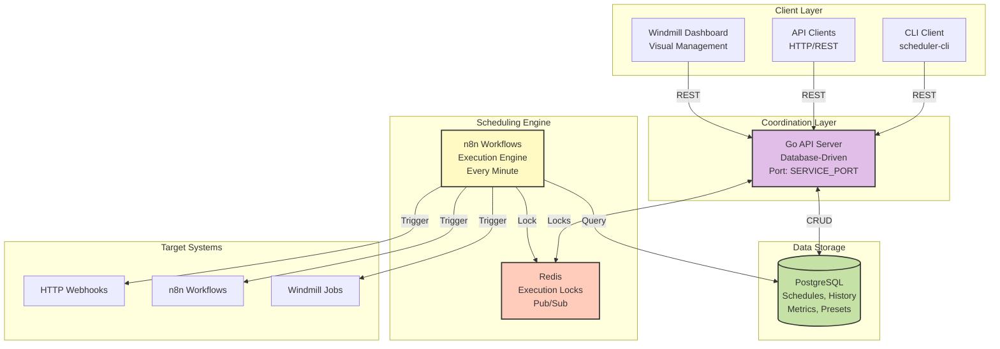

# Workflow Scheduler

> **Enterprise-grade cron scheduling platform for orchestrating Vrooli workflows with centralized management, execution tracking, and intelligent retry handling**

## 📝 **Overview**

The Workflow Scheduler provides a professional scheduling infrastructure for all Vrooli scenarios. It offers database-driven schedule management, timezone-aware execution, comprehensive monitoring, and intelligent error handling—all through a clean REST API and intuitive dashboard.

## ⚡ **Architecture** 



## 🚀 **Key Features**

### Core Capabilities
- **Database-Driven**: All schedules stored in PostgreSQL, no static files
- **Timezone-Aware**: Handles DST transitions and timezone conversions
- **Overlap Policies**: Skip, queue, or allow concurrent executions
- **Smart Retries**: Exponential backoff with configurable strategies
- **Catch-Up Mode**: Automatically run missed executions after downtime
- **Execution History**: Complete audit trail with performance metrics
- **Health Monitoring**: Track success rates and detect failing schedules
- **Multi-Target**: Trigger webhooks, n8n workflows, or Windmill jobs

### Management Interfaces
- **REST API**: Complete CRUD operations for schedules
- **CLI Tool**: Command-line management and monitoring
- **Dashboard**: Visual schedule builder and analytics (Windmill)
- **Metrics API**: Performance statistics and health scores

## 📋 **Schedule Configuration**

### Cron Expression Support
- Standard 5-field cron: `minute hour day month weekday`
- Special expressions: `@hourly`, `@daily`, `@weekly`, `@monthly`
- Complex patterns: `*/5 * * * *`, `0 9-17 * * 1-5`
- 30+ built-in presets for common patterns

### Example Schedule
```json
{
  "name": "Daily Report Generator",
  "description": "Generate and email daily analytics report",
  "cron_expression": "0 9 * * 1-5",
  "timezone": "America/New_York",
  "target_type": "webhook",
  "target_url": "http://localhost:5678/webhook/daily-report",
  "target_payload": {
    "report_type": "daily_sales",
    "recipients": ["team@company.com"],
    "format": "pdf"
  },
  "overlap_policy": "skip",
  "max_retries": 3,
  "retry_strategy": "exponential",
  "timeout_seconds": 300,
  "catch_up_missed": true,
  "tags": ["reporting", "daily", "critical"]
}
```

## 🛠️ **Quick Start**

### **Prerequisites**
```bash
# No special requirements - uses standard Vrooli resources
# PostgreSQL and Redis are automatically configured during setup
```

### **Setup**
```bash
# Navigate to the scenario directory
cd scenarios/workflow-scheduler

# Run setup (initializes database, imports workflows)
vrooli scenario setup workflow-scheduler

# Or using lifecycle commands
vrooli scenario generate workflow-scheduler && vrooli app start workflow-scheduler
```

### **Start Services**
```bash
# Start the scheduler platform
vrooli scenario develop workflow-scheduler

# Services will be available at:
# - API: http://localhost:8090
# - Dashboard: http://localhost:5681
# - n8n Engine: http://localhost:5678
```

## 🔧 **CLI Usage**

### Schedule Management
```bash
# Create a new schedule
scheduler-cli create \
  --name "Hourly Backup" \
  --cron "0 * * * *" \
  --url "http://localhost:5678/webhook/backup"

# List all schedules
scheduler-cli list
scheduler-cli list --enabled --tag critical

# Get schedule details
scheduler-cli show SCHEDULE_ID

# Update schedule
scheduler-cli update SCHEDULE_ID --cron "0 */2 * * *"

# Enable/disable schedule
scheduler-cli enable SCHEDULE_ID
scheduler-cli disable SCHEDULE_ID

# Delete schedule
scheduler-cli delete SCHEDULE_ID
```

### Execution Control
```bash
# Manually trigger a schedule
scheduler-cli trigger SCHEDULE_ID

# View execution history
scheduler-cli history SCHEDULE_ID --limit 20

# Retry a failed execution
scheduler-cli retry EXECUTION_ID

# Get performance metrics
scheduler-cli metrics SCHEDULE_ID
```

### Monitoring
```bash
# Check schedule status
scheduler-cli status SCHEDULE_ID

# View next scheduled runs
scheduler-cli next-runs SCHEDULE_ID --count 10

# Dashboard statistics
scheduler-cli dashboard
```

## 📊 **API Reference**

### Schedule Endpoints
- `GET /api/schedules` - List all schedules
- `POST /api/schedules` - Create new schedule
- `GET /api/schedules/{id}` - Get schedule details
- `PUT /api/schedules/{id}` - Update schedule
- `DELETE /api/schedules/{id}` - Delete schedule
- `POST /api/schedules/{id}/enable` - Enable schedule
- `POST /api/schedules/{id}/disable` - Disable schedule
- `POST /api/schedules/{id}/trigger` - Manual trigger

### Execution Endpoints
- `GET /api/executions` - List recent executions
- `GET /api/schedules/{id}/executions` - Schedule executions
- `GET /api/executions/{id}` - Execution details
- `POST /api/executions/{id}/retry` - Retry failed execution

### Analytics Endpoints
- `GET /api/schedules/{id}/metrics` - Performance metrics
- `GET /api/schedules/{id}/next-runs` - Preview next runs
- `GET /api/dashboard/stats` - Global statistics

### Utility Endpoints
- `GET /api/cron/validate?expression={cron}` - Validate expression
- `GET /api/cron/presets` - List cron presets
- `GET /api/timezones` - Supported timezones

## 🎯 **Use Cases**

### System Maintenance
```bash
# Database backup every night at 3 AM
scheduler-cli create \
  --name "Nightly DB Backup" \
  --cron "0 3 * * *" \
  --url "http://localhost:5678/webhook/backup-db" \
  --tag backup --tag critical
```

### Report Generation
```bash
# Weekly reports every Monday at 9 AM
scheduler-cli create \
  --name "Weekly Sales Report" \
  --cron "0 9 * * 1" \
  --url "http://localhost:5678/webhook/weekly-report" \
  --timezone "America/New_York"
```

### Health Monitoring
```bash
# Service health check every 10 minutes
scheduler-cli create \
  --name "Health Check" \
  --cron "*/10 * * * *" \
  --url "http://localhost:5678/webhook/health-check" \
  --overlap-policy skip
```

### Data Synchronization
```bash
# Hourly data sync with retry logic
scheduler-cli create \
  --name "Data Sync" \
  --cron "0 * * * *" \
  --url "http://localhost:5678/webhook/sync-data" \
  --max-retries 5 \
  --retry-strategy exponential
```

## 📈 **Performance & Reliability**

### Execution Guarantees
- **At-Most-Once**: Default for webhooks (overlap policy: skip)
- **At-Least-Once**: With retry logic and catch-up mode
- **Exactly-Once**: Using execution locks and idempotent targets

### Scalability
- Handles 100+ concurrent schedules
- Sub-second scheduling accuracy
- Efficient database queries with proper indexing
- Redis-based locking for distributed execution

### Monitoring
- Health scores for each schedule
- Success rate tracking
- Performance metrics (avg, min, max, p95, p99)
- Consecutive failure detection
- Automatic alerting on critical failures

## 🔄 **Integration Examples**

### Trigger n8n Workflow
```javascript
const schedule = {
  name: "Process Queue",
  cron_expression: "*/5 * * * *",
  target_type: "webhook",
  target_url: "http://localhost:5678/webhook/process-queue",
  target_payload: {
    queue_name: "documents",
    batch_size: 10
  }
};

fetch('http://localhost:8090/api/schedules', {
  method: 'POST',
  headers: {'Content-Type': 'application/json'},
  body: JSON.stringify(schedule)
});
```

### Trigger Windmill Job
```javascript
const schedule = {
  name: "Generate Analytics",
  cron_expression: "0 0 * * *",
  target_type: "webhook",
  target_url: "http://localhost:5681/api/w/main/jobs/run/f/analytics",
  target_headers: {
    "Authorization": "Bearer YOUR_TOKEN"
  }
};
```

### Custom Webhook
```javascript
const schedule = {
  name: "External API Sync",
  cron_expression: "@hourly",
  target_type: "webhook",
  target_url: "https://api.example.com/sync",
  target_method: "POST",
  target_headers: {
    "X-API-Key": "your-api-key"
  },
  target_payload: {
    "action": "sync",
    "source": "vrooli"
  }
};
```

## 🎨 **Dashboard Features**

The Windmill dashboard provides:
- **Visual Schedule Builder**: Drag-and-drop cron expression builder
- **Execution Timeline**: Visual representation of past and future runs
- **Performance Graphs**: Success rates, execution times, trends
- **Quick Actions**: Enable/disable, trigger, edit schedules
- **Alert Configuration**: Set up notification rules
- **Bulk Operations**: Manage multiple schedules at once

## 🔐 **Security**

- **Authentication**: Token-based API authentication (optional)
- **Audit Logging**: All schedule changes tracked
- **Secure Webhooks**: HTTPS support, custom headers
- **Rate Limiting**: Prevent execution storms
- **Input Validation**: Cron expression and payload validation

## 🐛 **Troubleshooting**

### Schedule Not Executing
1. Check if schedule is enabled: `scheduler-cli show SCHEDULE_ID`
2. Verify cron expression: `scheduler-cli validate "0 9 * * *"`
3. Check execution history: `scheduler-cli history SCHEDULE_ID`
4. Review n8n workflow logs: `docker logs vrooli-n8n`

### Missed Executions
- Enable catch-up mode: `catch_up_missed: true`
- Check scheduler was running: `scheduler-cli dashboard`
- Review execution locks in Redis

### Performance Issues
- Check metrics: `scheduler-cli metrics SCHEDULE_ID`
- Review overlap policy settings
- Optimize target webhook performance
- Consider increasing timeout values

## 📚 **Advanced Topics**

### Custom Overlap Policies
- **skip**: Don't run if previous execution still running
- **queue**: Wait for previous execution to complete
- **allow**: Run regardless (parallel execution)

### Retry Strategies
- **exponential**: 1s, 2s, 4s, 8s, 16s...
- **linear**: 5s, 10s, 15s, 20s...
- **fixed**: Always wait same duration

### Timezone Handling
- All times stored in UTC internally
- Automatic DST transition handling
- Per-schedule timezone configuration
- Next run calculations respect timezone

## 🚀 **Future Enhancements**

- [ ] Schedule templates and groups
- [ ] Dependency chains between schedules
- [ ] Event-based triggers (not just time)
- [ ] Schedule versioning and rollback
- [ ] Advanced notification rules
- [ ] Cost tracking for triggered resources
- [ ] Schedule recommendations based on usage
- [ ] Integration with external calendars

## 📖 **Related Documentation**

- [API Documentation](./API_DOCUMENTATION.md)
- [Implementation Plan](./IMPLEMENTATION_PLAN.md)
- [n8n Workflow Guide](./initialization/automation/n8n/README.md)
- [Database Schema](./initialization/storage/postgres/schema.sql)

---

**Built with ❤️ by the Vrooli Team** | **License: MIT** | **Version: 1.0.0**