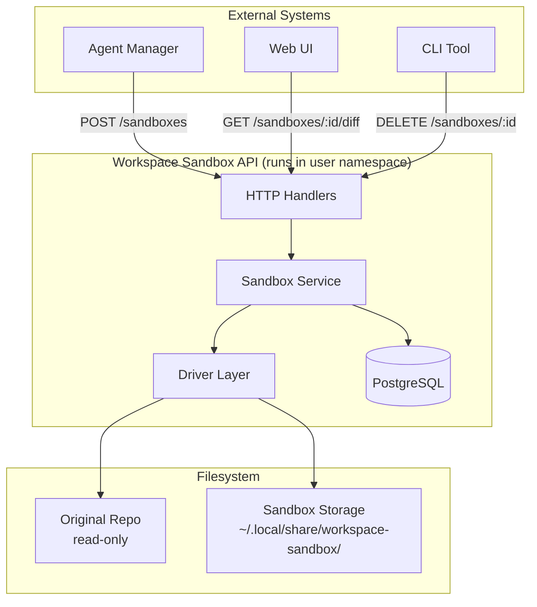
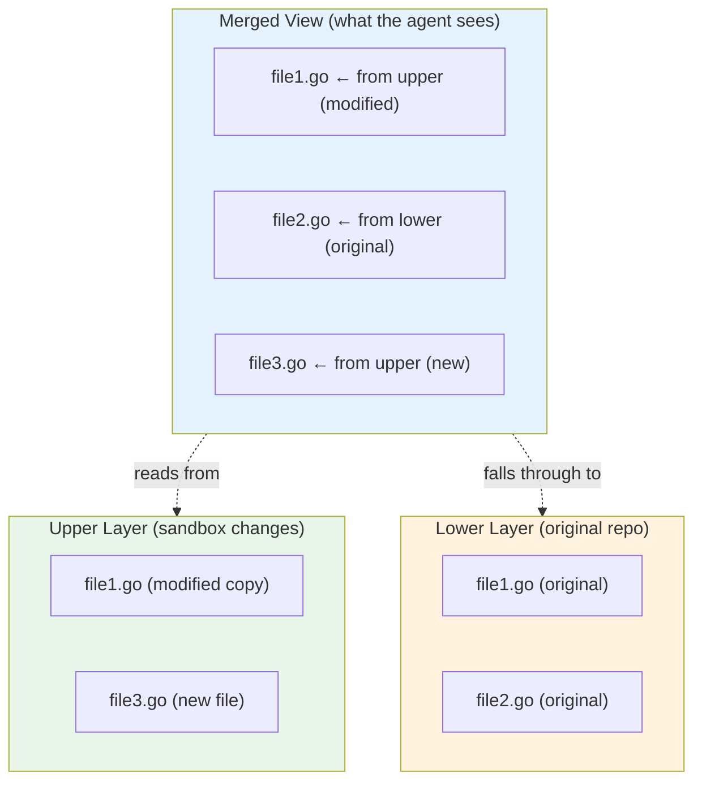
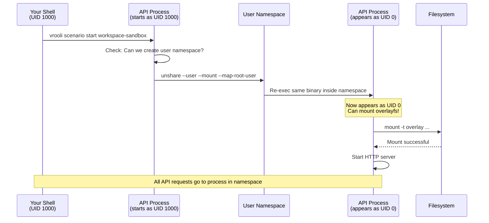
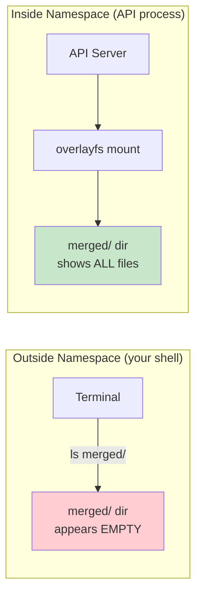
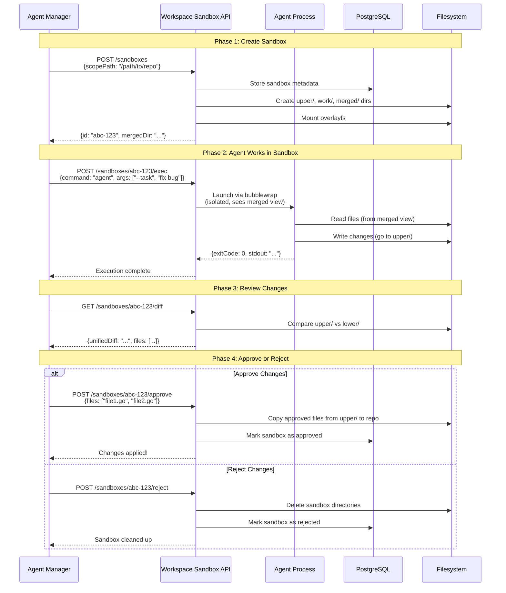
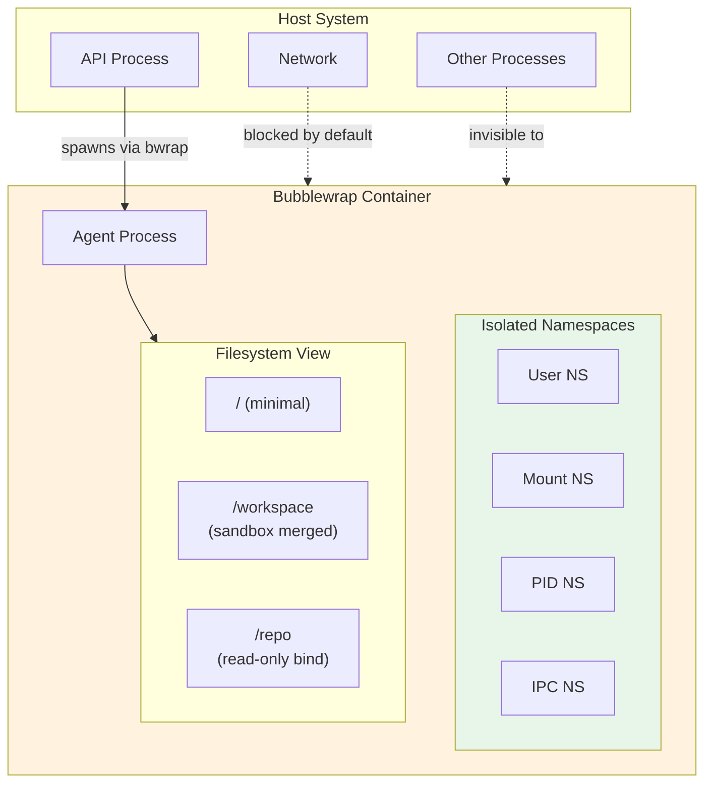
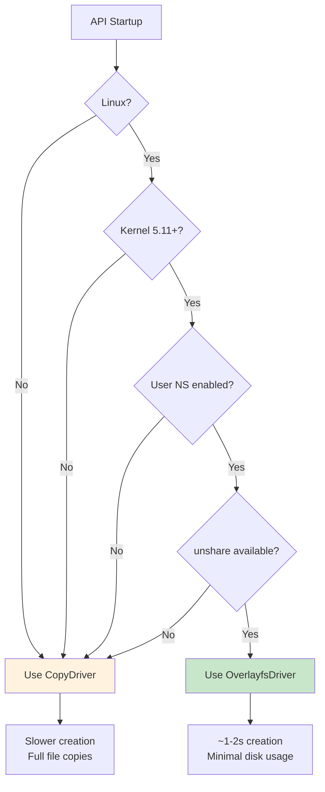

# Workspace Sandbox Architecture

This document explains how workspace-sandbox works, from basic concepts to implementation details. It's designed to be readable by anyone new to sandboxing concepts.

## Table of Contents

1. [The Problem We're Solving](#the-problem-were-solving)
2. [Core Concepts](#core-concepts)
3. [System Overview](#system-overview)
4. [How Overlayfs Works](#how-overlayfs-works)
5. [The User Namespace Pattern](#the-user-namespace-pattern)
6. [Agent Integration Workflow](#agent-integration-workflow)
7. [Process Isolation with Bubblewrap](#process-isolation-with-bubblewrap)
8. [Data Flow: From Change to Commit](#data-flow-from-change-to-commit)
9. [Driver Selection](#driver-selection)
10. [Common Questions](#common-questions)

---

## The Problem We're Solving

When AI agents work on code, they need to:
- Read and modify files in a repository
- Experiment without breaking the original code
- Have their changes reviewed before they become permanent

**Without sandboxing**, an agent could:
- Accidentally delete important files
- Make changes that conflict with other agents
- Leave the repo in a broken state

**With workspace-sandbox**, agents work in isolated copies where:
- The original repo is never touched until changes are approved
- Multiple agents can work simultaneously without conflicts
- All changes are reviewable as a unified diff

---

## Core Concepts

Before diving into the architecture, let's establish some key terms:

| Term | Definition |
|------|------------|
| **Sandbox** | An isolated workspace where an agent can read/write files without affecting the original |
| **Scope** | The directory being sandboxed (e.g., `scenarios/my-project`) |
| **Upper Layer** | Where all changes (new/modified files) are stored |
| **Lower Layer** | The original files (read-only) |
| **Merged View** | The combined view where upper overlays lower |
| **User Namespace** | A Linux feature that lets unprivileged users appear as root in an isolated context |

---

## System Overview



**Key Components:**

1. **API Server** - HTTP endpoints for all sandbox operations
2. **Sandbox Service** - Business logic for create, diff, approve, etc.
3. **Driver Layer** - Abstracts the actual filesystem isolation mechanism
4. **PostgreSQL** - Stores sandbox metadata (not the actual files)
5. **Filesystem** - Where the magic happens via overlayfs

---

## How Overlayfs Works

Overlayfs is a Linux kernel feature that creates a "layered" filesystem. Think of it like transparent sheets stacked on top of each other:



### How Reads Work

1. Agent requests `file2.go`
2. Overlayfs checks upper layer → not found
3. Falls through to lower layer → found!
4. Returns the original file

### How Writes Work

1. Agent modifies `file1.go`
2. Overlayfs copies original from lower to upper ("copy-up")
3. Modification happens in upper layer
4. Original in lower layer is untouched

### Why This Is Efficient

- **No full copy**: Only changed files use extra disk space
- **Fast creation**: Just create empty directories, no file copying
- **Easy diff**: Compare upper layer against lower layer

### The Work Directory

When you look at a sandbox's storage, you'll see four directories:

```
~/.local/share/workspace-sandbox/{sandbox-id}/
├── lower/   → (symlink or reference to original repo)
├── upper/   → Changed/new files stored here
├── work/    → Kernel scratch space (don't touch!)
└── merged/  → Combined view (mount point)
```

The `work/` directory is **internal to the overlayfs kernel driver** - you should never modify it. It serves several purposes:

| Purpose | Explanation |
|---------|-------------|
| **Atomic copy-up** | When copying a file from lower to upper, the kernel first writes to work/, then atomically moves it to upper/. This prevents partial files if the system crashes mid-operation. |
| **Rename operations** | Complex renames across layers use work/ as scratch space for temporary files. |
| **Whiteout handling** | When deleting files, work/ helps manage the whiteout markers that hide lower-layer files. |
| **Crash recovery** | Incomplete operations can be detected and cleaned up on next mount. |

The empty `work/work/` subfolder you might see inside is normal - it's the actual scratch area the kernel uses. The outer `work/` directory must exist and be on the same filesystem as `upper/` for overlayfs to function.

**Important:** If you delete or corrupt the work/ directory while a sandbox is mounted, the overlayfs mount will become unstable. Always unmount before cleanup.

---

## The User Namespace Pattern

Here's where it gets interesting. Overlayfs normally requires root privileges to mount. But we want to run without sudo. The solution: **user namespaces**.

### What Is a User Namespace?

A user namespace is a Linux feature that creates an isolated view of user/group IDs. Inside the namespace, you can appear as root (UID 0) while actually being a regular user outside.



### The Re-exec Pattern

The API uses a clever pattern:

1. **First run**: Process starts as normal user, detects it's not in a namespace
2. **Re-exec**: Calls `unshare` to create namespace and re-run itself
3. **Second run**: Now inside namespace, detects this, continues normally

```go
// Simplified version of what happens in main.go
func main() {
    status := namespace.Check()

    if !status.InUserNamespace && status.CanCreateUserNamespace {
        // Re-exec ourselves inside a user namespace
        namespace.EnterUserNamespace()
        // This never returns - we've been replaced
    }

    // If we get here, we're in the namespace (or fallback mode)
    startServer()
}
```

### Why the Merged Directory Appears Empty

This is the most confusing part for newcomers:



**The mount only exists inside the namespace.** From outside, the directory is just an empty folder. This is why:
- You can't `cd` into the merged directory from your shell
- All file operations must go through the API's `/exec` endpoint
- The API can see everything because it's inside the namespace

---

## Agent Integration Workflow

This is the complete lifecycle of how an agent would use workspace-sandbox:



### API Endpoints Reference

| Phase | Endpoint | Purpose |
|-------|----------|---------|
| Create | `POST /sandboxes` | Create new sandbox |
| Execute | `POST /sandboxes/:id/exec` | Run command in sandbox |
| Review | `GET /sandboxes/:id/diff` | Get unified diff of changes |
| Approve | `POST /sandboxes/:id/approve` | Apply changes to repo |
| Reject | `POST /sandboxes/:id/reject` | Discard changes |
| Cleanup | `DELETE /sandboxes/:id` | Remove sandbox |

### Example: Creating and Using a Sandbox

```bash
# 1. Create a sandbox for a scenario
curl -X POST http://localhost:15427/api/v1/sandboxes \
  -H "Content-Type: application/json" \
  -d '{"scopePath": "/home/user/project/scenarios/my-app"}'

# Response: {"id": "9ba9b981-178f-4ada-a12b-93f664bf14f1", ...}

# 2. Execute a command in the sandbox
curl -X POST http://localhost:15427/api/v1/sandboxes/9ba9b981-.../exec \
  -H "Content-Type: application/json" \
  -d '{"command": "touch", "args": ["new-file.txt"]}'

# Response: {"exitCode": 0, "stdout": "", "stderr": ""}

# 3. See what changed
curl http://localhost:15427/api/v1/sandboxes/9ba9b981-.../diff

# Response: {"files": [{"filePath": "new-file.txt", "changeType": "added"}], ...}

# 4. Approve the changes
curl -X POST http://localhost:15427/api/v1/sandboxes/9ba9b981-.../approve \
  -H "Content-Type: application/json" \
  -d '{"files": ["new-file.txt"]}'
```

---

## Process Isolation with Bubblewrap

When you call `/exec`, the command doesn't just run directly. It's wrapped in **bubblewrap (bwrap)**, a sandboxing tool that provides additional isolation.



### What Bubblewrap Provides

| Isolation | Default | Effect |
|-----------|---------|--------|
| User namespace | Yes | Agent appears as root inside container |
| Mount namespace | Yes | Agent sees only allowed paths |
| PID namespace | Yes | Agent can't see host processes |
| Network | Blocked | Agent can't make network calls |
| IPC namespace | Yes | Agent can't use shared memory |

### Configuring Isolation

The `/exec` endpoint accepts configuration options:

```json
{
  "command": "my-agent",
  "args": ["--task", "refactor"],
  "allowNetwork": false,
  "env": {
    "DEBUG": "true"
  },
  "workingDir": "/workspace"
}
```

---

## Data Flow: From Change to Commit

Let's trace what happens to a single file modification:

```mermaid
flowchart LR
    subgraph sandbox["Sandbox Lifecycle"]
        direction TB
        A["Agent modifies<br/>src/main.go"]
        B["Copy-up to upper/<br/>src/main.go"]
        C["Original untouched<br/>in repo"]
    end

    subgraph review["Review Phase"]
        direction TB
        D["GET /diff"]
        E["Compare upper/ vs repo"]
        F["Generate unified diff"]
    end

    subgraph apply["Apply Phase"]
        direction TB
        G["POST /approve"]
        H["Validate changes"]
        I["Copy to repo"]
        J["Cleanup sandbox"]
    end

    A --> B
    B --> C
    C --> D
    D --> E
    E --> F
    F --> G
    G --> H
    H --> I
    I --> J

    style sandbox fill:#e3f2fd
    style review fill:#fff3e0
    style apply fill:#e8f5e9
```



### File States

| Location | State | Visibility |
|----------|-------|------------|
| `repo/src/main.go` | Original | Everyone |
| `upper/src/main.go` | Modified copy | API only (in namespace) |
| `merged/src/main.go` | Merged view | Agent (via bwrap) |

### After Approval

```
Before:                          After:
repo/src/main.go (original)  →   repo/src/main.go (from upper/)
upper/src/main.go (changes)  →   (deleted)
merged/ (mount)              →   (unmounted)
```

---

## Driver Selection

Not all systems support overlayfs in user namespaces. Workspace-sandbox automatically selects the best available driver:



### CopyDriver Fallback

When overlayfs isn't available, CopyDriver provides the same API but:
- Copies the entire scope directory to create a snapshot
- Compares files byte-by-byte for diff generation
- Uses more disk space and time

**Check your driver:**
```bash
curl http://localhost:15427/api/v1/health | jq .driver
# "overlayfs" = optimal
# "copy" = fallback mode
```

---

## Common Questions

### Q: Why can't I see files in the merged directory?

The overlayfs mount only exists inside the user namespace where the API runs. Your shell is outside that namespace. Use the API's `/exec` endpoint to run commands that can see the files.

### Q: Can I use this for security sandboxing?

**No.** This system is designed for safety from accidents, not security from adversaries. A malicious agent could potentially escape. For security sandboxing, use proper containerization (Docker, gVisor, etc.).

### Q: What happens if the API crashes?

- Sandbox metadata persists in PostgreSQL
- Upper layer files persist on disk
- On restart, sandboxes can be recovered
- Stale sandboxes are cleaned by garbage collection

### Q: Can multiple agents use the same sandbox?

Technically yes, but not recommended. Each sandbox is designed for one agent session. For concurrent work, create separate sandboxes.

### Q: How do I clean up old sandboxes?

```bash
# Via CLI
workspace-sandbox gc --older-than 24h

# Via API
curl -X POST http://localhost:15427/api/v1/gc \
  -H "Content-Type: application/json" \
  -d '{"olderThan": "24h"}'
```

### Q: What files are NOT sandboxed?

- `.git` directory (blocked by policy)
- Files outside the scope path
- System paths

---

## Further Reading

- [README.md](../README.md) - Quick start and usage
- [PRD.md](../PRD.md) - Product requirements
- [requirements/](../requirements/) - Detailed requirements with test traceability
- [PROBLEMS.md](./PROBLEMS.md) - Known issues and edge cases
