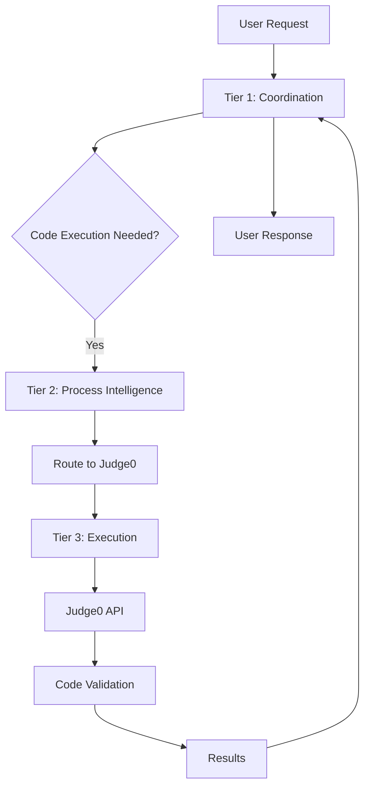

# Judge0 Integration Guide for Vrooli

This guide explains how Judge0 integrates with Vrooli's three-tier AI system to provide secure code execution capabilities.

## 🏗️ Architecture Integration

### Three-Tier AI System Integration



### Resource Provider Integration

Judge0 is registered as an `ExecutionResource` in Vrooli's resource system:

```typescript
// Automatic registration via decorator
@RegisterResource
export class Judge0Resource extends ResourceProvider<"judge0", Judge0Config> {
    readonly category = ResourceCategory.Execution;
    // ... implementation
}
```

## 🔗 Integration Points

### 1. AI Code Generation Validation

When AI generates code, Judge0 validates it before deployment:

```typescript
// In AI tier integration
async function validateGeneratedCode(code: string, language: string) {
    const judge0 = await resourceManager.getResource("judge0");
    
    const result = await judge0.executeCode({
        source_code: code,
        language_id: await judge0.findLanguageByName(language),
        stdin: testInputs,
        expected_output: expectedOutput
    });
    
    return result.status.id === 3; // Accepted
}
```

### 2. Workflow Automation

n8n workflows can execute code as part of automation:

```javascript
// n8n custom node
const judge0Result = await this.helpers.httpRequest({
    method: 'POST',
    url: 'http://localhost:2358/submissions',
    headers: {
        'X-Auth-Token': credentials.judge0ApiKey
    },
    body: {
        source_code: items[0].json.code,
        language_id: 93, // JavaScript
        wait: true
    }
});
```

### 3. Educational Features

AI can teach coding with live execution:

```typescript
// Educational routine
async function teachCoding(topic: string) {
    // AI generates explanation
    const explanation = await ollama.generate({
        prompt: `Explain ${topic} with code examples`
    });
    
    // Extract code examples
    const codeExamples = extractCodeBlocks(explanation);
    
    // Validate each example
    for (const example of codeExamples) {
        const result = await judge0.executeCode(example);
        
        if (result.status.id !== 3) {
            // AI fixes the code
            const fixed = await ollama.generate({
                prompt: `Fix this code: ${example}\nError: ${result.stderr}`
            });
        }
    }
}
```

## 🛡️ Security Integration

### Resource Limits

Judge0 enforces strict limits aligned with Vrooli's security policies:

```typescript
// Vrooli resource configuration
{
    "execution": {
        "judge0": {
            "securityLimits": {
                "cpuTime": 5,        // seconds
                "wallTime": 10,      // seconds
                "memoryLimit": 262144, // KB (256MB)
                "maxProcesses": 30,
                "fileSize": 5120     // KB (5MB)
            },
            "enableNetwork": false  // Always disabled
        }
    }
}
```

### API Authentication

Judge0 integrates with Vrooli's unified auth system:

```typescript
// Automatic auth header injection
const authHeaders = judge0.getAuthHeaders();
// Returns: { "X-Auth-Token": "stored-api-key" }
```

## 📊 Monitoring Integration

### Health Checks

Judge0 health is monitored alongside other resources:

```typescript
// Unified health monitoring
const health = await resourceManager.checkHealth();
console.log(health.execution.judge0);
// {
//   status: "healthy",
//   languages: 60,
//   workers: { active: 2, configured: 2 },
//   version: "1.13.1"
// }
```

### Metrics Collection

Execution metrics feed into Vrooli's analytics:

```typescript
// Automatic metric collection
interface Judge0Metrics {
    totalSubmissions: number;
    successRate: number;
    avgExecutionTime: number;
    languageUsage: Record<string, number>;
}
```

## 🔄 Event Bus Integration

Judge0 events flow through Vrooli's event system:

```typescript
// Event emission
eventBus.emit("resource.execution.completed", {
    resourceId: "judge0",
    submissionId: result.token,
    status: result.status,
    executionTime: result.time
});

// Event handling in tiers
eventBus.on("resource.execution.completed", async (event) => {
    if (event.status.id === 3) {
        await tier1.reportSuccess(event);
    } else {
        await tier2.handleExecutionError(event);
    }
});
```

## 🚀 Common Integration Patterns

### 1. AI Code Validation Pipeline

```typescript
class AICodeValidator {
    async validateCode(params: {
        code: string;
        language: string;
        testCases: TestCase[];
    }): Promise<ValidationResult> {
        const judge0 = await this.resourceManager.getResource("judge0");
        const results = [];
        
        for (const test of params.testCases) {
            const result = await judge0.executeCode({
                source_code: params.code,
                language_id: await this.getLanguageId(params.language),
                stdin: test.input,
                expected_output: test.expectedOutput
            });
            
            results.push({
                passed: result.status.id === 3,
                actual: result.stdout,
                expected: test.expectedOutput,
                error: result.stderr || result.compile_output
            });
        }
        
        return {
            allPassed: results.every(r => r.passed),
            results,
            summary: this.generateSummary(results)
        };
    }
}
```

### 2. Multi-Language Benchmarking

```typescript
class LanguageBenchmark {
    async compareImplementations(algorithm: string) {
        const implementations = await this.generateImplementations(algorithm);
        const results = {};
        
        for (const [language, code] of Object.entries(implementations)) {
            const start = Date.now();
            
            const result = await judge0.executeCode({
                source_code: code,
                language_id: this.languageMap[language],
                stdin: this.benchmarkInput
            });
            
            results[language] = {
                executionTime: Date.now() - start,
                memory: result.memory,
                cpuTime: result.time,
                success: result.status.id === 3
            };
        }
        
        return this.analyzeBenchmarkResults(results);
    }
}
```

### 3. Interactive Coding Assistant

```typescript
class CodingAssistant {
    async helpDebug(params: {
        code: string;
        error: string;
        language: string;
    }) {
        // First, reproduce the error
        const errorResult = await judge0.executeCode({
            source_code: params.code,
            language_id: this.getLanguageId(params.language)
        });
        
        // AI analyzes the error
        const analysis = await ollama.generate({
            prompt: `Debug this ${params.language} code:
                     Code: ${params.code}
                     Error: ${errorResult.stderr || errorResult.compile_output}
                     Suggest fixes.`
        });
        
        // Extract and test the fix
        const fixedCode = this.extractCode(analysis);
        const fixResult = await judge0.executeCode({
            source_code: fixedCode,
            language_id: this.getLanguageId(params.language)
        });
        
        return {
            analysis,
            fixedCode,
            testResult: fixResult,
            success: fixResult.status.id === 3
        };
    }
}
```

## 🔧 Configuration Best Practices

### 1. Resource Limits

```json
{
    "execution": {
        "judge0": {
            "enabled": true,
            "baseUrl": "http://localhost:2358",
            "workers": 2,
            "securityLimits": {
                "cpuTime": 5,
                "wallTime": 10,
                "memoryLimit": 262144,
                "maxProcesses": 30,
                "fileSize": 5120,
                "stackLimit": 262144
            },
            "enableNetwork": false,
            "enableCallbacks": false
        }
    }
}
```

### 2. Health Check Configuration

```json
{
    "healthCheck": {
        "endpoint": "/system_info",
        "intervalMs": 60000,
        "timeoutMs": 5000,
        "requiresAuth": true
    }
}
```

## 📈 Performance Optimization

### 1. Batch Processing

For multiple submissions, use batch API:

```typescript
const submissions = testCases.map(test => ({
    source_code: code,
    language_id: langId,
    stdin: test.input,
    expected_output: test.output
}));

const results = await judge0.submitBatch(submissions);
```

### 2. Language Caching

Judge0Resource caches language information:

```typescript
// Languages cached for 5 minutes
const languages = await judge0.listLanguages();
// Subsequent calls use cache
```

### 3. Worker Scaling

Scale workers based on load:

```bash
# Via management script
./manage.sh --action scale-workers --count 4

# Via Docker
docker compose scale judge0-workers=4
```

## 🚨 Error Handling

### Common Integration Errors

1. **API Key Issues**
```typescript
try {
    await judge0.executeCode(params);
} catch (error) {
    if (error.message.includes("401")) {
        // Regenerate or validate API key
        await this.refreshJudge0ApiKey();
    }
}
```

2. **Resource Limits**
```typescript
if (result.status.id === 5) {  // Time Limit Exceeded
    // Retry with increased limits
    params.cpu_time_limit = 10;
    result = await judge0.executeCode(params);
}
```

3. **Service Unavailable**
```typescript
const judge0 = await resourceManager.getResource("judge0");
if (!judge0.isHealthy()) {
    // Fallback or queue for later
    await this.queueForExecution(params);
}
```

## 🎯 Integration Checklist

- [ ] Judge0 resource registered in TypeScript
- [ ] Port 2358 allocated in port registry
- [ ] API key stored securely
- [ ] Health checks configured
- [ ] Security limits applied
- [ ] Event bus integration complete
- [ ] Error handling implemented
- [ ] Monitoring enabled
- [ ] Documentation updated

## 📚 Further Reading

- [Judge0 Official Documentation](https://judge0.com/docs)
- [Vrooli Resource System](../../README.md)
- [Three-Tier AI Architecture](/docs/architecture/ai-tiers.md)
- [Security Best Practices](/docs/security/README.md)