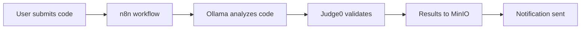

# Code Review Pipeline with Judge0

This example demonstrates a complete code review pipeline integrating Judge0 with other Vrooli resources.

## Workflow Overview



## n8n Workflow Configuration

```json
{
  "name": "AI Code Review Pipeline",
  "nodes": [
    {
      "name": "Webhook",
      "type": "n8n-nodes-base.webhook",
      "position": [250, 300],
      "parameters": {
        "path": "code-review",
        "responseMode": "onReceived",
        "options": {}
      }
    },
    {
      "name": "Ollama Code Analysis",
      "type": "n8n-nodes-base.httpRequest",
      "position": [450, 300],
      "parameters": {
        "method": "POST",
        "url": "http://localhost:11434/api/generate",
        "jsonParameters": true,
        "options": {},
        "bodyParametersJson": {
          "model": "deepseek-r1:8b",
          "prompt": "Review this code for bugs and suggest improvements:\n\n{{$json.code}}"
        }
      }
    },
    {
      "name": "Judge0 Validation",
      "type": "n8n-nodes-base.httpRequest",
      "position": [650, 300],
      "parameters": {
        "method": "POST",
        "url": "http://localhost:2358/submissions?wait=true",
        "authentication": "genericCredentialType",
        "genericAuthType": "httpHeaderAuth",
        "jsonParameters": true,
        "options": {},
        "bodyParametersJson": {
          "source_code": "={{$json.code}}",
          "language_id": "={{$json.language_id}}",
          "stdin": "={{$json.test_input}}",
          "expected_output": "={{$json.expected_output}}"
        }
      }
    },
    {
      "name": "Store Results",
      "type": "n8n-nodes-base.s3",
      "position": [850, 300],
      "parameters": {
        "operation": "upload",
        "bucketName": "code-reviews",
        "fileName": "review-{{Date.now()}}.json",
        "binaryPropertyName": "data"
      }
    }
  ]
}
```

## Complete Integration Script

```bash
#!/bin/bash
# code-review-pipeline.sh
# Automated code review with AI analysis and validation

# Configuration
OLLAMA_URL="http://localhost:11434"
JUDGE0_URL="http://localhost:2358"
MINIO_URL="http://localhost:9000"
N8N_WEBHOOK="http://localhost:5678/webhook/code-review"

# Function to analyze code with Ollama
analyze_code() {
    local code="$1"
    local language="$2"
    
    echo "🔍 Analyzing code with AI..."
    
    curl -s -X POST "$OLLAMA_URL/api/generate" \
        -d "{
            \"model\": \"deepseek-r1:8b\",
            \"prompt\": \"Analyze this $language code for bugs, performance issues, and security concerns:\n\n$code\",
            \"stream\": false
        }" | jq -r '.response'
}

# Function to validate code with Judge0
validate_code() {
    local code="$1"
    local language_id="$2"
    local test_cases="$3"
    
    echo "🧪 Validating code execution..."
    
    # Submit each test case
    for test in $(echo "$test_cases" | jq -c '.[]'); do
        local input=$(echo "$test" | jq -r '.input')
        local expected=$(echo "$test" | jq -r '.expected')
        
        local result=$(curl -s -X POST "$JUDGE0_URL/submissions?wait=true" \
            -H "Content-Type: application/json" \
            -H "X-Auth-Token: $JUDGE0_API_KEY" \
            -d "{
                \"source_code\": \"$code\",
                \"language_id\": $language_id,
                \"stdin\": \"$input\",
                \"expected_output\": \"$expected\"
            }")
        
        echo "$result" | jq .
    done
}

# Function to generate comprehensive report
generate_report() {
    local code="$1"
    local analysis="$2"
    local validation="$3"
    
    cat <<EOF
{
    "timestamp": "$(date -u +%Y-%m-%dT%H:%M:%SZ)",
    "code": $(echo "$code" | jq -Rs .),
    "ai_analysis": $(echo "$analysis" | jq -Rs .),
    "validation_results": $validation,
    "recommendations": [
        "Fix identified bugs before deployment",
        "Add comprehensive error handling",
        "Include unit tests for edge cases"
    ]
}
EOF
}

# Main pipeline
main() {
    local code_file="$1"
    local language="$2"
    local language_id="$3"
    local test_file="$4"
    
    # Read code and test cases
    local code=$(cat "$code_file")
    local tests=$(cat "$test_file")
    
    # Step 1: AI Analysis
    local analysis=$(analyze_code "$code" "$language")
    
    # Step 2: Code Validation
    local validation=$(validate_code "$code" "$language_id" "$tests")
    
    # Step 3: Generate Report
    local report=$(generate_report "$code" "$analysis" "$validation")
    
    # Step 4: Trigger n8n workflow
    echo "📤 Sending to n8n workflow..."
    curl -X POST "$N8N_WEBHOOK" \
        -H "Content-Type: application/json" \
        -d "$report"
    
    echo "✅ Code review pipeline complete!"
}

# Example usage
# ./code-review-pipeline.sh mycode.js javascript 93 test-cases.json
```

## Test Cases Format

```json
{
  "test_cases": [
    {
      "name": "Basic functionality",
      "input": "5",
      "expected": "25",
      "timeout": 2
    },
    {
      "name": "Edge case - zero",
      "input": "0",
      "expected": "0",
      "timeout": 1
    },
    {
      "name": "Negative numbers",
      "input": "-5",
      "expected": "25",
      "timeout": 1
    }
  ]
}
```

## Node-RED Integration

For real-time monitoring, connect Node-RED:

```javascript
// Node-RED function node
msg.topic = "code-review";
msg.payload = {
    code: msg.payload.code,
    language: msg.payload.language,
    timestamp: new Date().toISOString()
};

// Call Judge0 for validation
const judge0Result = await context.global.httpRequest({
    method: 'POST',
    url: 'http://localhost:2358/submissions',
    headers: {
        'X-Auth-Token': env.get('JUDGE0_API_KEY')
    },
    body: {
        source_code: msg.payload.code,
        language_id: msg.payload.language_id
    }
});

msg.payload.validation = judge0Result;
return msg;
```

## Benefits

1. **Automated Review**: Every code submission gets AI analysis
2. **Execution Validation**: Code is tested with real inputs
3. **Audit Trail**: All reviews stored in MinIO
4. **Real-time Monitoring**: Node-RED dashboard shows activity
5. **Multi-language Support**: Works with all 60+ Judge0 languages

## Advanced Features

### Performance Benchmarking
```javascript
// Compare execution times across languages
const languages = ['javascript', 'python', 'go', 'rust'];
const results = {};

for (const lang of languages) {
    const start = Date.now();
    await validateCode(code, lang);
    results[lang] = Date.now() - start;
}

console.log("Performance comparison:", results);
```

### Security Scanning
```bash
# Check for common vulnerabilities
SECURITY_PATTERNS=(
    "eval("
    "exec("
    "system("
    "__import__"
    "require("
)

for pattern in "${SECURITY_PATTERNS[@]}"; do
    if grep -q "$pattern" "$code_file"; then
        echo "⚠️  Security warning: Found $pattern"
    fi
done
```

### Integration with CI/CD
```yaml
# .github/workflows/code-review.yml
name: AI Code Review
on: [pull_request]

jobs:
  review:
    runs-on: ubuntu-latest
    steps:
      - uses: actions/checkout@v2
      - name: Run AI Code Review
        run: |
          ./scripts/resources/execution/judge0/examples/workflows/code-review-pipeline.sh \
            ${{ github.event.pull_request.changed_files }} \
            javascript 93 tests.json
```

This complete pipeline ensures code quality through AI analysis and actual execution validation!